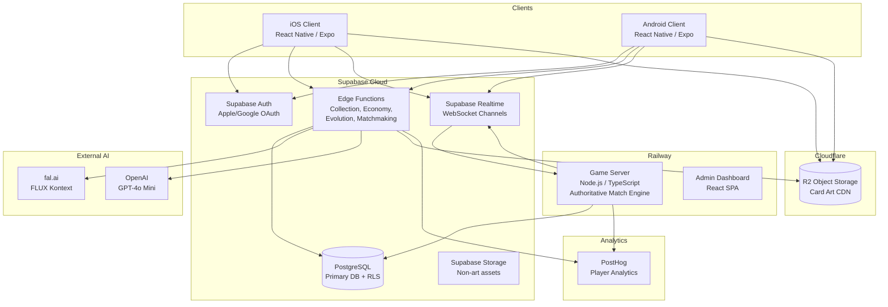
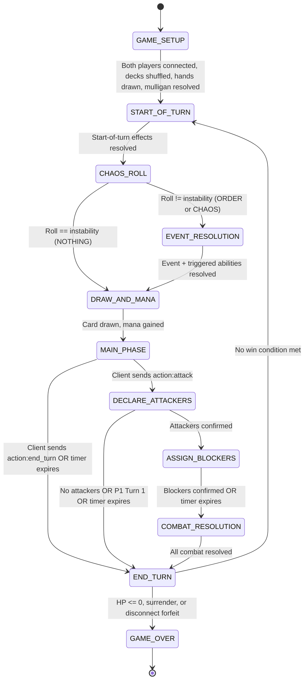

# 06 -- Technical Architecture

This document defines the system architecture, service design, API contracts, database schemas, and deployment strategy for Chaos Creatures. It is the engineering blueprint that translates the game design (00), battle mechanics (01), and data model (02) into a buildable system.

**Built for:** A solo non-engineer owner using Claude Code. Every decision is made. No ambiguity remains.

**Depends on:** `00-game-design-master.md`, `01-battle-mechanics.md`, `02-card-data-model.md`

---

## 1. System Overview

### 1.1 High-Level Architecture



### 1.2 Technology Stack (Final -- No Alternatives)

| Layer | Technology | Why This, Specifically |
|---|---|---|
| **Client** | React Native (Expo) + TypeScript | Claude Code builds TypeScript/React natively. Expo EAS handles iOS/Android builds. No Unity editor required. |
| **Auth** | Supabase Auth | Built-in Apple Sign-In and Google Sign-In. JWT issuance, refresh tokens, session management -- zero custom code. |
| **Database** | Supabase PostgreSQL | Managed Postgres with Row Level Security (RLS). No connection pooling to configure. Built-in migrations. |
| **Serverless API** | Supabase Edge Functions (Deno/TypeScript) | Handles REST endpoints for collection, economy, evolution, matchmaking. Auto-scales. Zero infrastructure. |
| **Real-time** | Supabase Realtime (WebSocket channels) | Clients subscribe to match channels. Game server broadcasts state changes. Built-in auth on channels. |
| **Game Server** | Railway (Node.js / TypeScript) | Stateful match engine. Railway auto-scales, auto-deploys from GitHub. One `railway up` command. |
| **Image Generation** | fal.ai (FLUX Kontext API) | Direct HTTP API. No GPU provisioning. FLUX Kontext Dev for free tier, Pro for subscribers. |
| **Text Generation** | OpenAI API (GPT-4o Mini) | Card names, flavor text. $0.15/$0.60 per 1M tokens. Negligible cost. |
| **Card Art Storage + CDN** | Cloudflare R2 | S3-compatible object storage with built-in global CDN. No egress fees. |
| **Analytics** | PostHog | Player behavior, retention, match data, economy health. Free tier covers launch. |
| **App Distribution** | Expo EAS Build + Apple/Google stores | One command builds for both platforms. |
| **Admin Dashboard** | React SPA on Railway | Simple web app for the owner to manage the game without touching code. |

### 1.3 Environment Variables (.env)

The owner creates accounts and puts all keys in a single `.env` file. Claude Code reads from this.

```bash
# Supabase
SUPABASE_URL=https://xxxx.supabase.co
SUPABASE_ANON_KEY=eyJ...
SUPABASE_SERVICE_ROLE_KEY=eyJ...

# fal.ai
FAL_KEY=fal_...

# OpenAI
OPENAI_API_KEY=sk-...

# Cloudflare R2
R2_ACCOUNT_ID=xxxx
R2_ACCESS_KEY_ID=xxxx
R2_SECRET_ACCESS_KEY=xxxx
R2_BUCKET_NAME=chaos-creatures-art
R2_PUBLIC_URL=https://art.chaoscreatures.com

# PostHog
POSTHOG_API_KEY=phc_...
POSTHOG_HOST=https://app.posthog.com

# Railway (set via Railway dashboard, not .env)
# RAILWAY_TOKEN is auto-configured

# Game Server
GAME_SERVER_PORT=3001
GAME_SERVER_SECRET=random-64-char-secret
```

---

## 2. Supabase Database Schema

All tables live in Supabase PostgreSQL. Row Level Security (RLS) policies are defined for every table. The schema maps directly to entities in `02-card-data-model.md`.

### 2.1 Core Tables

#### `players`

```sql
CREATE TABLE players (
  id UUID PRIMARY KEY DEFAULT gen_random_uuid(),
  auth_id UUID UNIQUE NOT NULL REFERENCES auth.users(id) ON DELETE CASCADE,
  display_name TEXT UNIQUE NOT NULL CHECK (length(display_name) BETWEEN 3 AND 20),
  friend_code TEXT UNIQUE NOT NULL DEFAULT ('CHAOS-' || upper(substr(md5(random()::text), 1, 4))),

  -- Subscription
  subscription_tier TEXT NOT NULL DEFAULT 'FREE' CHECK (subscription_tier IN ('FREE', 'MID', 'HIGH')),

  -- Faction
  primary_faction_id UUID REFERENCES factions(id),
  unlocked_faction_ids UUID[] DEFAULT '{}',
  onboarding_complete BOOLEAN NOT NULL DEFAULT FALSE,

  -- Progression
  player_level INTEGER NOT NULL DEFAULT 1,
  player_xp INTEGER NOT NULL DEFAULT 0,
  season_rank TEXT NOT NULL DEFAULT 'BRONZE_3',
  season_rank_points INTEGER NOT NULL DEFAULT 0,
  hidden_mmr INTEGER NOT NULL DEFAULT 1000,

  -- Currency
  chaos_dust INTEGER NOT NULL DEFAULT 0 CHECK (chaos_dust >= 0),

  -- Collection limits (derived from subscription_tier, denormalized for query speed)
  max_cards_per_faction INTEGER NOT NULL DEFAULT 50,
  max_deck_slots INTEGER NOT NULL DEFAULT 3,

  -- Shards
  shards_uncommon INTEGER NOT NULL DEFAULT 0 CHECK (shards_uncommon >= 0),
  shards_rare INTEGER NOT NULL DEFAULT 0 CHECK (shards_rare >= 0),
  shards_epic INTEGER NOT NULL DEFAULT 0 CHECK (shards_epic >= 0),
  shards_legendary INTEGER NOT NULL DEFAULT 0 CHECK (shards_legendary >= 0),

  -- Profile
  showcase_card_ids UUID[] DEFAULT '{}',
  active_title TEXT,

  -- Stats
  total_games INTEGER NOT NULL DEFAULT 0,
  total_wins INTEGER NOT NULL DEFAULT 0,
  total_losses INTEGER NOT NULL DEFAULT 0,
  current_win_streak INTEGER NOT NULL DEFAULT 0,
  best_win_streak INTEGER NOT NULL DEFAULT 0,
  cards_evolved_total INTEGER NOT NULL DEFAULT 0,
  highest_tier_reached TEXT NOT NULL DEFAULT 'COMMON',

  -- Social
  friend_ids UUID[] DEFAULT '{}',

  -- Settings (JSONB for flexibility)
  settings JSONB NOT NULL DEFAULT '{
    "master_volume": 1.0,
    "music_volume": 0.7,
    "sfx_volume": 1.0,
    "reduced_motion": false,
    "colorblind_mode": "NONE",
    "card_animation_quality": "FULL",
    "screen_shake": true,
    "auto_end_turn": false,
    "confirm_end_turn": true,
    "notify_daily_rewards": true,
    "notify_evolution_ready": true,
    "notify_friend_activity": true,
    "notify_season_ending": true,
    "block_friend_requests": false,
    "hide_profile": false,
    "hide_online_status": false
  }'::jsonb,

  created_at TIMESTAMPTZ NOT NULL DEFAULT now(),
  updated_at TIMESTAMPTZ NOT NULL DEFAULT now()
);

-- RLS: Players can only read/update their own row
ALTER TABLE players ENABLE ROW LEVEL SECURITY;

CREATE POLICY "Players can read own data"
  ON players FOR SELECT
  USING (auth.uid() = auth_id);

CREATE POLICY "Players can update own data"
  ON players FOR UPDATE
  USING (auth.uid() = auth_id)
  WITH CHECK (auth.uid() = auth_id);

-- Service role can read/write all (for game server, edge functions)
CREATE POLICY "Service role full access"
  ON players FOR ALL
  USING (auth.role() = 'service_role');

-- Public profiles: anyone can read display_name, season_rank, showcase
CREATE POLICY "Public profile read"
  ON players FOR SELECT
  USING (true);
```

#### `factions`

```sql
CREATE TABLE factions (
  id UUID PRIMARY KEY DEFAULT gen_random_uuid(),
  name TEXT NOT NULL,
  short_name TEXT UNIQUE NOT NULL CHECK (short_name IN ('IRONWRIGHT', 'FEY_COURTS', 'DEMONIC_KINGDOMS')),
  exclusive_mechanic TEXT NOT NULL CHECK (exclusive_mechanic IN ('AUGMENT', 'BOND', 'CORRUPTION')),
  art_prompt_prefix TEXT NOT NULL,
  flavor_voice TEXT NOT NULL,
  name_voice TEXT NOT NULL,
  card_frame_asset TEXT NOT NULL DEFAULT '',
  color_primary TEXT NOT NULL DEFAULT '#000000',
  color_secondary TEXT NOT NULL DEFAULT '#000000',
  color_background TEXT NOT NULL DEFAULT '#000000',
  particle_theme TEXT NOT NULL DEFAULT 'default',
  released_at TIMESTAMPTZ NOT NULL DEFAULT now(),
  card_template_count INTEGER NOT NULL DEFAULT 0
);

-- RLS: Factions are global read-only data
ALTER TABLE factions ENABLE ROW LEVEL SECURITY;
CREATE POLICY "Anyone can read factions" ON factions FOR SELECT USING (true);
```

#### `card_templates`

```sql
CREATE TABLE card_templates (
  id UUID PRIMARY KEY DEFAULT gen_random_uuid(),
  name TEXT NOT NULL,
  card_type TEXT NOT NULL CHECK (card_type IN ('CREATURE', 'SPELL', 'STABILIZER')),
  faction_id UUID NOT NULL REFERENCES factions(id),

  -- Base stats
  base_attack INTEGER,
  base_health INTEGER,
  base_instability INTEGER NOT NULL DEFAULT 0 CHECK (base_instability BETWEEN 0 AND 5),
  mana_cost INTEGER NOT NULL CHECK (mana_cost BETWEEN 1 AND 10),

  -- Keywords
  base_keywords TEXT[] NOT NULL DEFAULT '{}',

  -- Spell/Stabilizer
  spell_effect JSONB,
  stabilizer_type TEXT CHECK (stabilizer_type IN ('ORDER', 'CHAOS', 'HYBRID')),

  -- AI generation metadata
  art_prompt TEXT NOT NULL,
  art_url TEXT NOT NULL,
  flavor_text TEXT NOT NULL DEFAULT '',

  -- Pipeline metadata
  batch_id TEXT,
  approved_at TIMESTAMPTZ,
  approved_by TEXT,
  is_legendary_eligible BOOLEAN NOT NULL DEFAULT TRUE,

  created_at TIMESTAMPTZ NOT NULL DEFAULT now()
);

-- RLS: Templates are global read-only
ALTER TABLE card_templates ENABLE ROW LEVEL SECURITY;
CREATE POLICY "Anyone can read templates" ON card_templates FOR SELECT USING (true);
CREATE POLICY "Service role manages templates" ON card_templates FOR ALL USING (auth.role() = 'service_role');
```

#### `card_instances`

```sql
CREATE TABLE card_instances (
  id UUID PRIMARY KEY DEFAULT gen_random_uuid(),
  template_id UUID NOT NULL REFERENCES card_templates(id),
  owner_id UUID NOT NULL REFERENCES players(id) ON DELETE CASCADE,

  -- Current state
  tier TEXT NOT NULL DEFAULT 'COMMON' CHECK (tier IN ('COMMON', 'UNCOMMON', 'RARE', 'EPIC', 'LEGENDARY')),
  current_name TEXT NOT NULL,
  current_attack INTEGER,
  current_health INTEGER,
  current_mana_cost INTEGER NOT NULL,
  instability_value INTEGER NOT NULL DEFAULT 0,

  -- Keywords
  innate_keywords TEXT[] NOT NULL DEFAULT '{}',
  modifier_keywords TEXT[] NOT NULL DEFAULT '{}',

  -- Evolution history (JSONB array -- denormalized for single-row read)
  evolution_history JSONB NOT NULL DEFAULT '[]'::jsonb,

  -- Modifiers (JSONB array of ModifierInstance objects)
  modifiers JSONB NOT NULL DEFAULT '[]'::jsonb,

  -- Triggered abilities (JSONB array)
  triggered_abilities JSONB NOT NULL DEFAULT '[]'::jsonb,

  -- Progression
  chaos_energy INTEGER NOT NULL DEFAULT 0,
  games_played INTEGER NOT NULL DEFAULT 0,

  -- Art
  art_url TEXT NOT NULL,
  flavor_text TEXT NOT NULL DEFAULT '',
  art_prompt_history TEXT[] NOT NULL DEFAULT '{}',

  -- Metadata
  is_favorite BOOLEAN NOT NULL DEFAULT FALSE,
  in_deck_ids UUID[] NOT NULL DEFAULT '{}',
  created_at TIMESTAMPTZ NOT NULL DEFAULT now(),
  last_evolved_at TIMESTAMPTZ
);

-- Indexes
CREATE INDEX idx_card_instances_owner ON card_instances(owner_id);
CREATE INDEX idx_card_instances_owner_template ON card_instances(owner_id, template_id);
CREATE INDEX idx_card_instances_evolution_ready ON card_instances(owner_id, tier, chaos_energy);

-- RLS: Players can read/update their own cards
ALTER TABLE card_instances ENABLE ROW LEVEL SECURITY;

CREATE POLICY "Players read own cards"
  ON card_instances FOR SELECT
  USING (auth.uid() = (SELECT auth_id FROM players WHERE id = owner_id));

CREATE POLICY "Service role full access"
  ON card_instances FOR ALL
  USING (auth.role() = 'service_role');
```

#### `decks`

```sql
CREATE TABLE decks (
  id UUID PRIMARY KEY DEFAULT gen_random_uuid(),
  owner_id UUID NOT NULL REFERENCES players(id) ON DELETE CASCADE,
  name TEXT NOT NULL,
  faction_id UUID NOT NULL REFERENCES factions(id),
  avatar_id UUID NOT NULL REFERENCES avatars(id),

  -- Contents (JSONB array of {card_instance_id, quantity})
  card_entries JSONB NOT NULL DEFAULT '[]'::jsonb,

  -- Validation
  is_valid BOOLEAN NOT NULL DEFAULT FALSE,
  validation_errors TEXT[] NOT NULL DEFAULT '{}',

  -- Stats
  games_played INTEGER NOT NULL DEFAULT 0,
  wins INTEGER NOT NULL DEFAULT 0,
  losses INTEGER NOT NULL DEFAULT 0,

  created_at TIMESTAMPTZ NOT NULL DEFAULT now(),
  updated_at TIMESTAMPTZ NOT NULL DEFAULT now()
);

-- RLS
ALTER TABLE decks ENABLE ROW LEVEL SECURITY;

CREATE POLICY "Players read own decks"
  ON decks FOR SELECT
  USING (auth.uid() = (SELECT auth_id FROM players WHERE id = owner_id));

CREATE POLICY "Players manage own decks"
  ON decks FOR ALL
  USING (auth.uid() = (SELECT auth_id FROM players WHERE id = owner_id));

CREATE POLICY "Service role full access"
  ON decks FOR ALL
  USING (auth.role() = 'service_role');
```

#### `avatars`

```sql
CREATE TABLE avatars (
  id UUID PRIMARY KEY DEFAULT gen_random_uuid(),
  name TEXT NOT NULL,
  faction_id UUID NOT NULL REFERENCES factions(id),
  instability_modifier INTEGER NOT NULL,
  portrait_url TEXT NOT NULL DEFAULT '',
  battle_sprite_url TEXT NOT NULL DEFAULT '',
  frame_style TEXT NOT NULL DEFAULT 'default',
  title TEXT NOT NULL DEFAULT '',
  lore_text TEXT NOT NULL DEFAULT '',
  unlock_condition JSONB NOT NULL DEFAULT '{"type": "FREE_STARTER"}'::jsonb,
  created_at TIMESTAMPTZ NOT NULL DEFAULT now()
);

ALTER TABLE avatars ENABLE ROW LEVEL SECURITY;
CREATE POLICY "Anyone can read avatars" ON avatars FOR SELECT USING (true);
CREATE POLICY "Service role manages avatars" ON avatars FOR ALL USING (auth.role() = 'service_role');
```

#### `modifier_definitions`

```sql
CREATE TABLE modifier_definitions (
  id UUID PRIMARY KEY DEFAULT gen_random_uuid(),
  name TEXT NOT NULL,
  flavor_text TEXT NOT NULL DEFAULT '',
  pool_type TEXT NOT NULL CHECK (pool_type IN ('UNIVERSAL', 'FACTION')),
  faction_id UUID REFERENCES factions(id),
  pp_cost INTEGER NOT NULL CHECK (pp_cost BETWEEN 1 AND 3),
  tier_bracket TEXT NOT NULL CHECK (tier_bracket IN ('EARLY', 'LATE')),
  attunement TEXT NOT NULL CHECK (attunement IN ('ORDER', 'CHAOS')),
  base_effect JSONB NOT NULL,
  attuned_effect JSONB NOT NULL,
  has_penalty BOOLEAN NOT NULL DEFAULT FALSE,
  penalty_effect JSONB,
  grants_keyword TEXT,
  keyword_is_attuned BOOLEAN NOT NULL DEFAULT FALSE,
  instability_adjustment INTEGER NOT NULL DEFAULT 0,
  instability_is_attuned BOOLEAN NOT NULL DEFAULT FALSE,
  faction_mechanic TEXT CHECK (faction_mechanic IN ('AUGMENT', 'BOND', 'CORRUPTION')),
  power_rating INTEGER NOT NULL DEFAULT 5 CHECK (power_rating BETWEEN 1 AND 10)
);

ALTER TABLE modifier_definitions ENABLE ROW LEVEL SECURITY;
CREATE POLICY "Anyone can read modifiers" ON modifier_definitions FOR SELECT USING (true);
CREATE POLICY "Service role manages modifiers" ON modifier_definitions FOR ALL USING (auth.role() = 'service_role');
```

#### `match_records`

```sql
CREATE TABLE match_records (
  id UUID PRIMARY KEY,
  mode TEXT NOT NULL CHECK (mode IN ('RANKED', 'CASUAL', 'PRACTICE')),
  player_1_id UUID NOT NULL REFERENCES players(id),
  player_2_id UUID REFERENCES players(id),
  winner_id UUID REFERENCES players(id),
  loser_id UUID REFERENCES players(id),

  player_1_deck_id UUID,
  player_2_deck_id UUID,
  player_1_avatar_id UUID,
  player_2_avatar_id UUID,
  player_1_faction_id UUID,
  player_2_faction_id UUID,

  end_reason TEXT NOT NULL CHECK (end_reason IN ('HP_ZERO', 'SURRENDER', 'DISCONNECT', 'TIMEOUT')),
  total_turns INTEGER NOT NULL,
  duration_seconds INTEGER NOT NULL,

  player_1_final_hp INTEGER NOT NULL,
  player_2_final_hp INTEGER NOT NULL,
  player_1_rank TEXT,
  player_2_rank TEXT,

  cards_played JSONB NOT NULL DEFAULT '[]'::jsonb,

  total_rolls INTEGER NOT NULL DEFAULT 0,
  order_events_p1 INTEGER NOT NULL DEFAULT 0,
  chaos_events_p1 INTEGER NOT NULL DEFAULT 0,
  order_events_p2 INTEGER NOT NULL DEFAULT 0,
  chaos_events_p2 INTEGER NOT NULL DEFAULT 0,

  full_log JSONB NOT NULL DEFAULT '[]'::jsonb,

  started_at TIMESTAMPTZ NOT NULL,
  ended_at TIMESTAMPTZ NOT NULL DEFAULT now(),
  season_id TEXT NOT NULL DEFAULT 'season_1'
);

CREATE INDEX idx_match_records_p1 ON match_records(player_1_id, started_at DESC);
CREATE INDEX idx_match_records_p2 ON match_records(player_2_id, started_at DESC);

ALTER TABLE match_records ENABLE ROW LEVEL SECURITY;

CREATE POLICY "Players read own matches"
  ON match_records FOR SELECT
  USING (
    auth.uid() = (SELECT auth_id FROM players WHERE id = player_1_id)
    OR auth.uid() = (SELECT auth_id FROM players WHERE id = player_2_id)
  );

CREATE POLICY "Service role full access"
  ON match_records FOR ALL
  USING (auth.role() = 'service_role');
```

#### `missions`

```sql
CREATE TABLE missions (
  id UUID PRIMARY KEY DEFAULT gen_random_uuid(),
  player_id UUID NOT NULL REFERENCES players(id) ON DELETE CASCADE,
  mission_type TEXT NOT NULL,
  description TEXT NOT NULL,
  difficulty TEXT NOT NULL CHECK (difficulty IN ('EASY', 'MEDIUM', 'HARD')),
  period TEXT NOT NULL CHECK (period IN ('DAILY', 'WEEKLY', 'ONBOARDING')),
  target_value INTEGER NOT NULL,
  current_value INTEGER NOT NULL DEFAULT 0,
  is_completed BOOLEAN NOT NULL DEFAULT FALSE,
  is_claimed BOOLEAN NOT NULL DEFAULT FALSE,
  reward_dust INTEGER NOT NULL DEFAULT 0,
  reward_shard_tier TEXT,
  reward_shard_count INTEGER NOT NULL DEFAULT 0,
  expires_at TIMESTAMPTZ NOT NULL,
  created_at TIMESTAMPTZ NOT NULL DEFAULT now()
);

CREATE INDEX idx_missions_player ON missions(player_id, is_completed, expires_at);

ALTER TABLE missions ENABLE ROW LEVEL SECURITY;
CREATE POLICY "Players read own missions"
  ON missions FOR SELECT
  USING (auth.uid() = (SELECT auth_id FROM players WHERE id = player_id));
CREATE POLICY "Service role full access"
  ON missions FOR ALL
  USING (auth.role() = 'service_role');
```

#### `shard_transactions`

```sql
CREATE TABLE shard_transactions (
  id UUID PRIMARY KEY DEFAULT gen_random_uuid(),
  player_id UUID NOT NULL REFERENCES players(id) ON DELETE CASCADE,
  shard_tier TEXT NOT NULL,
  amount INTEGER NOT NULL,
  source TEXT NOT NULL,
  reference_id TEXT,
  created_at TIMESTAMPTZ NOT NULL DEFAULT now()
);

CREATE INDEX idx_shard_tx_player ON shard_transactions(player_id, created_at DESC);

ALTER TABLE shard_transactions ENABLE ROW LEVEL SECURITY;
CREATE POLICY "Players read own transactions"
  ON shard_transactions FOR SELECT
  USING (auth.uid() = (SELECT auth_id FROM players WHERE id = player_id));
CREATE POLICY "Service role full access"
  ON shard_transactions FOR ALL
  USING (auth.role() = 'service_role');
```

#### `event_definitions`

```sql
CREATE TABLE event_definitions (
  id TEXT PRIMARY KEY,
  name TEXT NOT NULL,
  event_type TEXT NOT NULL CHECK (event_type IN ('ORDER', 'CHAOS')),
  effect JSONB NOT NULL,
  description TEXT NOT NULL,
  design_notes TEXT NOT NULL DEFAULT '',
  can_backfire BOOLEAN NOT NULL DEFAULT FALSE
);

ALTER TABLE event_definitions ENABLE ROW LEVEL SECURITY;
CREATE POLICY "Anyone can read events" ON event_definitions FOR SELECT USING (true);
CREATE POLICY "Service role manages events" ON event_definitions FOR ALL USING (auth.role() = 'service_role');
```

#### `economy_config` (live-tunable values)

```sql
CREATE TABLE economy_config (
  key TEXT PRIMARY KEY,
  value JSONB NOT NULL,
  description TEXT NOT NULL DEFAULT '',
  updated_at TIMESTAMPTZ NOT NULL DEFAULT now(),
  updated_by TEXT NOT NULL DEFAULT 'system'
);

-- Seed with initial values
INSERT INTO economy_config (key, value, description) VALUES
  ('dust_per_win', '15', 'Chaos Dust earned per match win'),
  ('dust_per_loss', '5', 'Chaos Dust earned per match loss'),
  ('card_pack_cost_own_faction', '100', 'Dust cost for own faction pack'),
  ('card_pack_cost_other_faction', '150', 'Dust cost for other faction pack'),
  ('specific_common_cost', '50', 'Dust cost for targeted Common purchase'),
  ('shard_cost_uncommon', '30', 'Dust cost for Uncommon shard'),
  ('shard_cost_rare', '60', 'Dust cost for Rare shard'),
  ('shard_cost_epic', '120', 'Dust cost for Epic shard'),
  ('shard_cost_legendary', '240', 'Dust cost for Legendary shard'),
  ('avatar_unlock_cost', '300', 'Dust cost for avatar unlock'),
  ('energy_per_win', '2', 'Chaos energy per card per win'),
  ('energy_per_loss', '1', 'Chaos energy per card per loss'),
  ('energy_threshold_uncommon', '15', 'Energy needed for Common -> Uncommon'),
  ('energy_threshold_rare', '30', 'Energy needed for Uncommon -> Rare'),
  ('energy_threshold_epic', '50', 'Energy needed for Rare -> Epic'),
  ('energy_threshold_legendary', '75', 'Energy needed for Epic -> Legendary'),
  ('evolution_daily_cap_free', '5', 'Max evolutions per day for free tier'),
  ('evolution_daily_cap_mid', '15', 'Max evolutions per day for mid tier'),
  ('evolution_daily_cap_high', '30', 'Max evolutions per day for high tier'),
  ('ranked_points_win_same', '25', 'Points for winning vs same rank'),
  ('ranked_points_loss_same', '-20', 'Points for losing vs same rank'),
  ('season_length_weeks', '8', 'Season duration in weeks');

ALTER TABLE economy_config ENABLE ROW LEVEL SECURITY;
CREATE POLICY "Anyone can read config" ON economy_config FOR SELECT USING (true);
CREATE POLICY "Service role manages config" ON economy_config FOR ALL USING (auth.role() = 'service_role');
```

#### `generation_jobs` (AI generation tracking)

```sql
CREATE TABLE generation_jobs (
  id UUID PRIMARY KEY DEFAULT gen_random_uuid(),
  job_type TEXT NOT NULL CHECK (job_type IN ('EVOLUTION_IMAGE', 'EVOLUTION_TEXT', 'BASE_CARD_IMAGE', 'BASE_CARD_TEXT')),
  status TEXT NOT NULL DEFAULT 'PENDING' CHECK (status IN ('PENDING', 'PROCESSING', 'COMPLETED', 'FAILED', 'RETRYING')),
  priority INTEGER NOT NULL DEFAULT 0,

  -- Input
  player_id UUID REFERENCES players(id),
  card_instance_id UUID REFERENCES card_instances(id),
  input_data JSONB NOT NULL,

  -- Output
  output_data JSONB,
  art_url TEXT,
  error_message TEXT,

  -- Cost tracking
  model_used TEXT,
  cost_usd NUMERIC(10, 6) DEFAULT 0,

  -- Retry
  attempt_count INTEGER NOT NULL DEFAULT 0,
  max_attempts INTEGER NOT NULL DEFAULT 3,

  created_at TIMESTAMPTZ NOT NULL DEFAULT now(),
  started_at TIMESTAMPTZ,
  completed_at TIMESTAMPTZ
);

CREATE INDEX idx_generation_jobs_status ON generation_jobs(status, priority DESC, created_at);
CREATE INDEX idx_generation_jobs_player ON generation_jobs(player_id, created_at DESC);

ALTER TABLE generation_jobs ENABLE ROW LEVEL SECURITY;
CREATE POLICY "Players read own jobs"
  ON generation_jobs FOR SELECT
  USING (auth.uid() = (SELECT auth_id FROM players WHERE id = player_id));
CREATE POLICY "Service role full access"
  ON generation_jobs FOR ALL
  USING (auth.role() = 'service_role');
```

### 2.2 Database Migrations

All migrations are managed by Supabase CLI. The file structure:

```
supabase/
  migrations/
    20260301000000_create_factions.sql
    20260301000001_create_avatars.sql
    20260301000002_create_card_templates.sql
    20260301000003_create_players.sql
    20260301000004_create_card_instances.sql
    20260301000005_create_decks.sql
    20260301000006_create_modifier_definitions.sql
    20260301000007_create_match_records.sql
    20260301000008_create_missions.sql
    20260301000009_create_shard_transactions.sql
    20260301000010_create_event_definitions.sql
    20260301000011_create_economy_config.sql
    20260301000012_create_generation_jobs.sql
    20260301000013_seed_factions.sql
    20260301000014_seed_avatars.sql
    20260301000015_seed_event_definitions.sql
    20260301000016_seed_economy_config.sql
  seed.sql
```

Apply migrations:
```bash
npx supabase db push
```

---

## 3. Service Architecture

### 3.1 Auth (Supabase Auth -- zero custom code)

Supabase Auth handles everything:

- **Apple Sign-In:** Configured in Supabase dashboard. Client calls `supabase.auth.signInWithOAuth({ provider: 'apple' })`.
- **Google Sign-In:** Same pattern for Android.
- **JWT tokens:** Supabase issues and refreshes automatically.
- **Session management:** Client SDK handles token refresh transparently.

**On first sign-in**, a database trigger creates the player row:

```sql
CREATE OR REPLACE FUNCTION handle_new_user()
RETURNS TRIGGER AS $$
BEGIN
  INSERT INTO players (auth_id, display_name)
  VALUES (NEW.id, 'Player_' || substr(NEW.id::text, 1, 8));
  RETURN NEW;
END;
$$ LANGUAGE plpgsql SECURITY DEFINER;

CREATE TRIGGER on_auth_user_created
  AFTER INSERT ON auth.users
  FOR EACH ROW
  EXECUTE FUNCTION handle_new_user();
```

**Subscription tier updates:** An Edge Function receives App Store Server Notifications (webhook) and updates `players.subscription_tier`. The webhook URL is `https://<project>.supabase.co/functions/v1/apple-webhook`.

### 3.2 Collection Service (Supabase Edge Functions)

Manages card ownership, deck building, and inventory. All logic runs in Edge Functions with service_role access to bypass RLS when needed.

### 3.3 Economy Service (Supabase Edge Functions)

Manages Chaos Dust, shards, card pack purchases, quest tracking. All currency operations use PostgreSQL transactions with row-level locking:

```sql
-- Example: Dust deduction with atomicity
BEGIN;
  UPDATE players SET chaos_dust = chaos_dust - 100
  WHERE id = $1 AND chaos_dust >= 100;
  -- If 0 rows updated, ROLLBACK (insufficient funds)
  INSERT INTO card_instances (...) VALUES (...);
COMMIT;
```

Economy values are read from `economy_config` table at runtime, allowing the owner to change them via the Admin Dashboard without code changes.

### 3.4 Evolution Service (Supabase Edge Functions)

Orchestrates the full evolution flow. The evolution is a multi-step async process:

1. **Check eligibility** -- validate energy, shard availability, daily cap
2. **Start evolution** -- deduct shard, roll 70/30, select modifier options, generate ability, calculate stat changes
3. **Trigger AI generation** -- insert rows into `generation_jobs`, call fal.ai and OpenAI
4. **Poll status** -- client polls until image and text are ready
5. **Confirm choices** -- player picks modifier and name, server updates card

### 3.5 Matchmaking Service (Supabase Edge Functions + Realtime)

Uses a Supabase table as the matchmaking queue (instead of Redis sorted sets -- simpler, no separate infrastructure):

```sql
CREATE TABLE matchmaking_queue (
  id UUID PRIMARY KEY DEFAULT gen_random_uuid(),
  player_id UUID UNIQUE NOT NULL REFERENCES players(id),
  deck_id UUID NOT NULL REFERENCES decks(id),
  avatar_id UUID NOT NULL,
  faction_id UUID NOT NULL,
  mode TEXT NOT NULL CHECK (mode IN ('RANKED', 'CASUAL', 'PRACTICE')),
  season_rank TEXT NOT NULL,
  season_rank_points INTEGER NOT NULL,
  hidden_mmr INTEGER NOT NULL,
  queued_at TIMESTAMPTZ NOT NULL DEFAULT now()
);

ALTER TABLE matchmaking_queue ENABLE ROW LEVEL SECURITY;
CREATE POLICY "Players manage own queue entry"
  ON matchmaking_queue FOR ALL
  USING (auth.uid() = (SELECT auth_id FROM players WHERE id = player_id));
CREATE POLICY "Service role full access"
  ON matchmaking_queue FOR ALL
  USING (auth.role() = 'service_role');
```

A scheduled Edge Function runs every 2 seconds, scans the queue, and pairs players:

```typescript
// matchmaker.ts (Edge Function, invoked by pg_cron every 2 seconds)
async function matchPlayers() {
  const { data: queue } = await supabase
    .from('matchmaking_queue')
    .select('*')
    .order('queued_at', { ascending: true });

  // Group by mode
  const ranked = queue.filter(q => q.mode === 'RANKED');

  for (let i = 0; i < ranked.length - 1; i++) {
    const p1 = ranked[i];
    const waitSeconds = (Date.now() - new Date(p1.queued_at).getTime()) / 1000;

    // Expand search range based on wait time
    const rankRange = Math.min(5, 2 + Math.floor(waitSeconds / 5));

    for (let j = i + 1; j < ranked.length; j++) {
      const p2 = ranked[j];
      const rankDiff = Math.abs(rankToNumber(p1.season_rank) - rankToNumber(p2.season_rank));

      if (rankDiff <= rankRange) {
        await createMatch(p1, p2);
        // Remove both from queue
        ranked.splice(j, 1);
        ranked.splice(i, 1);
        i--;
        break;
      }
    }
  }
}
```

When a match is created, both players are notified via Supabase Realtime (they subscribe to `matchmaking:{player_id}` channel).

### 3.6 Game Server (Railway -- Node.js/TypeScript)

The game server is the authoritative match engine. It runs on Railway as a Node.js process.

**Responsibilities:**
- WebSocket connection management via Supabase Realtime channels
- Full game state machine (Section 4)
- Server-authoritative turn resolution
- Timer management (60s decision, 10s event choice)
- Seeded PRNG per match for reproducible chaos rolls
- Combat resolution with full keyword priority algorithm
- Match result persistence to Supabase PostgreSQL

**Communication pattern:**
- Game server connects to Supabase Realtime as a service-role client
- Each match gets a channel: `match:{match_id}`
- Players subscribe to this channel from the mobile client
- Game server broadcasts state updates; players send actions

**Scaling:**
- Railway auto-scales based on CPU/memory
- Each server instance handles 50-100 concurrent matches
- Match state is held in-memory during the match, with periodic snapshots to PostgreSQL for reconnection

**Server startup:**
```typescript
import { createClient } from '@supabase/supabase-js';

const supabase = createClient(
  process.env.SUPABASE_URL!,
  process.env.SUPABASE_SERVICE_ROLE_KEY!
);

// Game server listens for new match assignments
const channel = supabase.channel('game-server-assignments');
channel.on('broadcast', { event: 'new_match' }, (payload) => {
  const match = payload.payload;
  startMatch(match.match_id, match.player_1, match.player_2, match.decks);
});
channel.subscribe();
```

### 3.7 AI Generation Pipeline (Edge Functions + fal.ai + OpenAI)

AI generation runs inside Edge Functions. No separate worker infrastructure needed -- Edge Functions handle the async pattern.

**Flow:**


**fal.ai call (image generation):**

```typescript
async function generateEvolutionArt(params: {
  referenceImageUrl: string;
  prompt: string;
  shardQuality: 'PLANAR' | 'REFINED' | 'PRISMATIC';
  evolutionOutcome: 'ORDER' | 'CHAOS';
  tier: string;
}): Promise<string> {
  const model = params.shardQuality === 'PLANAR'
    ? 'fal-ai/flux-kontext/dev'
    : 'fal-ai/flux-kontext/pro';

  const response = await fetch(`https://fal.run/${model}`, {
    method: 'POST',
    headers: {
      'Authorization': `Key ${process.env.FAL_KEY}`,
      'Content-Type': 'application/json',
    },
    body: JSON.stringify({
      image_url: params.referenceImageUrl,
      prompt: params.prompt,
      num_inference_steps: params.shardQuality === 'PRISMATIC' ? 40 : 28,
      guidance_scale: params.evolutionOutcome === 'ORDER' ? 7.5 : 12.0,
      output_format: 'png',
    }),
  });

  const result = await response.json();
  const imageUrl = result.images[0].url;

  // Upload to R2
  const r2Url = await uploadToR2(imageUrl, params);

  // If PRISMATIC, run second refinement pass
  if (params.shardQuality === 'PRISMATIC') {
    const refinementResponse = await fetch(`https://fal.run/fal-ai/flux-kontext/pro`, {
      method: 'POST',
      headers: {
        'Authorization': `Key ${process.env.FAL_KEY}`,
        'Content-Type': 'application/json',
      },
      body: JSON.stringify({
        image_url: r2Url,
        prompt: `Enhance details, improve lighting quality, sharpen edges, maintain character consistency. ${params.prompt}`,
        num_inference_steps: 20,
        guidance_scale: 7.0,
        output_format: 'png',
      }),
    });
    const refinementResult = await refinementResponse.json();
    return await uploadToR2(refinementResult.images[0].url, params, 'refined');
  }

  return r2Url;
}
```

**OpenAI call (text generation):**

```typescript
async function generateEvolutionText(params: {
  faction: Faction;
  templateName: string;
  currentName: string;
  tier: string;
  evolutionOutcome: 'ORDER' | 'CHAOS';
  evolutionHistory: EvolutionRecord[];
}): Promise<{ nameCandidates: string[]; flavorText: string }> {
  const response = await fetch('https://api.openai.com/v1/chat/completions', {
    method: 'POST',
    headers: {
      'Authorization': `Bearer ${process.env.OPENAI_API_KEY}`,
      'Content-Type': 'application/json',
    },
    body: JSON.stringify({
      model: 'gpt-4o-mini',
      temperature: 0.8,
      max_tokens: 200,
      response_format: { type: 'json_object' },
      messages: [
        {
          role: 'system',
          content: `You generate card names and flavor text for a fantasy card game.
            Faction: ${params.faction.name}. Voice: ${params.faction.flavor_voice}.
            Return JSON: {"names": ["Name1", "Name2", "Name3"], "flavor_text": "..."}`
        },
        {
          role: 'user',
          content: `Base name: ${params.templateName}
            Current name: ${params.currentName}
            Evolution: ${params.tier}, direction: ${params.evolutionOutcome}
            History: ${params.evolutionHistory.length} prior evolutions
            Generate 3 name candidates (2-4 words each) and 1 flavor text (max 120 chars).`
        }
      ],
    }),
  });

  const result = await response.json();
  const parsed = JSON.parse(result.choices[0].message.content);
  return { nameCandidates: parsed.names, flavorText: parsed.flavor_text };
}
```

**Quality check pipeline:**

```typescript
async function validateGeneratedImage(imageUrl: string): Promise<{
  valid: boolean;
  reason?: string;
}> {
  // Use fal.ai's built-in NSFW detection or a lightweight check
  // fal.ai returns safety scores with generation results
  // If the score indicates unsafe content, reject

  // Text-in-image detection: Use fal.ai's OCR or a simple heuristic
  // FLUX Kontext with "no text" in the prompt rarely generates text
  // Check generation output metadata for text artifacts

  return { valid: true };
}
```

**Retry logic:**
- Generation jobs have `attempt_count` and `max_attempts` (3)
- On failure: increment attempt_count, modify prompt (add stronger "no text" directive, reduce denoising by 0.1)
- After 3 failures: apply programmatic fallback (color shift + overlay using Sharp on the server) and set a flag for background retry
- The Edge Function that processes retries runs on a 30-second cron via `pg_cron`

**Fallback art:**

```typescript
async function generateFallbackArt(
  existingArtUrl: string,
  evolutionOutcome: 'ORDER' | 'CHAOS'
): Promise<string> {
  // Download existing art
  const imageBuffer = await fetch(existingArtUrl).then(r => r.arrayBuffer());

  // Apply color treatment using Sharp (available in Deno/Edge Functions)
  const sharp = (await import('sharp')).default;
  let processed = sharp(Buffer.from(imageBuffer));

  if (evolutionOutcome === 'ORDER') {
    processed = processed.tint({ r: 100, g: 150, b: 255 }).sharpen();
  } else {
    processed = processed.tint({ r: 200, g: 50, b: 150 }).modulate({ saturation: 1.3 });
  }

  const outputBuffer = await processed.png().toBuffer();
  // Upload to R2 as fallback
  return await uploadBufferToR2(outputBuffer, 'fallback');
}
```

---

## 4. Game Server Deep Dive

### 4.1 Game State Machine

Maps directly to the `TurnPhase` enum from `02-card-data-model.md` Section 13.



**Phase transition rules:**

| From | To | Trigger | Server Action |
|---|---|---|---|
| `GAME_SETUP` | `START_OF_TURN` | Both players connected, mulligan resolved | Create GameState, assign P1/P2, deal opening hands (P1: 4 cards, P2: 5 cards + Chaos Spark) |
| `START_OF_TURN` | `CHAOS_ROLL` | Automatic | Fire start-of-turn effects left-to-right (slot 0-4). Corruption self-damage. Check deaths. Recalculate instability. |
| `CHAOS_ROLL` | `EVENT_RESOLUTION` | Roll != instability | Roll D20, compare to instability, update attunement state on all creatures, recalculate stats |
| `CHAOS_ROLL` | `DRAW_AND_MANA` | Roll == instability | Skip event phase entirely |
| `EVENT_RESOLUTION` | `DRAW_AND_MANA` | Event resolved + triggers fired | Select random event from 8-event pool, resolve effect, fire ON_ORDER/ON_CHAOS triggers left-to-right, process deaths |
| `DRAW_AND_MANA` | `MAIN_PHASE` | Automatic | Draw 1 card (if deck non-empty), gain 1 mana (up to cap 10). Start 60s decision timer. |
| `MAIN_PHASE` | `DECLARE_ATTACKERS` | Client sends `action:attack` | Validate all cards played were legal. Transition to attacker selection. |
| `MAIN_PHASE` | `END_TURN` | Client sends `action:end_turn` OR timer expires | No combat this turn. |
| `DECLARE_ATTACKERS` | `ASSIGN_BLOCKERS` | Client sends `action:confirm_attackers` | Validate Taunt forced-attack rules. Lock attacker list. Switch control to defender. Start defender 60s timer. |
| `DECLARE_ATTACKERS` | `END_TURN` | P1 Turn 1 OR no valid attackers OR timer expires | Skip combat. |
| `ASSIGN_BLOCKERS` | `COMBAT_RESOLUTION` | Client sends `action:confirm_blockers` OR timer expires | Validate Taunt forced-block rules. If timer expired: no blockers assigned. |
| `COMBAT_RESOLUTION` | `END_TURN` | All combat resolved | Execute full combat algorithm. Process deaths. Check win condition. |
| `END_TURN` | `START_OF_TURN` | No win condition met | Expire temporary buffs. Recalculate stats. Advance turn counter. Switch active player. |
| `END_TURN` | `GAME_OVER` | Win condition met | Record MatchRecord. Award chaos energy (2/win, 1/loss) to all 20 deck cards. Update player stats/rank. |

### 4.2 Turn Resolution Algorithm

All game logic runs server-side. The client sends only discrete actions; the server validates, applies, and broadcasts results.

**Phase 1: Start of Turn**
```typescript
function resolveStartOfTurn(state: GameState): void {
  state.current_turn += 1;
  const activePlayer = getActivePlayer(state);

  // Fire start-of-turn effects left-to-right (slot 0 -> slot 4)
  for (let slot = 0; slot < 5; slot++) {
    const creature = activePlayer.board[slot];
    if (!creature || !creature.is_alive) continue;

    // Corruption self-damage from modifiers
    for (const modifier of creature.modifiers) {
      if (modifier.base_effect.effect_type === 'DAMAGE' &&
          modifier.base_effect.target === 'SELF') {
        applyDamage(creature, modifier.base_effect.value!);
      }
    }
  }

  // Check deaths from start-of-turn effects
  processDeaths(state, activePlayer);
  recalculateInstability(activePlayer);
}
```

**Phase 2: Chaos Roll**
```typescript
function resolveChaosRoll(state: GameState): ChaosRollResult {
  const activePlayer = getActivePlayer(state);
  const roll = state.rng.nextInt(1, 20); // Seeded PRNG

  state.last_roll_value = roll;

  let result: 'ORDER' | 'CHAOS' | 'NOTHING';
  if (roll < activePlayer.instability) {
    result = 'CHAOS';
  } else if (roll > activePlayer.instability) {
    result = 'ORDER';
  } else {
    result = 'NOTHING';
    state.last_roll_event = null;
    return { roll, result, instability: activePlayer.instability };
  }

  state.last_roll_event = result;
  activePlayer.last_event_type = result;

  // Update attunement state on all active player's creatures
  for (const creature of activePlayer.board) {
    if (!creature) continue;
    for (const modifier of creature.modifiers) {
      modifier.is_attuned_active = (modifier.attunement === result);
      modifier.is_penalty_active = (modifier.has_penalty && modifier.attunement !== result);
    }
  }

  recalculateAllCreatureStats(activePlayer);
  recalculateInstability(activePlayer);

  return { roll, result, instability: activePlayer.instability };
}
```

**Phase 3: Event Resolution**
```typescript
function resolveEvent(state: GameState): EventResolutionResult | null {
  if (!state.last_roll_event || state.last_roll_event === 'NOTHING') return null;

  const activePlayer = getActivePlayer(state);
  const eventPool = getEventPool(state.last_roll_event); // 8 events
  const selectedEvent = eventPool[state.rng.nextInt(0, 7)]; // Equal weight 12.5% each

  state.last_roll_event_id = selectedEvent.id;

  // Resolve event effect
  const eventResult = resolveEffect(state, selectedEvent.effect, activePlayer);

  // For events requiring player choice (O2 Planar Ward, O5 Fortify):
  // Send choice request to client with 10s sub-timer
  // This sub-timer does NOT count against the 60s decision timer
  // On timeout: auto-select leftmost valid target

  // Fire triggered abilities left-to-right (slot 0 -> slot 4)
  const triggerType = (state.last_roll_event === 'ORDER') ? 'ON_ORDER' : 'ON_CHAOS';
  const triggers: TriggerResult[] = [];

  for (let slot = 0; slot < 5; slot++) {
    const creature = activePlayer.board[slot];
    if (!creature || !creature.is_alive) continue;

    for (const ability of creature.triggered_abilities) {
      if (ability.trigger === triggerType) {
        const result = resolveEffect(state, ability.effect, activePlayer);
        triggers.push({ creature_id: creature.instance_id, ability_name: ability.name, result });
      }
    }
  }

  processDeaths(state, activePlayer);
  recalculateInstability(activePlayer);

  return { event: selectedEvent, triggers };
}
```

**Phase 4: Draw and Gain Mana**
```typescript
function resolveDrawAndMana(state: GameState): { card?: BattleCard; mana: number } {
  const activePlayer = getActivePlayer(state);
  let drawnCard: BattleCard | undefined;

  if (activePlayer.deck.length > 0) {
    drawnCard = activePlayer.deck.shift()!;
    activePlayer.hand.push(drawnCard);
  }

  if (activePlayer.current_mana < activePlayer.mana_cap) {
    activePlayer.current_mana += 1;
  }

  return { card: drawnCard, mana: activePlayer.current_mana };
}
```

**Phase 5: Main Phase (client-driven, server-validated)**
```typescript
function handlePlayCard(state: GameState, action: {
  card_id: string;
  target_slot?: number;
  target_id?: string;
}): PlayCardResult {
  const activePlayer = getActivePlayer(state);
  const card = activePlayer.hand.find(c => c.instance_id === action.card_id);

  if (!card) throw new GameError('CARD_NOT_IN_HAND', 'Card not in hand');
  if (card.mana_cost > activePlayer.current_mana) throw new GameError('NOT_ENOUGH_MANA', 'Not enough mana');

  if (card.card_type === 'CREATURE' || card.card_type === 'STABILIZER') {
    if (action.target_slot === undefined) throw new GameError('NO_SLOT', 'Must specify board slot');
    if (action.target_slot < 0 || action.target_slot > 4) throw new GameError('INVALID_SLOT', 'Slot must be 0-4');
    if (activePlayer.board[action.target_slot] !== null) throw new GameError('SLOT_OCCUPIED', 'Slot is occupied');
  }

  activePlayer.current_mana -= card.mana_cost;
  activePlayer.hand = activePlayer.hand.filter(c => c.instance_id !== action.card_id);

  if (card.card_type === 'CREATURE' || card.card_type === 'STABILIZER') {
    const placed = createBattleCreature(card, action.target_slot!);
    activePlayer.board[action.target_slot!] = placed;

    // Fire ON_PLAY triggered abilities
    for (const ability of placed.triggered_abilities) {
      if (ability.trigger === 'ON_PLAY') {
        resolveEffect(state, ability.effect, activePlayer);
      }
    }
    recalculateInstability(activePlayer);
  } else if (card.card_type === 'SPELL') {
    resolveSpellEffect(state, card, action.target_id);
    activePlayer.graveyard.push(card);
  }

  return { card, slot: action.target_slot };
}
```

**Phase 6: Declare Attackers**
```typescript
function handleDeclareAttackers(state: GameState, action: {
  attacker_ids: string[];
}): void {
  const activePlayer = getActivePlayer(state);
  const defendingPlayer = getDefendingPlayer(state);

  // P1 Turn 1 restriction
  if (state.current_turn === 1 && state.active_player === state.first_player) {
    throw new GameError('P1_NO_ATTACK_TURN_1', 'P1 cannot attack on turn 1');
  }

  // Validate each attacker
  for (const id of action.attacker_ids) {
    const creature = findOnBoard(activePlayer, id);
    if (!creature || !creature.is_alive) throw new GameError('INVALID_ATTACKER', `Invalid attacker: ${id}`);
    if (creature.card_type === 'STABILIZER') throw new GameError('STABILIZER_CANNOT_ATTACK', 'Stabilizers cannot attack');
  }

  // Validate Taunt forced-attack minimum
  const opponentTauntCount = countTauntCreatures(defendingPlayer);
  const attackableCount = countAttackableCreatures(activePlayer);
  const minAttackers = Math.min(opponentTauntCount, attackableCount);

  if (action.attacker_ids.length < minAttackers) {
    throw new GameError('TAUNT_MINIMUM', `Must attack with at least ${minAttackers} creatures due to Taunt`);
  }

  // Fire ON_ATTACK triggered abilities
  for (const id of action.attacker_ids) {
    const creature = findOnBoard(activePlayer, id)!;
    for (const ability of creature.triggered_abilities) {
      if (ability.trigger === 'ON_ATTACK') {
        resolveEffect(state, ability.effect, activePlayer);
      }
    }
  }

  state.declared_attackers = action.attacker_ids;
}
```

**Phase 7: Assign Blockers**
```typescript
function handleAssignBlockers(state: GameState, action: {
  assignments: Array<{ blocker_id: string; attacker_id: string }>;
}): void {
  const defendingPlayer = getDefendingPlayer(state);
  const activePlayer = getActivePlayer(state);

  const usedBlockers = new Set<string>();
  const usedAttackers = new Set<string>();

  for (const assignment of action.assignments) {
    const blocker = findOnBoard(defendingPlayer, assignment.blocker_id);
    const attacker = findOnBoard(activePlayer, assignment.attacker_id);

    if (!blocker?.is_alive) throw new GameError('INVALID_BLOCKER', 'Invalid blocker');
    if (!attacker || !state.declared_attackers.includes(attacker.instance_id)) {
      throw new GameError('INVALID_BLOCK_TARGET', 'Invalid attacker target');
    }
    if (usedBlockers.has(blocker.instance_id)) throw new GameError('BLOCKER_USED', 'Blocker already assigned');
    if (usedAttackers.has(attacker.instance_id)) throw new GameError('ATTACKER_BLOCKED', 'Attacker already blocked');
    if (blocker.card_type === 'STABILIZER') throw new GameError('STABILIZER_CANNOT_BLOCK', 'Stabilizers cannot block');

    // Flying check
    if (attacker.active_keywords.includes('FLYING')) {
      if (!blocker.active_keywords.includes('FLYING') && !blocker.active_keywords.includes('REACH')) {
        throw new GameError('CANNOT_BLOCK_FLYING', 'Cannot block Flying without Flying or Reach');
      }
    }

    usedBlockers.add(blocker.instance_id);
    usedAttackers.add(attacker.instance_id);
  }

  // Validate Taunt forced-block: all Taunt creatures MUST block if they can legally block any attacker
  for (const creature of defendingPlayer.board) {
    if (!creature?.is_alive) continue;
    if (!creature.active_keywords.includes('TAUNT')) continue;
    if (usedBlockers.has(creature.instance_id)) continue;

    // Check if any unblocked attacker can be legally blocked by this Taunt
    for (const attackerId of state.declared_attackers) {
      if (usedAttackers.has(attackerId)) continue;
      const attacker = findOnBoard(activePlayer, attackerId)!;

      if (attacker.active_keywords.includes('FLYING')) {
        if (!creature.active_keywords.includes('FLYING') && !creature.active_keywords.includes('REACH')) {
          continue; // Cannot legally block
        }
      }
      // This Taunt creature can block but was not assigned
      throw new GameError('TAUNT_MUST_BLOCK', 'Taunt creature must block if able');
    }
  }

  // Fire ON_BLOCK triggered abilities
  for (const assignment of action.assignments) {
    const blocker = findOnBoard(defendingPlayer, assignment.blocker_id)!;
    for (const ability of blocker.triggered_abilities) {
      if (ability.trigger === 'ON_BLOCK') {
        resolveEffect(state, ability.effect, defendingPlayer);
      }
    }
  }

  state.blocker_assignments = action.assignments.map(a => ({
    blocker_creature_id: a.blocker_id,
    attacker_creature_id: a.attacker_id,
  }));
}
```

### 4.3 Combat Resolution Algorithm

Implements the full keyword priority order from `01-battle-mechanics.md` Phase 8.

```typescript
function resolveCombat(state: GameState): CombatResult {
  const activePlayer = getActivePlayer(state);
  const defendingPlayer = getDefendingPlayer(state);
  const destroyedCreatures: Array<{ creature: BattleCreature; side: 'ATTACKING' | 'DEFENDING' }> = [];
  const combatPairs: CombatPairResult[] = [];

  // --- Blocked combat pairs ---
  for (const assignment of state.blocker_assignments) {
    const attacker = findOnBoard(activePlayer, assignment.attacker_creature_id)!;
    const blocker = findOnBoard(defendingPlayer, assignment.blocker_creature_id)!;

    let attackerDamageToBlocker = attacker.attack;
    let blockerDamageToAttacker = blocker.attack;
    let blockerShieldAbsorbed = false;
    let attackerShieldAbsorbed = false;

    // STEP 1: SHIELD CHECK
    if (blocker.shield_active) {
      blocker.shield_active = false;
      attackerDamageToBlocker = 0;
      blockerShieldAbsorbed = true;
    }
    if (attacker.shield_active) {
      attacker.shield_active = false;
      blockerDamageToAttacker = 0;
      attackerShieldAbsorbed = true;
    }

    // STEP 2: DEAL DAMAGE (simultaneous)
    blocker.health -= attackerDamageToBlocker;
    attacker.health -= blockerDamageToAttacker;

    // STEP 3: DEATHTOUCH CHECK
    if (attacker.active_keywords.includes('DEATHTOUCH') && attackerDamageToBlocker > 0) {
      blocker.is_alive = false;
      destroyedCreatures.push({ creature: blocker, side: 'DEFENDING' });
    }
    if (blocker.active_keywords.includes('DEATHTOUCH') && blockerDamageToAttacker > 0) {
      attacker.is_alive = false;
      destroyedCreatures.push({ creature: attacker, side: 'ATTACKING' });
    }

    // STEP 4: NORMAL DEATH CHECK
    if (blocker.health <= 0 && blocker.is_alive) {
      blocker.is_alive = false;
      destroyedCreatures.push({ creature: blocker, side: 'DEFENDING' });
    }
    if (attacker.health <= 0 && attacker.is_alive) {
      attacker.is_alive = false;
      destroyedCreatures.push({ creature: attacker, side: 'ATTACKING' });
    }

    // STEP 5: PIERCING CHECK (attacker only)
    if (attacker.active_keywords.includes('PIERCING') && !blockerShieldAbsorbed) {
      if (attackerDamageToBlocker > 0) {
        const overkill = attacker.attack - blocker.max_health;
        if (overkill > 0) {
          defendingPlayer.current_hp -= overkill;
        }
      }
    }

    // STEP 6: LIFESTEAL CHECK
    if (attacker.active_keywords.includes('LIFESTEAL')) {
      activePlayer.current_hp = Math.min(
        activePlayer.current_hp + attackerDamageToBlocker,
        activePlayer.max_hp
      );
    }
    if (blocker.active_keywords.includes('LIFESTEAL')) {
      defendingPlayer.current_hp = Math.min(
        defendingPlayer.current_hp + blockerDamageToAttacker,
        defendingPlayer.max_hp
      );
    }

    combatPairs.push({
      attacker_id: attacker.instance_id,
      blocker_id: blocker.instance_id,
      attacker_damage: attackerDamageToBlocker,
      blocker_damage: blockerDamageToAttacker,
    });
  }

  // --- Unblocked attackers ---
  const blockedAttackerIds = new Set(state.blocker_assignments.map(a => a.attacker_creature_id));
  const unblockedResults: UnblockedResult[] = [];

  for (const attackerId of state.declared_attackers) {
    if (blockedAttackerIds.has(attackerId)) continue;
    const attacker = findOnBoard(activePlayer, attackerId);
    if (!attacker?.is_alive) continue;

    defendingPlayer.current_hp -= attacker.attack;

    if (attacker.active_keywords.includes('LIFESTEAL')) {
      activePlayer.current_hp = Math.min(
        activePlayer.current_hp + attacker.attack,
        activePlayer.max_hp
      );
    }

    unblockedResults.push({ attacker_id: attackerId, face_damage: attacker.attack });
  }

  // STEP 7: Remove destroyed creatures
  for (const entry of destroyedCreatures) {
    removeFromBoard(entry.creature);
  }

  // STEP 8: Fire ON_DEATH abilities (active player deaths first, left-to-right)
  const activeDeaths = destroyedCreatures
    .filter(e => e.side === 'ATTACKING')
    .sort((a, b) => a.creature.board_slot - b.creature.board_slot);
  const defendingDeaths = destroyedCreatures
    .filter(e => e.side === 'DEFENDING')
    .sort((a, b) => a.creature.board_slot - b.creature.board_slot);

  for (const entry of [...activeDeaths, ...defendingDeaths]) {
    for (const ability of entry.creature.triggered_abilities) {
      if (ability.trigger === 'ON_DEATH') {
        const owner = entry.side === 'ATTACKING' ? activePlayer : defendingPlayer;
        resolveEffect(state, ability.effect, owner);
      }
    }
  }

  // STEP 9: Recalculate instability
  recalculateInstability(activePlayer);
  recalculateInstability(defendingPlayer);

  // STEP 10: Check win condition
  if (defendingPlayer.current_hp <= 0 && activePlayer.current_hp <= 0) {
    state.winner = defendingPlayer.side; // Simultaneous death: active player loses
  } else if (defendingPlayer.current_hp <= 0) {
    state.winner = activePlayer.side;
  } else if (activePlayer.current_hp <= 0) {
    state.winner = defendingPlayer.side;
  }

  state.declared_attackers = [];
  state.blocker_assignments = [];

  return { pairs: combatPairs, unblocked: unblockedResults, deaths: destroyedCreatures };
}
```

### 4.4 Timer Management

```typescript
class MatchTimerManager {
  private decisionTimer: NodeJS.Timeout | null = null;
  private eventChoiceTimer: NodeJS.Timeout | null = null;
  private timerStartedAt: number = 0;
  private timerDurationMs: number = 60000;

  startDecisionTimer(matchId: string, callback: () => void): void {
    this.timerStartedAt = Date.now();
    this.timerDurationMs = 60000;

    // 15-second warning
    setTimeout(() => {
      broadcastToMatch(matchId, 'timer:warning', { seconds_remaining: 15 });
    }, 45000);

    // Expiry
    this.decisionTimer = setTimeout(() => {
      broadcastToMatch(matchId, 'timer:expired', { phase: 'decision' });
      callback();
    }, 60000);
  }

  startEventChoiceTimer(matchId: string, callback: () => void): void {
    this.eventChoiceTimer = setTimeout(() => {
      broadcastToMatch(matchId, 'timer:expired', { phase: 'event_choice' });
      callback(); // Auto-select leftmost valid target
    }, 10000);
  }

  getRemainingMs(): number {
    return Math.max(0, this.timerDurationMs - (Date.now() - this.timerStartedAt));
  }

  cancelAll(): void {
    if (this.decisionTimer) clearTimeout(this.decisionTimer);
    if (this.eventChoiceTimer) clearTimeout(this.eventChoiceTimer);
  }
}
```

**Disconnect handling:**
- When a player disconnects, their timer keeps running
- If the timer expires while disconnected, the turn auto-ends
- Track `consecutive_missed_turns` on the BattlePlayer
- At 3 consecutive missed turns: auto-forfeit (EndReason: DISCONNECT)

### 4.5 Anti-Cheat: Server-Authoritative Design

**What the client sends (actions only):**

| Action | Payload | Phase |
|---|---|---|
| `play_card` | `{card_id: string, target_slot?: number, target_id?: string}` | MAIN_PHASE |
| `use_chaos_spark` | `{}` | MAIN_PHASE |
| `end_main_phase` | `{}` | MAIN_PHASE |
| `declare_attackers` | `{attacker_ids: string[]}` | DECLARE_ATTACKERS |
| `assign_blockers` | `{assignments: [{blocker_id: string, attacker_id: string}]}` | ASSIGN_BLOCKERS |
| `choose_event_target` | `{creature_id: string}` | EVENT_RESOLUTION |
| `surrender` | `{}` | Any (after turn 2) |

**What the server validates on every action:**
- Action is legal in the current phase
- It is the correct player's turn to act
- The action is within the timer window
- Card is in the player's hand and they have enough mana
- Board slot is empty (for placement)
- Blocker assignments satisfy Taunt rules
- No impossible targeting (e.g., blocking Flying without Reach)

**What the client never knows:**
- Opponent's hand contents
- Opponent's deck order
- The match PRNG seed
- Upcoming event results

### 4.6 Reconnection Handling

```typescript
async function handleReconnection(matchId: string, playerId: string): Promise<GameStateProjection> {
  // Load match state from in-memory store (or PostgreSQL snapshot if server restarted)
  const state = matchStore.get(matchId);
  if (!state) throw new GameError('MATCH_NOT_FOUND', 'Match not found or expired');

  const player = state.player_1.player_id === playerId ? state.player_1 : state.player_2;
  player.is_connected = true;
  player.consecutive_missed_turns = 0;

  // Build client-specific projection (hide opponent hand/deck)
  const projection = buildClientProjection(state, playerId);

  // Notify opponent
  broadcastToMatch(matchId, 'opponent:reconnected', {});

  return projection;
}

function buildClientProjection(state: GameState, playerId: string): GameStateProjection {
  const isP1 = state.player_1.player_id === playerId;
  const myPlayer = isP1 ? state.player_1 : state.player_2;
  const opponent = isP1 ? state.player_2 : state.player_1;

  return {
    match_id: state.match_id,
    current_turn: state.current_turn,
    phase: state.phase,
    active_player: state.active_player,
    my_side: isP1 ? 'PLAYER_1' : 'PLAYER_2',

    my_hp: myPlayer.current_hp,
    my_mana: myPlayer.current_mana,
    my_mana_cap: myPlayer.mana_cap,
    my_instability: myPlayer.instability,
    my_board: myPlayer.board,
    my_hand: myPlayer.hand, // Full hand visible to own player
    my_deck_count: myPlayer.deck.length,
    my_graveyard: myPlayer.graveyard,

    opponent_hp: opponent.current_hp,
    opponent_mana: opponent.current_mana,
    opponent_instability: opponent.instability,
    opponent_board: opponent.board, // Board is public
    opponent_hand_count: opponent.hand.length, // Only count, not contents
    opponent_deck_count: opponent.deck.length,
    opponent_graveyard: opponent.graveyard,

    last_roll_value: state.last_roll_value,
    last_roll_event: state.last_roll_event,
    declared_attackers: state.declared_attackers,
    blocker_assignments: state.blocker_assignments,
    timer_remaining_ms: state.timerManager.getRemainingMs(),
  };
}
```

---

## 5. WebSocket Message Formats

All match communication uses Supabase Realtime channels with JSON payloads. Each match uses channel `match:{match_id}`.

### 5.1 Client-to-Server Messages

Clients send messages via the Realtime channel broadcast:

```typescript
// Client sends an action
supabase.channel(`match:${matchId}`).send({
  type: 'broadcast',
  event: 'player_action',
  payload: {
    action: 'play_card',
    data: {
      card_id: 'uuid-here',
      target_slot: 2,
    },
    player_id: 'my-player-id',
    timestamp: Date.now(),
  },
});
```

**Action schemas:**

```typescript
type PlayerAction =
  | { action: 'mulligan'; data: { mulligan: boolean } }
  | { action: 'play_card'; data: { card_id: string; target_slot?: number; target_id?: string } }
  | { action: 'use_chaos_spark'; data: {} }
  | { action: 'end_main_phase'; data: {} }
  | { action: 'declare_attackers'; data: { attacker_ids: string[] } }
  | { action: 'assign_blockers'; data: { assignments: Array<{ blocker_id: string; attacker_id: string }> } }
  | { action: 'choose_event_target'; data: { creature_id: string } }
  | { action: 'surrender'; data: {} };
```

### 5.2 Server-to-Client Messages

The game server broadcasts to the match channel:

```typescript
// Server broadcasts state update
channel.send({
  type: 'broadcast',
  event: 'game_event',
  payload: {
    event_type: 'turn:chaos_roll',
    data: { /* event-specific data */ },
    sequence: 42, // Monotonic sequence number for ordering
    timestamp: Date.now(),
  },
});
```

**Event schemas:**

```typescript
// Match start
type MatchStart = {
  event_type: 'match:start';
  data: {
    match_id: string;
    your_side: 'PLAYER_1' | 'PLAYER_2';
    opponent: { display_name: string; avatar_id: string; faction_id: string };
    first_player: 'PLAYER_1' | 'PLAYER_2';
    your_hand: BattleCard[];
    your_deck_count: number;
  };
};

// Full state snapshot (on connect/reconnect)
type MatchState = {
  event_type: 'match:state';
  data: GameStateProjection; // See Section 4.6
};

// Turn start
type TurnStart = {
  event_type: 'turn:start';
  data: { turn_number: number; active_player: 'PLAYER_1' | 'PLAYER_2' };
};

// Chaos roll result
type ChaosRoll = {
  event_type: 'turn:chaos_roll';
  data: {
    roll_value: number;
    instability: number;
    result: 'ORDER' | 'CHAOS' | 'NOTHING';
    creatures_updated: Array<{
      creature_id: string;
      attack: number;
      health: number;
      active_keywords: string[];
      modifiers_active: Array<{ id: string; is_attuned: boolean; is_penalty: boolean }>;
    }>;
  };
};

// Event triggered
type EventTriggered = {
  event_type: 'turn:event';
  data: {
    event_id: string;
    event_name: string;
    event_type: 'ORDER' | 'CHAOS';
    description: string;
    effect_results: Array<{ target_id: string; effect: string; value: number }>;
  };
};

// Event requires player choice
type EventChoiceRequired = {
  event_type: 'turn:event_choice_required';
  data: {
    valid_targets: string[];
    timeout_seconds: 10;
    event_id: string;
    event_name: string;
  };
};

// Triggered abilities fired
type TriggersFired = {
  event_type: 'turn:triggers_fired';
  data: {
    triggers: Array<{
      creature_id: string;
      ability_name: string;
      effect_description: string;
      results: Array<{ target_id: string; effect: string; value: number }>;
    }>;
  };
};

// Card drawn
type CardDrawn = {
  event_type: 'turn:draw';
  data: { card?: BattleCard; deck_count: number }; // card only sent to drawing player
};

// Mana update
type ManaUpdate = {
  event_type: 'turn:mana';
  data: { current_mana: number; mana_cap: number };
};

// Main phase started
type MainPhase = {
  event_type: 'phase:main';
  data: { timer_remaining_ms: number };
};

// Card played (broadcast to both)
type CardPlayed = {
  event_type: 'card:played';
  data: {
    player_side: 'PLAYER_1' | 'PLAYER_2';
    card: BattleCard;
    slot: number;
    mana_remaining: number;
  };
};

// Combat resolution
type CombatResolution = {
  event_type: 'combat:resolution';
  data: {
    pairs: Array<{
      attacker_id: string;
      blocker_id: string;
      attacker_damage_dealt: number;
      blocker_damage_dealt: number;
      attacker_died: boolean;
      blocker_died: boolean;
      piercing_damage?: number;
      attacker_lifesteal?: number;
      blocker_lifesteal?: number;
    }>;
    unblocked: Array<{
      attacker_id: string;
      face_damage: number;
      lifesteal?: number;
    }>;
    player_1_hp: number;
    player_2_hp: number;
  };
};

// Match end
type MatchEnd = {
  event_type: 'match:end';
  data: {
    winner: 'PLAYER_1' | 'PLAYER_2';
    end_reason: 'HP_ZERO' | 'SURRENDER' | 'DISCONNECT' | 'TIMEOUT';
    your_rank_change: number;
    chaos_energy_earned: number;
    dust_earned: number;
    missions_progressed: Array<{ mission_id: string; new_value: number; completed: boolean }>;
  };
};

// Timer events
type TimerWarning = {
  event_type: 'timer:warning';
  data: { seconds_remaining: number };
};

// Error (sent only to offending player)
type GameErrorEvent = {
  event_type: 'error';
  data: { code: string; message: string };
};
```

### 5.3 Error Codes

| Code | Message | When |
|---|---|---|
| `CARD_NOT_IN_HAND` | Card not in hand | play_card with invalid card_id |
| `NOT_ENOUGH_MANA` | Not enough mana | play_card when mana insufficient |
| `SLOT_OCCUPIED` | Slot is occupied | play_card to non-empty slot |
| `INVALID_SLOT` | Slot must be 0-4 | play_card with bad slot |
| `WRONG_PHASE` | Action not valid in current phase | Any action in wrong phase |
| `NOT_YOUR_TURN` | Not your turn | Action when not active player |
| `INVALID_ATTACKER` | Invalid attacker | declare_attackers with bad ID |
| `TAUNT_MINIMUM` | Must attack due to Taunt | Too few attackers declared |
| `INVALID_BLOCKER` | Invalid blocker | assign_blockers with bad ID |
| `CANNOT_BLOCK_FLYING` | Cannot block Flying | Ground creature blocking flyer |
| `TAUNT_MUST_BLOCK` | Taunt must block if able | Taunt creature not assigned |
| `STABILIZER_CANNOT_ATTACK` | Stabilizers cannot attack | Stabilizer in attacker list |
| `STABILIZER_CANNOT_BLOCK` | Stabilizers cannot block | Stabilizer in blocker list |
| `P1_NO_ATTACK_TURN_1` | P1 cannot attack turn 1 | P1 attacks on turn 1 |
| `TIMER_EXPIRED` | Timer expired | Action after timer ran out |
| `MATCH_NOT_FOUND` | Match not found | Reconnect to invalid match |

### 5.4 Client Retry Logic

```typescript
// Client reconnection pattern
const MAX_RECONNECT_ATTEMPTS = 5;
const BASE_DELAY_MS = 1000;

async function connectToMatch(matchId: string): Promise<void> {
  let attempts = 0;

  while (attempts < MAX_RECONNECT_ATTEMPTS) {
    try {
      const channel = supabase.channel(`match:${matchId}`);

      channel.on('broadcast', { event: 'game_event' }, (payload) => {
        handleGameEvent(payload.payload);
      });

      const status = await channel.subscribe();
      if (status === 'SUBSCRIBED') {
        // Request full state snapshot
        channel.send({
          type: 'broadcast',
          event: 'player_action',
          payload: { action: 'reconnect', data: {}, player_id: myPlayerId },
        });
        return;
      }
    } catch (error) {
      attempts++;
      const delay = BASE_DELAY_MS * Math.pow(2, attempts) + Math.random() * 1000;
      await new Promise(resolve => setTimeout(resolve, delay));
    }
  }

  // After 5 attempts, show "Connection lost" UI
  showConnectionLostScreen();
}
```

---

## 6. REST API Endpoints

All REST endpoints are Supabase Edge Functions. Base URL: `https://<project>.supabase.co/functions/v1`

### 6.1 Auth

Auth is handled entirely by Supabase Auth SDK -- no custom endpoints needed. The client calls:

```typescript
// Sign in
const { data, error } = await supabase.auth.signInWithOAuth({ provider: 'apple' });

// Get session
const { data: { session } } = await supabase.auth.getSession();

// Sign out
await supabase.auth.signOut();
```

### 6.2 Players

| Method | Path | Request | Response |
|---|---|---|---|
| GET | `/players/me` | -- | `{ player: Player }` |
| PATCH | `/players/me` | `{ display_name?: string, settings?: PlayerSettings }` | `{ player: Player }` |
| POST | `/players/me/faction` | `{ faction_id: string }` | `{ player: Player }` |
| GET | `/players/{id}/public` | -- | `{ display_name, season_rank, showcase_card_ids, active_title }` |

**Example response for GET /players/me:**

```json
{
  "player": {
    "id": "uuid",
    "display_name": "ChaosLord42",
    "friend_code": "CHAOS-7K2M",
    "subscription_tier": "FREE",
    "primary_faction_id": "uuid",
    "unlocked_faction_ids": ["uuid"],
    "onboarding_complete": true,
    "player_level": 5,
    "season_rank": "SILVER_2",
    "season_rank_points": 87,
    "chaos_dust": 420,
    "shards_uncommon": 3,
    "shards_rare": 1,
    "shards_epic": 0,
    "shards_legendary": 0,
    "total_games": 47,
    "total_wins": 25,
    "total_losses": 22
  }
}
```

### 6.3 Collection

| Method | Path | Request | Response |
|---|---|---|---|
| GET | `/collection/cards` | `?faction_id=&tier=&sort=name&page=1&limit=20` | `{ cards: CardInstance[], total: number, page: number }` |
| GET | `/collection/cards/{id}` | -- | `{ card: CardInstance }` |
| DELETE | `/collection/cards/{id}` | -- | `{ shard_returned: string | null, shard_tier: string | null }` |
| PATCH | `/collection/cards/{id}` | `{ is_favorite: boolean }` | `{ card: CardInstance }` |

### 6.4 Decks

| Method | Path | Request | Response |
|---|---|---|---|
| GET | `/decks` | -- | `{ decks: Deck[] }` |
| POST | `/decks` | `{ name: string, faction_id: string, avatar_id: string }` | `{ deck: Deck }` |
| GET | `/decks/{id}` | -- | `{ deck: Deck, cards: CardInstance[] }` |
| PUT | `/decks/{id}` | `{ name?: string, avatar_id?: string, card_entries?: DeckEntry[] }` | `{ deck: Deck, validation_errors: string[] }` |
| DELETE | `/decks/{id}` | -- | `204 No Content` |

**DeckEntry format:**
```json
{ "card_instance_id": "uuid", "quantity": 1 }
```

**Validation errors returned:**
```json
{
  "deck": { "id": "uuid", "is_valid": false },
  "validation_errors": [
    "Deck must contain exactly 20 cards (currently 18)",
    "Legendary card 'Ashblade the Apocalyptic' appears 2 times (max 1)"
  ]
}
```

### 6.5 Economy

| Method | Path | Request | Response |
|---|---|---|---|
| GET | `/economy/balance` | -- | `{ chaos_dust: number, shards: { uncommon: number, rare: number, epic: number, legendary: number } }` |
| POST | `/economy/purchase/card-pack` | `{ faction_id: string }` | `{ cards: CardInstance[], dust_spent: number }` |
| POST | `/economy/purchase/specific-card` | `{ template_id: string }` | `{ card: CardInstance, dust_spent: number }` |
| POST | `/economy/purchase/shard` | `{ shard_tier: "UNCOMMON" \| "RARE" \| "EPIC" \| "LEGENDARY" }` | `{ shard_tier: string, dust_spent: number }` |
| POST | `/economy/purchase/avatar` | `{ avatar_id: string }` | `{ avatar: Avatar, dust_spent: number }` |
| GET | `/economy/missions` | -- | `{ daily: Mission[], weekly: Mission[], onboarding: Mission[] }` |
| POST | `/economy/missions/{id}/claim` | -- | `{ reward_type: string, reward_amount: number }` |

**Card pack response example:**

```json
{
  "cards": [
    {
      "id": "uuid-1",
      "template_id": "uuid-t1",
      "current_name": "Cogwork Stalker",
      "tier": "COMMON",
      "current_attack": 2,
      "current_health": 3,
      "mana_cost": 2,
      "art_url": "https://art.chaoscreatures.com/base/ironwright/uuid-t1.png"
    },
    { "..." : "..." },
    { "..." : "..." }
  ],
  "dust_spent": 100
}
```

### 6.6 Evolution

| Method | Path | Request | Response |
|---|---|---|---|
| POST | `/evolution/check` | `{ card_instance_id: string }` | See below |
| POST | `/evolution/start` | See below | See below |
| GET | `/evolution/{id}/status` | -- | See below |
| POST | `/evolution/{id}/confirm` | `{ modifier_chosen_id: string, name_chosen: string }` | `{ card: CardInstance }` |

**POST /evolution/check response:**

```json
{
  "eligible": true,
  "chaos_energy": 32,
  "threshold": 30,
  "next_tier": "RARE",
  "shards_available": { "uncommon": 3, "rare": 1, "epic": 0, "legendary": 0 },
  "shard_required": "RARE",
  "shard_quality": "PLANAR",
  "daily_evolutions_remaining": 4,
  "prompt_modifiers": [
    "Glowing eyes",
    "Battle-scarred",
    "Armored plating",
    "Crackling energy",
    "Reinforced gears",
    "Steam venting"
  ]
}
```

**POST /evolution/start request:**

```json
{
  "card_instance_id": "uuid",
  "prompt_modifiers": ["Glowing eyes", "Steam venting"],
  "channel_direction": "ORDER"
}
```

**POST /evolution/start response:**

```json
{
  "evolution_id": "uuid",
  "actual_outcome": "CHAOS",
  "modifier_options": [
    {
      "id": "mod-def-uuid-1",
      "name": "Chaos-Forged Blade",
      "pool_type": "UNIVERSAL",
      "attunement": "CHAOS",
      "base_effect": { "effect_type": "STAT_MODIFY_ATTACK", "value": 2 },
      "attuned_effect": { "effect_type": "STAT_MODIFY_ATTACK", "value": 1 },
      "instability_adjustment": 1
    },
    {
      "id": "mod-def-uuid-2",
      "name": "Overclocked Piston",
      "pool_type": "FACTION",
      "faction_mechanic": "AUGMENT",
      "attunement": "CHAOS",
      "base_effect": { "effect_type": "STAT_MODIFY_ATTACK", "value": 1, "condition": "PER_AUGMENT" },
      "attuned_effect": { "effect_type": "STAT_MODIFY_ATTACK", "value": 1, "condition": "PER_AUGMENT" }
    }
  ],
  "ability": {
    "name": "Chaos Fury",
    "trigger": "ON_CHAOS",
    "effect": { "effect_type": "STAT_MODIFY_ATTACK", "target": "SELF", "value": 2, "duration": "THIS_TURN" },
    "description": "When a Chaos Event triggers, this creature gets +2 ATK this turn."
  },
  "stat_changes": { "attack_change": 2, "health_change": 1 },
  "instability_change": 1
}
```

**GET /evolution/{id}/status response:**

```json
{
  "status": "COMPLETE",
  "art_url": "https://art.chaoscreatures.com/evolution/player-uuid/card-uuid/step-2.png",
  "name_candidates": ["Overclocked Stalker", "Cogwork Fury", "Stalker, Unbound"],
  "flavor_text": "The gears scream as chaos energy surges through brass veins."
}
```

Status values: `PENDING` | `IMAGE_PROCESSING` | `TEXT_PROCESSING` | `COMPLETE` | `FAILED`

### 6.7 Matchmaking

| Method | Path | Request | Response |
|---|---|---|---|
| POST | `/matchmaking/queue` | `{ deck_id: string, mode: "RANKED" \| "CASUAL" \| "PRACTICE" }` | `{ queue_id: string, estimated_wait_seconds: number }` |
| DELETE | `/matchmaking/queue` | -- | `204 No Content` |
| GET | `/matchmaking/status` | -- | `{ status: "QUEUED" \| "MATCHED" \| "NOT_QUEUED", match_id?: string }` |

When a match is found, the client receives a Realtime broadcast on channel `matchmaking:{player_id}`:

```json
{
  "event": "match_found",
  "payload": {
    "match_id": "uuid",
    "opponent": {
      "display_name": "OpponentName",
      "avatar_id": "uuid",
      "faction_short_name": "FEY_COURTS"
    }
  }
}
```

---

## 7. Object Storage (Cloudflare R2)

### 7.1 Bucket Structure

```
chaos-creatures-art/
  base/                          # Base card art from batch pipeline
    {faction_short_name}/
      {template_id}.png
  evolution/                     # Per-player evolution art
    {player_id}/
      {card_instance_id}/
        step-1.png
        step-2.png
        step-3.png
        step-4.png
  avatars/
    {avatar_id}.png
  fallback/                      # Programmatic fallback art
    {card_instance_id}/
      step-{n}.png
```

### 7.2 R2 Upload Helper

```typescript
import { S3Client, PutObjectCommand } from '@aws-sdk/client-s3';

const r2Client = new S3Client({
  region: 'auto',
  endpoint: `https://${process.env.R2_ACCOUNT_ID}.r2.cloudflarestorage.com`,
  credentials: {
    accessKeyId: process.env.R2_ACCESS_KEY_ID!,
    secretAccessKey: process.env.R2_SECRET_ACCESS_KEY!,
  },
});

async function uploadToR2(
  imageUrl: string,
  params: { player_id?: string; card_instance_id?: string; step?: number; type: 'base' | 'evolution' | 'fallback' },
  suffix?: string
): Promise<string> {
  const imageBuffer = await fetch(imageUrl).then(r => r.arrayBuffer());

  let key: string;
  if (params.type === 'base') {
    key = `base/${params.card_instance_id}.png`;
  } else if (params.type === 'evolution') {
    const filename = suffix ? `step-${params.step}-${suffix}.png` : `step-${params.step}.png`;
    key = `evolution/${params.player_id}/${params.card_instance_id}/${filename}`;
  } else {
    key = `fallback/${params.card_instance_id}/step-${params.step}.png`;
  }

  await r2Client.send(new PutObjectCommand({
    Bucket: process.env.R2_BUCKET_NAME,
    Key: key,
    Body: Buffer.from(imageBuffer),
    ContentType: 'image/png',
    CacheControl: params.type === 'base' ? 'public, max-age=31536000' : 'public, max-age=3600',
  }));

  return `${process.env.R2_PUBLIC_URL}/${key}`;
}
```

### 7.3 CDN Configuration

- R2 public bucket URL serves as CDN automatically (Cloudflare edge caching)
- Base art: `Cache-Control: public, max-age=31536000` (1 year, immutable)
- Evolution art: `Cache-Control: public, max-age=3600` (1 hour, may be replaced by retry)
- Client caches images locally with the art_url as cache key

---

## 8. Admin Dashboard

A React SPA deployed on Railway that gives the owner full control without touching code or databases.

### 8.1 Features

| Feature | Description |
|---|---|
| **Dashboard** | Active matches count, players online, daily signups, revenue, AI generation cost |
| **Player Lookup** | Search by display_name or friend_code. View full profile, collection, match history. |
| **Match Monitor** | List active matches. View match state in real-time (spectator mode). |
| **Card Templates** | Browse all templates. View art, stats, approval status. |
| **Card Generation** | Trigger batch card generation. Set faction, count, creature type. Review/approve/reject in grid view. |
| **Economy Controls** | Form fields for all `economy_config` values. Change dust rewards, shard costs, energy thresholds. Changes take effect immediately. |
| **Balance Patch** | Update modifier definitions (stats, effects). Push changes live. |
| **Content Review** | Queue of AI-generated evolution art awaiting review (for flagged content). Approve/reject. |
| **Analytics** | Embedded PostHog dashboards -- DAU/MAU, retention, match stats, economy health. |
| **Season Management** | Start/end seasons. Configure rewards. Push season reset. |
| **Generation Jobs** | View AI generation queue. See pending/failed/completed jobs. Retry failed jobs. |

### 8.2 Auth

The Admin Dashboard uses a simple password set in the environment:

```typescript
// Admin auth is a single shared password (owner only)
const ADMIN_PASSWORD = process.env.ADMIN_PASSWORD; // Set in Railway env vars

app.post('/admin/login', (req, res) => {
  if (req.body.password === ADMIN_PASSWORD) {
    const token = jwt.sign({ role: 'admin' }, process.env.ADMIN_JWT_SECRET!, { expiresIn: '24h' });
    res.json({ token });
  } else {
    res.status(401).json({ error: 'Invalid password' });
  }
});
```

### 8.3 Economy Config Editor

The admin dashboard reads from and writes to the `economy_config` table:

```typescript
// GET /admin/economy-config
app.get('/admin/economy-config', requireAdmin, async (req, res) => {
  const { data } = await supabase.from('economy_config').select('*').order('key');
  res.json({ config: data });
});

// PUT /admin/economy-config/:key
app.put('/admin/economy-config/:key', requireAdmin, async (req, res) => {
  const { data, error } = await supabase
    .from('economy_config')
    .update({
      value: req.body.value,
      updated_at: new Date().toISOString(),
      updated_by: 'admin',
    })
    .eq('key', req.params.key)
    .select()
    .single();

  if (error) return res.status(400).json({ error: error.message });
  res.json({ config: data });
});
```

All Edge Functions read economy values from `economy_config` at runtime, so changes take effect on the next API call -- no deploy needed.

### 8.4 Batch Card Generation UI

```typescript
// POST /admin/generate-batch
app.post('/admin/generate-batch', requireAdmin, async (req, res) => {
  const { faction_id, count, creature_type_hint } = req.body;

  // Create generation jobs
  const jobs = [];
  for (let i = 0; i < count; i++) {
    jobs.push({
      job_type: 'BASE_CARD_IMAGE',
      status: 'PENDING',
      priority: -1, // Lowest priority
      input_data: { faction_id, creature_type_hint, batch_index: i },
    });
  }

  const { data } = await supabase.from('generation_jobs').insert(jobs).select();
  res.json({ jobs_created: data.length, batch_id: data[0]?.id });
});

// GET /admin/generation-review
// Returns completed base card jobs that need approval
app.get('/admin/generation-review', requireAdmin, async (req, res) => {
  const { data } = await supabase
    .from('generation_jobs')
    .select('*')
    .eq('job_type', 'BASE_CARD_IMAGE')
    .eq('status', 'COMPLETED')
    .is('output_data->approved', null)
    .order('created_at', { ascending: true })
    .limit(50);

  res.json({ pending_review: data });
});

// POST /admin/generation-review/:id/approve
app.post('/admin/generation-review/:id/approve', requireAdmin, async (req, res) => {
  const job = await getJob(req.params.id);

  // Create the card template from the approved generation
  await supabase.from('card_templates').insert({
    name: job.output_data.name,
    card_type: job.output_data.card_type,
    faction_id: job.input_data.faction_id,
    base_attack: job.output_data.base_attack,
    base_health: job.output_data.base_health,
    base_instability: job.output_data.base_instability,
    mana_cost: job.output_data.mana_cost,
    base_keywords: job.output_data.base_keywords,
    art_prompt: job.output_data.art_prompt,
    art_url: job.art_url,
    flavor_text: job.output_data.flavor_text,
    batch_id: job.id,
    approved_at: new Date().toISOString(),
    approved_by: 'admin',
  });

  // Mark job as approved
  await supabase.from('generation_jobs').update({
    output_data: { ...job.output_data, approved: true },
  }).eq('id', req.params.id);

  res.json({ status: 'approved' });
});

// POST /admin/generation-review/:id/reject
app.post('/admin/generation-review/:id/reject', requireAdmin, async (req, res) => {
  await supabase.from('generation_jobs').update({
    output_data: { ...job.output_data, approved: false, rejection_reason: req.body.reason },
  }).eq('id', req.params.id);

  res.json({ status: 'rejected' });
});
```

---

## 9. Infrastructure & Deployment

### 9.1 Local Development

```yaml
# docker-compose.yml
version: '3.8'

services:
  # Supabase local dev (via Supabase CLI -- not Docker)
  # Run `npx supabase start` separately

  game-server:
    build:
      context: ./packages/game-server
      dockerfile: Dockerfile
    ports:
      - "3001:3001"
    environment:
      - SUPABASE_URL=http://localhost:54321
      - SUPABASE_SERVICE_ROLE_KEY=${SUPABASE_SERVICE_ROLE_KEY}
      - GAME_SERVER_PORT=3001
      - GAME_SERVER_SECRET=${GAME_SERVER_SECRET}
      - NODE_ENV=development
    volumes:
      - ./packages/game-server/src:/app/src

  admin-dashboard:
    build:
      context: ./packages/admin-dashboard
      dockerfile: Dockerfile
    ports:
      - "3002:3002"
    environment:
      - SUPABASE_URL=http://localhost:54321
      - SUPABASE_SERVICE_ROLE_KEY=${SUPABASE_SERVICE_ROLE_KEY}
      - ADMIN_PASSWORD=${ADMIN_PASSWORD}
      - ADMIN_JWT_SECRET=${ADMIN_JWT_SECRET}
      - PORT=3002
    volumes:
      - ./packages/admin-dashboard/src:/app/src
```

**Full local dev startup (one command):**

```bash
# start.sh -- the only command the owner runs
npx supabase start && docker compose up -d && echo "Local dev running:
  Supabase Studio: http://localhost:54323
  Game Server: http://localhost:3001
  Admin Dashboard: http://localhost:3002
  Expo: Run 'npx expo start' in packages/mobile"
```

### 9.2 Repository Structure

```
chaos-creatures/
  docs/design/                    # Design docs (this repo)
  packages/
    mobile/                       # React Native (Expo) client
      app/                        # Expo Router pages
      components/
      lib/
        supabase.ts               # Supabase client init
        game-client.ts            # Match WebSocket handler
      app.json                    # Expo config
      eas.json                    # EAS Build config
    game-server/                  # Node.js game server (Railway)
      src/
        index.ts                  # Server entry point
        match-engine.ts           # Game state machine
        combat.ts                 # Combat resolution
        timers.ts                 # Timer management
        types.ts                  # Shared types
      Dockerfile
      railway.json
    admin-dashboard/              # React admin SPA (Railway)
      src/
        App.tsx
        pages/
          Dashboard.tsx
          Players.tsx
          EconomyConfig.tsx
          GenerationReview.tsx
          MatchMonitor.tsx
      Dockerfile
      railway.json
    shared/                       # Shared TypeScript types
      src/
        types.ts                  # All game types, enums, interfaces
        constants.ts              # Game constants
  supabase/
    migrations/                   # Database migrations
    functions/                    # Edge Functions
      collection/index.ts
      economy/index.ts
      evolution/index.ts
      matchmaking/index.ts
      apple-webhook/index.ts
    seed.sql                      # Initial game data
    config.toml                   # Supabase project config
  docker-compose.yml
  start.sh
  deploy.sh
  .env.example
```

### 9.3 Production Deployment

**Railway config for Game Server (`packages/game-server/railway.json`):**

```json
{
  "$schema": "https://railway.app/railway.schema.json",
  "build": {
    "builder": "DOCKERFILE",
    "dockerfilePath": "Dockerfile"
  },
  "deploy": {
    "startCommand": "node dist/index.js",
    "healthcheckPath": "/health",
    "healthcheckTimeout": 10,
    "restartPolicyType": "ON_FAILURE",
    "restartPolicyMaxRetries": 3
  }
}
```

**Railway config for Admin Dashboard (`packages/admin-dashboard/railway.json`):**

```json
{
  "$schema": "https://railway.app/railway.schema.json",
  "build": {
    "builder": "DOCKERFILE",
    "dockerfilePath": "Dockerfile"
  },
  "deploy": {
    "startCommand": "node dist/server.js",
    "healthcheckPath": "/health"
  }
}
```

**Game Server Dockerfile:**

```dockerfile
FROM node:20-slim AS builder
WORKDIR /app
COPY package*.json ./
RUN npm ci
COPY . .
RUN npm run build

FROM node:20-slim
WORKDIR /app
COPY --from=builder /app/dist ./dist
COPY --from=builder /app/node_modules ./node_modules
COPY --from=builder /app/package.json .
EXPOSE 3001
CMD ["node", "dist/index.js"]
```

**One-command deploy:**

```bash
# deploy.sh
#!/bin/bash
set -e

echo "Deploying Chaos Creatures..."

# 1. Push Supabase migrations
echo "Pushing database migrations..."
npx supabase db push

# 2. Deploy Edge Functions
echo "Deploying Edge Functions..."
npx supabase functions deploy collection
npx supabase functions deploy economy
npx supabase functions deploy evolution
npx supabase functions deploy matchmaking
npx supabase functions deploy apple-webhook

# 3. Deploy Game Server to Railway
echo "Deploying Game Server..."
cd packages/game-server
railway up --detach
cd ../..

# 4. Deploy Admin Dashboard to Railway
echo "Deploying Admin Dashboard..."
cd packages/admin-dashboard
railway up --detach
cd ../..

# 5. Build mobile app (if --build flag passed)
if [ "$1" = "--build" ]; then
  echo "Building mobile apps..."
  cd packages/mobile
  npx eas build --platform all --non-interactive
  cd ../..
fi

echo "Deployment complete!"
```

### 9.4 CI/CD (GitHub Actions)

```yaml
# .github/workflows/deploy.yml
name: Deploy

on:
  push:
    branches: [main]

jobs:
  test:
    runs-on: ubuntu-latest
    steps:
      - uses: actions/checkout@v4
      - uses: actions/setup-node@v4
        with: { node-version: 20 }
      - run: npm ci
      - run: npm run lint
      - run: npm run typecheck
      - run: npm test

  deploy:
    needs: test
    runs-on: ubuntu-latest
    steps:
      - uses: actions/checkout@v4
      - uses: actions/setup-node@v4
        with: { node-version: 20 }

      # Deploy Supabase
      - uses: supabase/setup-cli@v1
      - run: npx supabase db push
        env:
          SUPABASE_ACCESS_TOKEN: ${{ secrets.SUPABASE_ACCESS_TOKEN }}
          SUPABASE_PROJECT_ID: ${{ secrets.SUPABASE_PROJECT_ID }}

      - run: npx supabase functions deploy --all
        env:
          SUPABASE_ACCESS_TOKEN: ${{ secrets.SUPABASE_ACCESS_TOKEN }}
          SUPABASE_PROJECT_ID: ${{ secrets.SUPABASE_PROJECT_ID }}

      # Deploy Railway services
      - uses: railwayapp/deploy@v1
        with:
          service: game-server
        env:
          RAILWAY_TOKEN: ${{ secrets.RAILWAY_TOKEN }}

      - uses: railwayapp/deploy@v1
        with:
          service: admin-dashboard
        env:
          RAILWAY_TOKEN: ${{ secrets.RAILWAY_TOKEN }}
```

### 9.5 Monitoring & Alerting

**PostHog dashboards (configured via PostHog UI, not code):**

| Dashboard | Key Metrics |
|---|---|
| **Game Health** | Active matches, match start rate, match completion rate, avg match duration, turns per match |
| **Player Health** | DAU/MAU, session length, matches per session, new player retention (D1/D7/D30) |
| **Economy** | Dust earned/spent rate, shard consumption rate, evolution rate, dust bank distribution |
| **AI Pipeline** | Generation latency, success rate, retry rate, cost per generation, queue depth |
| **Revenue** | Subscriber count by tier, conversion rate, churn rate, monthly revenue |

**Alerting:** PostHog webhooks to a Slack channel (or email) for:
- Match completion rate drops below 90% (possible game server issue)
- AI generation failure rate exceeds 10%
- Daily revenue drops >30% day-over-day
- Zero matches for 5+ minutes during expected peak hours

**Railway monitoring:** Built-in logs, metrics, and alerts. The game server logs to stdout; Railway captures and indexes automatically.

**Supabase monitoring:** Built-in dashboard shows database size, connection count, API request rate, Edge Function invocations.

---

## 10. Security

### 10.1 Server-Authoritative Game Logic

The client is a rendering and input layer. All game logic runs on the game server. The client receives only the results. See Section 4.5 for the full anti-cheat specification.

### 10.2 Rate Limiting

Supabase Edge Functions have built-in rate limiting. Additional custom limits:

| Endpoint Category | Rate Limit | Window | Implementation |
|---|---|---|---|
| Auth endpoints | 10 requests | 1 minute | Supabase Auth built-in |
| General API | 100 requests | 1 minute | Edge Function middleware |
| Evolution start | Tier-based (5/15/30 per day) | 24 hours | `generation_jobs` count check |
| Card pack purchase | 20 purchases | 1 hour | Edge Function middleware |
| Matchmaking queue | 5 entries | 1 minute | Edge Function middleware |

Rate limiting implementation in Edge Functions:

```typescript
async function checkRateLimit(playerId: string, action: string, limit: number, windowMinutes: number): Promise<boolean> {
  const windowStart = new Date(Date.now() - windowMinutes * 60 * 1000).toISOString();
  const { count } = await supabase
    .from('rate_limit_log')
    .select('*', { count: 'exact', head: true })
    .eq('player_id', playerId)
    .eq('action', action)
    .gte('created_at', windowStart);

  if ((count ?? 0) >= limit) return false;

  await supabase.from('rate_limit_log').insert({ player_id: playerId, action });
  return true;
}
```

### 10.3 Input Validation

Every client action is validated with Zod schemas on the server:

```typescript
import { z } from 'zod';

const PlayCardSchema = z.object({
  card_id: z.string().uuid(),
  target_slot: z.number().int().min(0).max(4).optional(),
  target_id: z.string().uuid().optional(),
});

const DeclareAttackersSchema = z.object({
  attacker_ids: z.array(z.string().uuid()).min(0).max(5),
});

const AssignBlockersSchema = z.object({
  assignments: z.array(z.object({
    blocker_id: z.string().uuid(),
    attacker_id: z.string().uuid(),
  })).max(5),
});
```

### 10.4 Encryption & Secrets

| Layer | Mechanism |
|---|---|
| In transit | TLS 1.3 for all connections (Supabase, Railway, R2 all enforce HTTPS) |
| At rest (database) | Supabase managed encryption (AES-256) |
| At rest (R2) | Cloudflare R2 server-side encryption |
| Secrets | Railway environment variables (encrypted at rest). Never in code. |
| Player data | No passwords stored (OAuth only via Supabase Auth). Apple ID tokens never touch our code. |

### 10.5 AI Safety

- **Prompt injection prevention:** Players select from a curated whitelist of visual prompt modifiers. No free-form text reaches any AI model. The prompt is constructed entirely server-side from validated components.
- **Output safety:** fal.ai has built-in content moderation. Additional checks run on generated images before storage (see Section 3.7 quality check pipeline).
- **Cost protection:** Per-user daily caps on evolution (5/15/30 by tier). Hard cap of 50 per user per day regardless of tier.

---

## 11. Performance Targets

| Metric | Target | How Measured |
|---|---|---|
| Turn resolution latency | < 100ms server-side | Game server instrumentation (timestamp before/after) |
| REST API p95 | < 200ms | Supabase Edge Function metrics |
| WebSocket delivery | < 50ms server-to-client | Client-side timestamp comparison |
| AI image generation | < 30s end-to-end | `generation_jobs` timestamps |
| AI text generation | < 5s end-to-end | `generation_jobs` timestamps |
| Matchmaking queue time | < 15s at launch | `matchmaking_queue.queued_at` to match creation |
| Client frame rate | 30fps minimum on iPhone 11 / equivalent Android | Client profiling |
| Client cold start | < 5s to home screen | Client instrumentation |

### 11.1 Optimization Strategies

**Server-side:**
- Game state held in-memory on the game server (not in database) during active matches
- PostgreSQL snapshots only on phase transitions (for reconnection), not every action
- Pre-computed stat deltas rather than full recalculation from base stats
- Connection pooling via Supabase client (built-in)

**Client-side:**
- Card art preloaded during matchmaking
- Local image cache (200MB cap, LRU eviction)
- Server sends deltas, not full state, for each action
- Lazy loading of collection screens (paginated)
- Animation quality tiered by device capability

**Network:**
- R2 CDN for all card art (global edge caching)
- WebSocket compression via Supabase Realtime (built-in)
- Reconnection with state snapshot (no game log replay)

### 11.2 Capacity Planning (Launch)

| Metric | Launch Target | Infrastructure |
|---|---|---|
| Concurrent players | 1,000-5,000 | 1-3 Railway instances |
| Concurrent matches | 200-2,000 | ~50-100 matches per Railway instance |
| Daily matches | 10,000-50,000 | |
| Daily evolutions | 2,000-10,000 | Edge Functions (auto-scale) |
| Database size (1 year) | ~20-50 GB | Supabase Pro plan |
| R2 storage (1 year) | ~500 GB - 2 TB | Cloudflare R2 ($0.015/GB/month) |
| Monthly AI cost | ~$500-2,000 | Image generation dominant |

---

## 12. Data Flow Reference

| Flow | Services | Path |
|---|---|---|
| Card Evolution | Edge Function -> fal.ai + OpenAI -> R2 -> PostgreSQL | Client -> Edge Function (validate, deduct shard) -> fal.ai (image) + OpenAI (text) -> R2 (store art) -> PostgreSQL (update card) -> Client |
| Chaos Roll | Game Server | In-memory GameState -> Roll -> Event Selection -> Trigger Resolution -> Stat Recalc -> Broadcast (Realtime) |
| Card Pack Opening | Edge Function | Client -> Edge Function (deduct dust) -> PostgreSQL (create CardInstances from random templates) -> Client |
| Match Lifecycle | Edge Function + Game Server | Queue (PostgreSQL) -> Match (in-memory) -> Turns -> MatchRecord (PostgreSQL) + chaos energy update |
| Deck Validation | Edge Function | Client -> Edge Function (validate 20 cards, single faction, copy limits, Legendary limits) -> PostgreSQL (save) |
| Economy Config Change | Admin Dashboard | Admin UI form -> PUT /admin/economy-config -> PostgreSQL `economy_config` table -> Next API call reads new value |

---

## Revision Log

| Change | Old | New | Reason |
|---|---|---|---|
| **Entire infrastructure stack** | AWS/GCP, Kong, Redis, BullMQ, S3, CloudFront, Kubernetes, Kafka, BigQuery, Prometheus+Grafana, LaunchDarkly | Supabase, Railway, Cloudflare R2, PostHog, fal.ai, OpenAI | CLAUDE.md mandates exact stack. No alternatives. |
| **Client technology** | Unity (C#) + Phaser.js (web) | React Native (Expo) / TypeScript only | CLAUDE.md: "NOT Unity. This is a firm decision." |
| **Database schema** | Reference to data model doc, table name list | Full CREATE TABLE statements with column types, constraints, CHECK clauses, RLS policies | Owner cannot fill in schema details. Must be code-ready. |
| **API endpoints** | Table of method/path/description | Full JSON request/response shapes for every endpoint | Claude Code needs exact shapes to implement. |
| **WebSocket messages** | Event name + brief payload description | Full TypeScript type definitions for every message | Must be directly implementable. |
| **AI generation** | BullMQ workers, Replicate OR fal.ai | Direct fal.ai HTTP calls from Edge Functions, generation_jobs table for tracking | No BullMQ, no Replicate. fal.ai only. |
| **Job queue** | BullMQ + Redis + separate worker pods | `generation_jobs` PostgreSQL table + Edge Function cron | Simpler. No Redis infrastructure to manage. |
| **Matchmaking** | Redis sorted sets | PostgreSQL table + scheduled Edge Function | No Redis. Supabase PostgreSQL handles it. |
| **Game server scaling** | Kubernetes HPA, pod disruption budgets, NGINX ingress | Railway auto-scaling | Owner cannot operate Kubernetes. Railway handles scaling. |
| **CI/CD** | Generic GitHub Actions + Kubernetes deploy | Specific GitHub Actions with Supabase CLI + Railway deploy action | Must be copy-paste ready. |
| **Monitoring** | Prometheus + Grafana + Datadog + PagerDuty | PostHog + Railway built-in + Supabase built-in | Owner cannot configure Prometheus/Grafana. |
| **Admin Dashboard** | Not mentioned | Full spec with endpoints, auth, economy editor, generation review, match monitor | Owner needs to manage the game without touching code. This was completely missing. |
| **Local dev** | Kubernetes + Docker (implied) | docker-compose.yml + Supabase CLI + single start.sh | Must work with one command. |
| **Deploy** | Multi-step Kubernetes rolling update | Single deploy.sh script | Must be one command. |
| **Session/cache (Redis)** | Redis Cluster for sessions, game state, matchmaking, leaderboards, rate limiting | In-memory on game server (game state), PostgreSQL (matchmaking, rate limiting), Supabase Auth (sessions) | No Redis. Eliminated a whole infrastructure component. |
| **Object storage** | S3/GCS with CloudFront/Cloud CDN | Cloudflare R2 with built-in CDN | CLAUDE.md: "Cloudflare R2" specifically. |
| **Analytics** | Kafka/Kinesis -> BigQuery/Redshift -> Looker/Metabase | PostHog | CLAUDE.md: "PostHog" specifically. |
| **Feature flags** | LaunchDarkly | Removed (economy_config table serves this purpose for balance values) | Owner cannot configure LaunchDarkly. Economy config table is simpler. |
| **Error codes** | Not defined | Full error code table with codes, messages, and trigger conditions | Claude Code needs these to implement error handling. |
| **WebSocket retry logic** | "reconnection handling" paragraph | Full TypeScript retry implementation with exponential backoff | Must be directly implementable. |
| **Economy config** | Hardcoded values | `economy_config` database table with admin UI editor | Owner must change values without code changes. |
| **Rate limiting** | "Redis counters" | PostgreSQL-based rate limiting with Edge Function helper | No Redis. |
| **All pseudocode** | Python-style pseudocode | TypeScript (matching actual implementation language) | Project is TypeScript only. |
| **Environment setup** | "set up Kubernetes cluster" (multi-step) | Single .env file with 12 keys | Owner creates accounts, pastes keys. Nothing else. |
| **Manual processes** | QA review as manual checklist, balance testing as playtesting | Admin Dashboard with approve/reject UI, economy_config table for live tuning | Owner cannot do manual playtesting or raw database edits. |

---

*Last updated: 2026-02-16*
*Status: Complete revision for solo non-engineer owner using Claude Code. All infrastructure decisions final per CLAUDE.md. All schemas, API contracts, message formats, and deployment configs are code-ready.*
