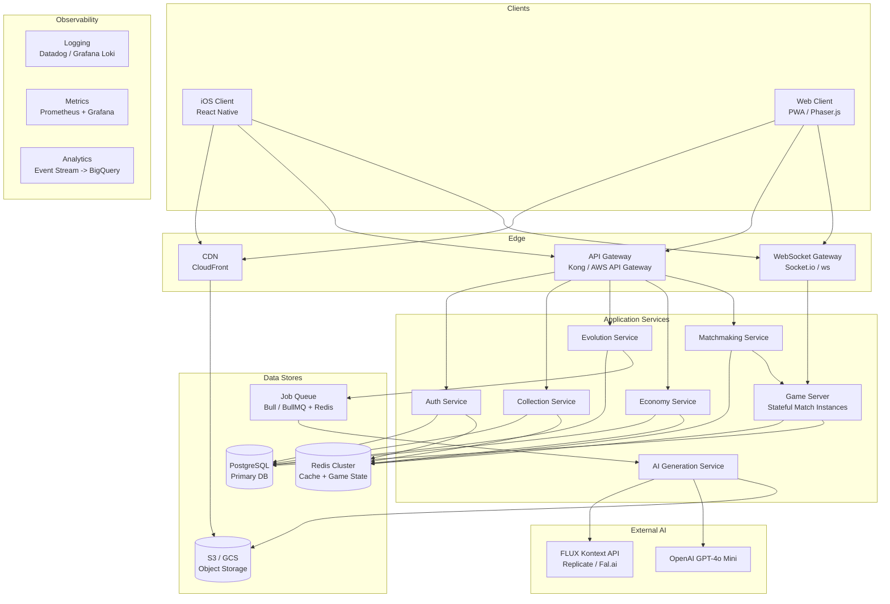
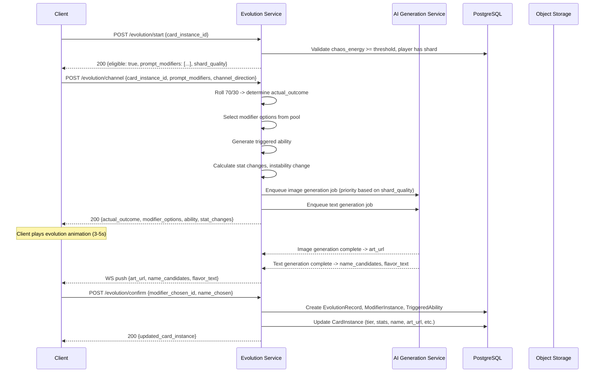
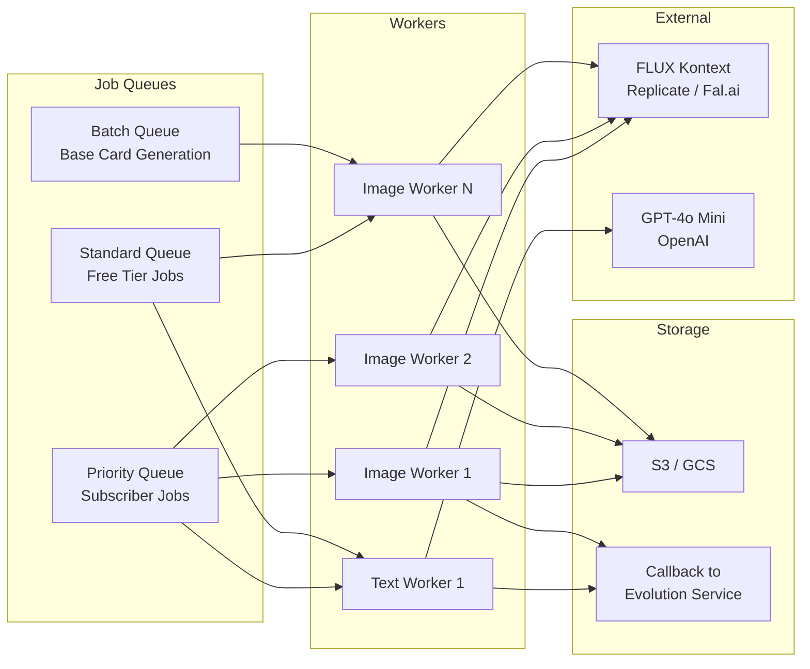
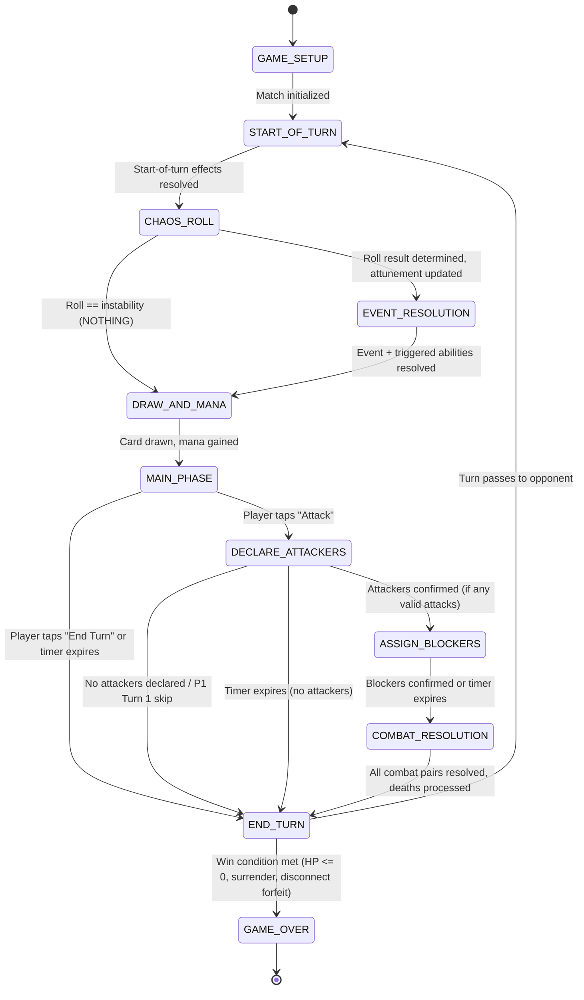
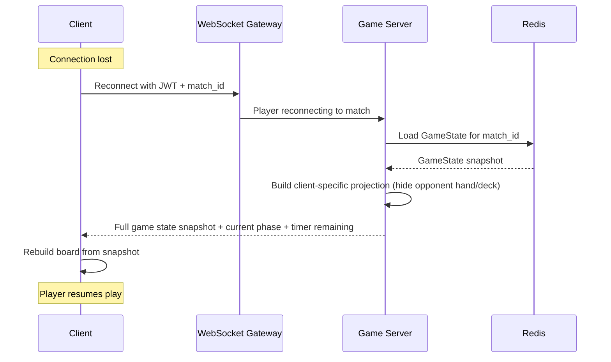
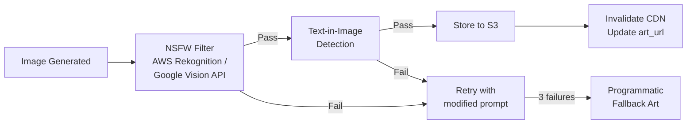
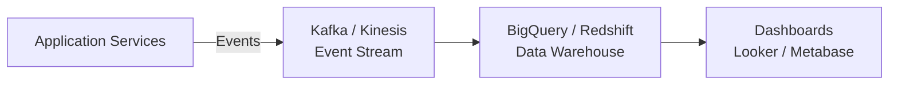
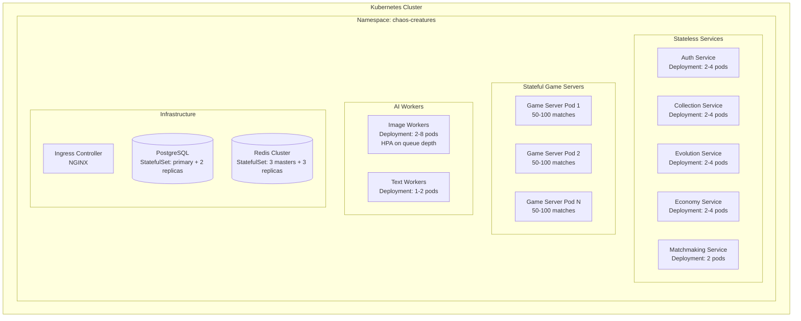

# 06 -- Technical Architecture

This document defines the system architecture, service design, API contracts, data infrastructure, and deployment strategy for Chaos Creatures. It is the engineering blueprint that translates the game design (00), battle mechanics (01), and data model (02) into a buildable system.

**Depends on:** `00-game-design-master.md`, `01-battle-mechanics.md`, `02-card-data-model.md`

---

## 1. System Overview

### 1.1 High-Level Architecture



### 1.2 Technology Stack

| Layer | Technology | Justification |
|---|---|---|
| **Client** | React Native (iOS primary) + Phaser.js (web prototype) | Cross-platform from a single codebase. React Native for native mobile feel; Phaser.js for the web prototype as noted in the master design doc. Supports 2D card rendering, particle effects, and animation without 3D overhead. |
| **API Gateway** | Kong or AWS API Gateway | Rate limiting, auth token validation, request routing, SSL termination. Kong is self-hosted and extensible; AWS API Gateway if deploying on AWS. |
| **WebSocket** | Socket.io over Node.js | Persistent connection for real-time match communication. Socket.io handles reconnection, room management, and fallback transports automatically. |
| **Backend Language** | TypeScript / Node.js | Shared language with client reduces context switching. Async I/O is ideal for WebSocket-heavy game servers. Strong typing via TypeScript catches data contract mismatches at compile time. |
| **Primary Database** | PostgreSQL 16 | Relational integrity for players, cards, decks, match records. JSONB columns for flexible nested structures (evolution_history, modifiers). Row-level security for multi-tenant data. |
| **Cache / Game State** | Redis 7 (Cluster mode) | Sub-millisecond reads for active game state, session tokens, matchmaking queue, leaderboards. Redis Streams for pub/sub between game server instances. |
| **Job Queue** | BullMQ (backed by Redis) | Reliable async job processing for AI generation. Supports priority queues (subscriber priority), retry logic, rate limiting, and dead-letter queues. |
| **Object Storage** | AWS S3 or Google Cloud Storage | Card art, generated evolution images, avatar portraits. Lifecycle policies for cost management. |
| **CDN** | CloudFront (AWS) or Cloud CDN (GCP) | Global edge caching for card art delivery. Reduces latency for image-heavy mobile clients. |
| **Image Generation** | FLUX Kontext via Replicate or Fal.ai | Image-to-image for evolution (preserves visual DNA). Dev variant for free tier, Pro variant for subscribers. Sub-10s generation times. |
| **Text Generation** | OpenAI GPT-4o Mini | Card names and flavor text. At $0.15/$0.60 per 1M tokens, text generation cost is negligible. Simple constrained creative text tasks. |
| **Container Orchestration** | Kubernetes (EKS or GKE) | Auto-scaling game servers by match load. Rolling deployments. Pod-level resource isolation. |
| **CI/CD** | GitHub Actions | Automated testing, linting, container builds, staged deployment. |
| **Monitoring** | Prometheus + Grafana, Datadog or equivalent | Metrics, alerting, dashboards. Match server latency, AI generation success rates, queue depths. |
| **Analytics** | Event stream (Kafka or Kinesis) to BigQuery/Redshift | Player behavior, balance telemetry, economy tracking, AI cost reporting. |

---

## 2. Service Architecture

### 2.1 Auth Service

Handles account creation, authentication, and session management.

**Responsibilities:**
- Apple Sign-In (primary OAuth provider for iOS)
- JWT session token issuance and refresh
- Subscription tier verification (integrates with Apple App Store Server API for receipt validation)
- Account linking, display name management, friend code generation
- Rate limiting on auth endpoints (brute-force protection)

**Data owned:**
- Player credentials and OAuth tokens (encrypted at rest)
- Session tokens in Redis (TTL-based expiry)
- Subscription state (synced from App Store receipts)

**Key flows:**
1. Client sends Apple ID token -> Auth Service validates with Apple -> issues JWT (access + refresh)
2. Access token included in all subsequent API calls via Authorization header
3. Subscription changes detected via App Store Server Notifications (webhook) -> updates `Player.subscription_tier`

### 2.2 Game Server

Manages real-time matches. Each active match runs as a stateful game loop on a game server instance.

**Responsibilities:**
- WebSocket connection management (both players connected to the same match instance)
- Full game state machine (Section 3 below)
- Server-authoritative turn resolution -- client sends actions, server validates and applies
- Timer management (60s decision, 10s event choice sub-timer)
- Chaos roll RNG (seeded per match for reproducibility)
- Combat resolution with full keyword priority algorithm
- Reconnection handling (game state snapshot restoration)
- Match result persistence to MatchRecord

**Data owned (runtime):**
- `GameState` object in Redis (keyed by `match_id`)
- WebSocket room per match
- Match RNG seed

**Scaling model:**
- Each game server pod handles N concurrent matches (target: 50-100 matches per pod)
- Horizontal scaling via Kubernetes HPA based on WebSocket connection count and CPU
- Matches are pinned to a specific pod for the duration of the game (sticky sessions via match_id routing)
- If a pod fails, matches can be recovered from Redis game state snapshot (within the reconnection window)

### 2.3 Collection Service

Manages card ownership, deck building, and inventory.

**Responsibilities:**
- CardInstance CRUD (create on pack opening or evolution, read for collection/deck views)
- Deck management (create, edit, validate, delete)
- Deck validation enforcement (20 cards, single faction, max 2 copies, max 2 Legendaries at 1 copy each)
- Card favoriting, dismantling (shard recovery)
- Collection limit enforcement by subscription tier (50/100/200 cards per faction)

**Data owned:**
- `CardInstance` table
- `Deck` and `DeckEntry` tables
- `ModifierInstance` and `TriggeredAbility` tables (attached to card instances)

**Key endpoints:** See Section 6 (API Design).

### 2.4 Evolution Service

Orchestrates the full card evolution flow, coordinating between the client, AI Generation Service, and Collection Service.

**Responsibilities:**
- Evolution eligibility validation (chaos energy threshold, shard availability, card tier)
- Shard deduction and quality determination (PLANAR/REFINED/PRISMATIC based on subscription tier)
- 70/30 channeling roll execution
- Modifier pool selection (PP budget, tier bracket, attunement, faction)
- Triggered ability generation for the evolution step
- Stat increase calculation based on PP growth tables
- Instability change calculation based on evolution outcome
- Coordination with AI Generation Service for art + text
- Final CardInstance update after player confirms choices

**Flow (maps directly to Data Model Section 20, "Card Evolution Flow"):**



### 2.5 Economy Service

Manages all currency transactions, shard inventory, quest tracking, and progression.

**Responsibilities:**
- Chaos Dust balance management (earn from matches, spend on packs/shards/avatars)
- Shard inventory management (earn from purchases, consume on evolution)
- Card pack generation (draw 3 random Commons from faction pool, duplicate protection)
- Quest assignment, progress tracking, and reward distribution
- Season milestone tracking and reward disbursement
- Subscription benefit application (+50%/+100% quest dust, monthly card/shard grants)
- Transaction logging for all currency movements (audit trail)

**Data owned:**
- `Player.chaos_dust`, `Player.shards_*` fields
- `ShardTransaction` table (audit log)
- `Mission` table
- `PlayerAchievement` table

**Transactional safety:** All currency operations use PostgreSQL transactions with row-level locking on the Player record to prevent double-spend. Shard deduction during evolution is atomic with the evolution record creation.

### 2.6 Matchmaking Service

Pairs players for matches and spawns game server instances.

**Responsibilities:**
- Queue management (players enter queue with a validated deck)
- Rank-based matching for Ranked mode (match within +/- 2 rank tiers, expanding over time)
- Hidden MMR matching for Casual mode
- AI opponent selection for Practice mode (difficulty-based deck selection)
- Match creation: assigns Player 1/Player 2, creates GameState, notifies both clients via WebSocket

**Algorithm:**
1. Player enters queue -> stored in Redis sorted set keyed by rank/MMR
2. Every 1 second, matchmaker scans the queue for viable pairs
3. Match quality score = |rank_difference|; pairs with lowest score are matched first
4. If a player has waited >10s, expand search range by 1 rank tier per 5 additional seconds
5. At 30s, match with any available player within 5 rank tiers
6. At 45s, match with any available player
7. Once paired: create GameState in Redis, assign match to a game server pod, notify both clients via WebSocket with match_id

**Queue data structure (Redis):**
```
matchmaking:ranked:{rank_tier} -> Sorted Set (score = queue_entry_timestamp, member = player_id)
matchmaking:casual -> Sorted Set (score = hidden_mmr, member = player_id)
matchmaking:player:{player_id} -> Hash {deck_id, avatar_id, faction_id, queued_at, mode}
```

### 2.7 AI Generation Service

Handles all AI model integrations for image and text generation. Runs as async job workers consuming from BullMQ queues.

**Responsibilities:**
- FLUX Kontext image generation (evolution art, batch base card art)
- GPT-4o Mini text generation (card names, flavor text)
- Quality check pipeline (NSFW filter, text-in-image detection)
- Retry logic with exponential backoff
- Rate limiting per user tier
- Cost tracking per generation call
- Result storage to S3 and metadata callback to Evolution Service

**Architecture:**



**Queue priority:**
- Subscriber (REFINED/PRISMATIC shards): priority queue, processed first
- Free tier (PLANAR shards): standard queue, processed after priority
- Batch pipeline (pre-launch base cards): lowest priority, processed during off-peak

**Rate limits:**
| Tier | Evolutions per day | Rationale |
|---|---|---|
| Free | 5 | Limits AI cost for non-paying users |
| Mid | 15 | Reasonable evolution pace for active subscribers |
| High | 30 | Full collector experience |
| Batch pipeline | 1000/hour | Controlled burn during pre-launch generation |

---

## 3. Game Server Deep Dive

### 3.1 Game State Machine

The game server implements a finite state machine that maps directly to the `TurnPhase` enum from the data model (Section 13 of `02-card-data-model.md`).



**Phase transition rules:**

| From | To | Trigger | Server Action |
|---|---|---|---|
| `GAME_SETUP` | `START_OF_TURN` | Both players connected, decks shuffled, hands drawn, mulligan resolved | Create GameState, assign P1/P2, deal opening hands |
| `START_OF_TURN` | `CHAOS_ROLL` | Automatic after start-of-turn effects | Fire start-of-turn effects (Corruption self-damage, stabilizer auras) left-to-right by slot. Check deaths. Recalculate instability. |
| `CHAOS_ROLL` | `EVENT_RESOLUTION` | Roll != instability | Roll D20, compare to instability, update attunement state on all creatures, recalculate stats |
| `CHAOS_ROLL` | `DRAW_AND_MANA` | Roll == instability | Skip event phase entirely |
| `EVENT_RESOLUTION` | `DRAW_AND_MANA` | Event effect resolved, triggers fired | Select random event, resolve effect, fire ON_ORDER/ON_CHAOS triggers left-to-right, process deaths, recalculate instability |
| `DRAW_AND_MANA` | `MAIN_PHASE` | Automatic | Draw 1 card (if deck non-empty), gain 1 mana (up to cap 10). Start 60s decision timer. |
| `MAIN_PHASE` | `DECLARE_ATTACKERS` | Client sends `action:attack` | Validate all cards played were legal. Transition to attacker selection. |
| `MAIN_PHASE` | `END_TURN` | Client sends `action:end_turn` OR timer expires | No combat this turn |
| `DECLARE_ATTACKERS` | `ASSIGN_BLOCKERS` | Client sends `action:confirm_attackers` | Validate Taunt forced-attack rules. Lock attacker list. Switch control to defending player. Start defender's 60s timer. |
| `DECLARE_ATTACKERS` | `END_TURN` | P1 Turn 1 OR no valid attackers OR timer expires | Skip combat |
| `ASSIGN_BLOCKERS` | `COMBAT_RESOLUTION` | Client sends `action:confirm_blockers` OR timer expires | Validate Taunt forced-block rules. If timer expired: no blockers assigned. |
| `COMBAT_RESOLUTION` | `END_TURN` | All combat resolved | Execute full combat algorithm (Section 3.3). Process deaths. Check win condition. |
| `END_TURN` | `START_OF_TURN` | No win condition met | Expire temporary buffs. Recalculate stats. Advance turn counter. Switch active player. |
| `END_TURN` | `GAME_OVER` | Win condition met | Record MatchRecord. Award chaos energy to all deck cards. Update player stats/rank. Notify clients. |

### 3.2 Turn Resolution Algorithm

The server processes each turn through the 9-phase pipeline. All game logic runs server-side. The client sends only discrete actions; the server validates, applies, and broadcasts results.

**Phase 1: Start of Turn**
```
function resolveStartOfTurn(state: GameState):
    state.current_turn += 1
    activePlayer = getActivePlayer(state)

    // Fire start-of-turn effects left-to-right (slot 0 -> slot 4)
    for slot in 0..4:
        creature = activePlayer.board[slot]
        if creature == null or !creature.is_alive: continue

        // Corruption self-damage
        for modifier in creature.modifiers:
            if modifier has start-of-turn self-damage effect:
                applyDamage(creature, modifier.damage_value)

        // Stabilizer aura effects (already passive, but some trigger at start)

    // Check deaths from start-of-turn effects
    processDeaths(state, activePlayer)

    // Recalculate instability after board changes
    recalculateInstability(activePlayer)
```

**Phase 2: Chaos Roll**
```
function resolveChaosRoll(state: GameState):
    activePlayer = getActivePlayer(state)
    roll = state.rng.nextInt(1, 20)  // Seeded RNG for reproducibility

    state.last_roll_value = roll

    if roll < activePlayer.instability:
        state.last_roll_event = CHAOS
    else if roll > activePlayer.instability:
        state.last_roll_event = ORDER
    else:
        state.last_roll_event = NOTHING
        return  // Skip to DRAW_AND_MANA

    // Update attunement state on all active player's creatures
    activePlayer.last_event_type = state.last_roll_event
    for creature in activePlayer.board:
        if creature == null: continue
        for modifier in creature.modifiers:
            modifier.is_attuned_active = (modifier.attunement == state.last_roll_event)
            modifier.is_penalty_active = (modifier.has_penalty AND modifier.attunement != state.last_roll_event)

    // Recalculate all creature stats with new attunement state
    recalculateAllCreatureStats(activePlayer)

    // Recalculate player instability (modifier instability adjustments may have changed)
    recalculateInstability(activePlayer)
```

**Phase 3: Event Resolution**
```
function resolveEvent(state: GameState):
    if state.last_roll_event == NOTHING: return

    activePlayer = getActivePlayer(state)
    eventPool = getEventPool(state.last_roll_event)  // 8 events
    selectedEvent = eventPool[state.rng.nextInt(0, 7)]  // Equal weight

    state.last_roll_event_id = selectedEvent.id

    // Resolve event effect
    resolveEffect(state, selectedEvent.effect, activePlayer)

    // For events requiring player choice (O2 Planar Ward, O5 Fortify):
    // Send choice request to client with 10s sub-timer
    // If timeout: auto-select leftmost valid target

    // Fire triggered abilities left-to-right (slot 0 -> slot 4)
    triggerType = (state.last_roll_event == ORDER) ? ON_ORDER : ON_CHAOS
    for slot in 0..4:
        creature = activePlayer.board[slot]
        if creature == null or !creature.is_alive: continue
        for ability in creature.triggered_abilities:
            if ability.trigger == triggerType:
                resolveEffect(state, ability.effect, activePlayer)

    // Process deaths from event/ability effects
    processDeaths(state, activePlayer)

    // Recalculate instability after board changes
    recalculateInstability(activePlayer)
```

**Phase 4: Draw and Gain Mana**
```
function resolveDrawAndMana(state: GameState):
    activePlayer = getActivePlayer(state)

    // Draw 1 card
    if activePlayer.deck.length > 0:
        card = activePlayer.deck.shift()  // Remove from top
        activePlayer.hand.push(card)

    // Gain 1 mana (up to cap)
    if activePlayer.current_mana < activePlayer.mana_cap:
        activePlayer.current_mana += 1
```

**Phase 5: Main Phase (client-driven, server-validated)**
```
// Client sends individual actions; server validates each one:

function handlePlayCard(state: GameState, action: PlayCardAction):
    activePlayer = getActivePlayer(state)
    card = findInHand(activePlayer, action.card_id)

    validate(card != null, "Card not in hand")
    validate(card.mana_cost <= activePlayer.current_mana, "Not enough mana")

    if card.card_type == CREATURE or card.card_type == STABILIZER:
        validate(action.target_slot != null, "Must specify board slot")
        validate(activePlayer.board[action.target_slot] == null, "Slot occupied")

    // Deduct mana
    activePlayer.current_mana -= card.mana_cost

    // Remove from hand
    removeFromHand(activePlayer, card)

    if card.card_type == CREATURE:
        placedCreature = createBattleCreature(card, action.target_slot)
        activePlayer.board[action.target_slot] = placedCreature
        // Fire ON_PLAY triggered abilities
        for ability in placedCreature.triggered_abilities:
            if ability.trigger == ON_PLAY:
                resolveEffect(state, ability.effect, activePlayer)
        recalculateInstability(activePlayer)

    else if card.card_type == SPELL:
        resolveSpellEffect(state, card, action.target_id)
        activePlayer.graveyard.push(card)

    else if card.card_type == STABILIZER:
        placedStabilizer = createBattleCreature(card, action.target_slot)
        activePlayer.board[action.target_slot] = placedStabilizer
        recalculateInstability(activePlayer)

    // Handle Chaos Spark
    if card is CHAOS_SPARK:
        activePlayer.current_mana += 1  // Temporary +1
        activePlayer.has_chaos_spark = false
```

**Phase 6: Declare Attackers (client-driven, server-validated)**
```
function handleDeclareAttackers(state: GameState, action: DeclareAttackersAction):
    // P1 Turn 1 restriction
    if state.current_turn == 1 AND state.active_player == state.first_player:
        validate(false, "P1 cannot attack on turn 1")

    activePlayer = getActivePlayer(state)
    defendingPlayer = getDefendingPlayer(state)

    attackerIds = action.attacker_creature_ids

    // Validate each attacker exists and is alive on the board
    for id in attackerIds:
        creature = findOnBoard(activePlayer, id)
        validate(creature != null AND creature.is_alive, "Invalid attacker")

    // Validate Taunt forced-attack minimum
    opponentTauntCount = countTauntCreatures(defendingPlayer)
    minAttackers = min(opponentTauntCount, countAttackableCreatures(activePlayer))
    validate(attackerIds.length >= minAttackers, "Must attack with at least N creatures due to Taunt")

    // Fire ON_ATTACK triggered abilities
    for id in attackerIds:
        creature = findOnBoard(activePlayer, id)
        for ability in creature.triggered_abilities:
            if ability.trigger == ON_ATTACK:
                resolveEffect(state, ability.effect, activePlayer)

    state.declared_attackers = attackerIds
```

**Phase 7: Assign Blockers (defending player, server-validated)**
```
function handleAssignBlockers(state: GameState, action: AssignBlockersAction):
    defendingPlayer = getDefendingPlayer(state)
    activePlayer = getActivePlayer(state)

    assignments = action.blocker_assignments  // [{blocker_id, attacker_id}]

    // Validate each assignment
    usedBlockers = new Set()
    usedAttackers = new Set()
    for assignment in assignments:
        blocker = findOnBoard(defendingPlayer, assignment.blocker_id)
        attacker = findOnBoard(activePlayer, assignment.attacker_id)

        validate(blocker != null AND blocker.is_alive, "Invalid blocker")
        validate(attacker != null AND state.declared_attackers.includes(attacker.id), "Invalid attacker target")
        validate(!usedBlockers.has(blocker.id), "Blocker already assigned")
        validate(!usedAttackers.has(attacker.id), "Attacker already blocked")

        // Flying check: Flying attacker can only be blocked by Flying or Reach
        if FLYING in attacker.active_keywords:
            validate(FLYING in blocker.active_keywords OR REACH in blocker.active_keywords,
                     "Cannot block Flying without Flying or Reach")

        // Stabilizers cannot block
        validate(blocker.card_type != STABILIZER, "Stabilizers cannot block")

        usedBlockers.add(blocker.id)
        usedAttackers.add(attacker.id)

    // Validate Taunt forced-block: all Taunt creatures MUST block if they can legally block any attacker
    for creature in defendingPlayer.board:
        if creature == null OR !creature.is_alive: continue
        if TAUNT not in creature.active_keywords: continue
        if creature.id in usedBlockers: continue  // Already blocking

        // Check if any unblocked attacker can be legally blocked by this Taunt
        for attackerId in state.declared_attackers:
            if attackerId in usedAttackers: continue  // Already blocked
            attacker = findOnBoard(activePlayer, attackerId)
            if FLYING in attacker.active_keywords:
                if FLYING not in creature.active_keywords AND REACH not in creature.active_keywords:
                    continue  // Cannot legally block
            // This Taunt creature can block this attacker but wasn't assigned
            validate(false, "Taunt creature must block if able")

    // Fire ON_BLOCK triggered abilities
    for assignment in assignments:
        blocker = findOnBoard(defendingPlayer, assignment.blocker_id)
        for ability in blocker.triggered_abilities:
            if ability.trigger == ON_BLOCK:
                resolveEffect(state, ability.effect, defendingPlayer)

    state.blocker_assignments = assignments
```

### 3.3 Combat Resolution Algorithm

Implements the full keyword priority order from `01-battle-mechanics.md` Phase 8. All damage is simultaneous.

```
function resolveCombat(state: GameState):
    activePlayer = getActivePlayer(state)
    defendingPlayer = getDefendingPlayer(state)
    destroyedCreatures = []

    // --- Blocked combat pairs ---
    for assignment in state.blocker_assignments:
        attacker = findOnBoard(activePlayer, assignment.attacker_creature_id)
        blocker = findOnBoard(defendingPlayer, assignment.blocker_creature_id)

        attackerDamageToBlocker = attacker.attack
        blockerDamageToAttacker = blocker.attack

        // STEP 1: SHIELD CHECK (both sides)
        attackerShieldAbsorbed = false
        blockerShieldAbsorbed = false

        if blocker.shield_active:
            // Shield absorbs ALL damage from attacker
            blocker.shield_active = false
            attackerDamageToBlocker = 0
            blockerShieldAbsorbed = true

        if attacker.shield_active:
            // Shield absorbs ALL damage from blocker
            attacker.shield_active = false
            blockerDamageToAttacker = 0
            attackerShieldAbsorbed = true

        // STEP 2: DEAL DAMAGE (simultaneous)
        blocker.health -= attackerDamageToBlocker
        attacker.health -= blockerDamageToAttacker

        // STEP 3: DEATHTOUCH CHECK
        if DEATHTOUCH in attacker.active_keywords AND attackerDamageToBlocker > 0:
            blocker.is_alive = false
            destroyedCreatures.push({creature: blocker, side: DEFENDING})

        if DEATHTOUCH in blocker.active_keywords AND blockerDamageToAttacker > 0:
            attacker.is_alive = false
            destroyedCreatures.push({creature: attacker, side: ATTACKING})

        // STEP 4: NORMAL DEATH CHECK
        if blocker.health <= 0 AND blocker.is_alive:
            blocker.is_alive = false
            destroyedCreatures.push({creature: blocker, side: DEFENDING})

        if attacker.health <= 0 AND attacker.is_alive:
            attacker.is_alive = false
            destroyedCreatures.push({creature: attacker, side: ATTACKING})

        // STEP 5: PIERCING CHECK (attacker only)
        if PIERCING in attacker.active_keywords AND !blockerShieldAbsorbed:
            if attackerDamageToBlocker > 0:
                overkill = attacker.attack - blocker.max_health  // Use pre-damage health
                if overkill > 0:
                    defendingPlayer.current_hp -= overkill

        // STEP 6: LIFESTEAL CHECK (both sides)
        if LIFESTEAL in attacker.active_keywords:
            activePlayer.current_hp += attackerDamageToBlocker  // 0 if shield absorbed
            activePlayer.current_hp = min(activePlayer.current_hp, activePlayer.max_hp)

        if LIFESTEAL in blocker.active_keywords:
            defendingPlayer.current_hp += blockerDamageToAttacker  // 0 if shield absorbed
            defendingPlayer.current_hp = min(defendingPlayer.current_hp, defendingPlayer.max_hp)

    // --- Unblocked attackers ---
    blockedAttackerIds = state.blocker_assignments.map(a => a.attacker_creature_id)
    for attackerId in state.declared_attackers:
        if attackerId in blockedAttackerIds: continue

        attacker = findOnBoard(activePlayer, attackerId)
        if !attacker.is_alive: continue

        // Deal damage to face
        defendingPlayer.current_hp -= attacker.attack

        // Lifesteal on face damage
        if LIFESTEAL in attacker.active_keywords:
            activePlayer.current_hp += attacker.attack
            activePlayer.current_hp = min(activePlayer.current_hp, activePlayer.max_hp)

    // STEP 7: Remove destroyed creatures
    for entry in destroyedCreatures:
        removeFromBoard(entry.creature)

    // STEP 8: Fire ON_DEATH abilities
    // Active player's deaths first, then defending player's deaths
    // Left-to-right by board slot within each side
    activeDeaths = destroyedCreatures.filter(e => e.side == ATTACKING).sort(by slot)
    defendingDeaths = destroyedCreatures.filter(e => e.side == DEFENDING).sort(by slot)

    for entry in [...activeDeaths, ...defendingDeaths]:
        for ability in entry.creature.triggered_abilities:
            if ability.trigger == ON_DEATH:
                resolveEffect(state, ability.effect, getPlayerBySide(state, entry.side))

    // STEP 9: Recalculate both players' instability
    recalculateInstability(activePlayer)
    recalculateInstability(defendingPlayer)

    // STEP 10: Check win condition
    if defendingPlayer.current_hp <= 0 AND activePlayer.current_hp <= 0:
        // Simultaneous death: active player loses
        state.winner = defendingPlayer
    else if defendingPlayer.current_hp <= 0:
        state.winner = activePlayer
    else if activePlayer.current_hp <= 0:
        state.winner = defendingPlayer

    // Clear combat state
    state.declared_attackers = []
    state.blocker_assignments = []
```

### 3.4 Event System

**Random event selection:** The server maintains a seeded PRNG per match. When an event is needed, the server picks uniformly at random from the 8-event pool for the triggered type (12.5% each).

**Event targeting resolution:**
- Events with deterministic targets (e.g., O1 Mending Light: "most damaged creature") are resolved server-side immediately.
- Events requiring player choice (O2 Planar Ward, O5 Fortify) send a choice request to the client with a 10-second sub-timer. This sub-timer does NOT count against the 60-second decision timer. On timeout, the server auto-selects the leftmost valid target.
- Events with random targets (e.g., C1 Surge: "random friendly creature") use the match PRNG.

**Triggered ability resolution order:**
1. The event effect resolves first.
2. Then, all ON_ORDER or ON_CHAOS triggered abilities on the active player's creatures fire left-to-right by board slot (slot 0 through slot 4).
3. Each ability fully resolves before the next fires.
4. If an ability kills a creature in a later slot, that creature's ability does not fire.
5. If an ability buffs a creature in a later slot, that creature benefits from the buff when its own ability fires.

### 3.5 Taunt Enforcement

Taunt is a two-part rule enforced at two separate phases:

**Phase 6 -- Forced Attack:**
- Count the number of Taunt creatures on the defending player's board.
- The active player must declare at least that many attackers (up to the number of creatures they control that can legally attack).
- The active player chooses which of their creatures to send; the server only enforces the minimum count.
- If the active player has fewer creatures than the opponent has Taunts, all their creatures must attack.

**Phase 7 -- Forced Block:**
- All Taunt creatures on the defending player's board must be assigned as blockers if there is any attacker they can legally block.
- A Taunt creature cannot be forced to block a Flying attacker unless it has Flying or Reach.
- The defending player chooses which attacker each Taunt creature blocks.

### 3.6 Timer Management

**Decision timer (60 seconds):**
- Starts when `MAIN_PHASE` begins for the active player.
- Covers phases 5-6 (play cards and declare attackers) as one continuous window.
- At 15 seconds remaining: server sends a `timer:warning` event to the client.
- At 0 seconds: server auto-ends the turn (no cards played, no attackers declared).

**Defender timer (60 seconds):**
- Starts when `ASSIGN_BLOCKERS` begins for the defending player.
- At 0 seconds: no blockers assigned, all attackers hit face.

**Event choice sub-timer (10 seconds):**
- Starts when an event requiring player choice fires (O2 Planar Ward, O5 Fortify).
- Does NOT count against the decision timer.
- At 0 seconds: auto-select leftmost valid target.

**Disconnect timer:**
- If a player disconnects, their decision timer continues running.
- If the timer expires while disconnected, the turn auto-ends.
- Track `consecutive_missed_turns` on the BattlePlayer.
- At 3 consecutive missed turns: auto-forfeit (EndReason: DISCONNECT).

### 3.7 Anti-Cheat: Server-Authoritative Design

The client is a rendering and input layer only. All game logic is server-authoritative.

**What the client sends (actions only):**
| Action | Payload | Phase |
|---|---|---|
| `play_card` | `{card_id, target_slot?, target_id?}` | MAIN_PHASE |
| `use_chaos_spark` | `{}` | MAIN_PHASE |
| `end_main_phase` | `{}` | MAIN_PHASE |
| `declare_attackers` | `{attacker_ids: string[]}` | DECLARE_ATTACKERS |
| `assign_blockers` | `{assignments: [{blocker_id, attacker_id}]}` | ASSIGN_BLOCKERS |
| `choose_event_target` | `{creature_id}` | EVENT_RESOLUTION (sub-timer) |
| `surrender` | `{}` | Any (after turn 2) |

**What the server validates on every action:**
- Action is legal in the current phase
- It is the correct player's turn to act
- The action is within the timer window
- Card is in the player's hand and they have enough mana
- Board slot is empty (for placement)
- Blocker assignments satisfy Taunt rules
- No impossible targeting (e.g., blocking Flying without Reach)

**What the client never knows:**
- Opponent's hand contents
- Opponent's deck order
- The match PRNG seed
- Upcoming event results

**What the client receives:**
- Full board state for both players (public information)
- Own hand and deck count (own private information)
- Opponent hand count and deck count (public)
- All roll results, event effects, trigger activations, damage numbers, stat changes
- Game log entries for the current turn

### 3.8 Reconnection Handling



**Key reconnection rules:**
- Game state is persisted to Redis on every state mutation (phase transition, action resolution).
- The reconnecting player receives the full game state snapshot minus hidden information.
- If the player was mid-decision (timer running), the timer continues from where it was.
- The opponent sees "Opponent reconnected" when the player returns.
- Maximum reconnection window: 3 consecutive timer expirations (3 missed turns). After that, auto-forfeit.

---

## 4. AI Generation Pipeline

### 4.1 Architecture Overview

AI generation is asynchronous. The player triggers an evolution; the server enqueues generation jobs; results arrive seconds later and are pushed to the client. This decouples the evolution ceremony from API latency.

### 4.2 FLUX Kontext Integration (Image Generation)

**Input construction:**
```
{
  model: shard_quality == PLANAR ? "flux-kontext-dev" : "flux-kontext-pro",
  input_image: card.art_url,  // Current card art as reference
  prompt: buildEvolutionPrompt(faction, evolution_direction, player_modifiers, history),
  width: shard_quality == PLANAR ? 768 : 1024,
  height: shard_quality == PLANAR ? 1024 : 1024,
  guidance_scale: evolution_outcome == ORDER ? 7.5 : 12.0,  // Lower for subtle, higher for dramatic
  num_inference_steps: shard_quality == PRISMATIC ? 50 : 28
}
```

**Prompt construction (maps to master doc Section 13a):**
```
function buildEvolutionPrompt(faction, direction, playerModifiers, history):
    parts = []

    // Layer 1: Faction art prefix
    parts.push(faction.art_prompt_prefix)

    // Layer 2: Evolution direction
    if direction == ORDER:
        parts.push("subtle structural refinement, crystalline growth, luminous details, refined armor plating")
    else:
        parts.push("dramatic transformation, fractured forms, wild chaos energy, distorted silhouettes, vivid colors")

    // Layer 3: Player-selected prompt modifiers (curated list)
    for mod in playerModifiers:
        parts.push(mod)  // e.g., "crystalline armor", "chaos veins", "luminous eyes"

    // Layer 4: Evolution history context
    orderCount = history.filter(h => h.actual_outcome == ORDER).length
    chaosCount = history.filter(h => h.actual_outcome == CHAOS).length
    parts.push(`This creature has undergone ${orderCount} order transformations and ${chaosCount} chaos transformations.`)

    return parts.join(". ")
```

**Two-pass generation (PRISMATIC shards only):**
1. First pass: generate evolved art with standard parameters.
2. Second pass: take the first-pass output as input, apply a refinement prompt ("enhance detail, increase clarity, sharpen edges, maintain character consistency"), lower denoising strength (0.2-0.3).

### 4.3 GPT-4o Mini Integration (Text Generation)

**Request construction:**
```
{
  model: "gpt-4o-mini",
  messages: [
    {
      role: "system",
      content: `You are a card name and flavor text generator for a fantasy card game.
                Faction voice: ${faction.flavor_voice}
                Name voice: ${faction.name_voice}
                Generate concise, evocative names and atmospheric flavor text.`
    },
    {
      role: "user",
      content: `Card base name: ${template.name}
                Current name: ${card.current_name}
                Evolution tier: ${from_tier} -> ${to_tier}
                Evolution direction: ${actual_outcome}
                Previous names: ${evolution_history.map(h => h.name_chosen).join(" -> ")}
                Evolution history: ${orderCount} order, ${chaosCount} chaos transformations

                Generate:
                1. Three name candidates (concise, 1-4 words each)
                2. One flavor text (1-2 sentences, ${faction.flavor_voice})`
    }
  ],
  max_tokens: 150,
  temperature: 0.8
}
```

**Response parsing:** Parse the structured response to extract name candidates and flavor text. If parsing fails, retry with a more constrained prompt (JSON mode).

### 4.4 Quality Check Pipeline

Every generated image passes through a quality pipeline before being stored:



**NSFW filter:** Use AWS Rekognition or Google Cloud Vision API to detect inappropriate content. Threshold: reject if confidence > 80% on any unsafe category.

**Text-in-image detection:** FLUX occasionally embeds text artifacts in generated images. Run OCR detection; if significant text is found, retry generation with an explicit "no text, no letters, no words" addition to the prompt.

**Retry logic:** Exponential backoff with jitter. Max 3 retries per generation. After 3 failures, apply programmatic fallback (color shift + particle overlay matching evolution direction on the existing art). Queue a background retry for the full AI art.

**Fallback art:** A server-side image processing pipeline (using Sharp or similar) applies:
- Order evolution: blue/gold color grade, crystalline particle overlay
- Chaos evolution: red/purple color grade, fracture/crack overlay

### 4.5 Cost Management

| Tier | Image Model | Cost/Image | Text Cost/Call | Monthly Cap | Est. Monthly Cost |
|---|---|---|---|---|---|
| Free | FLUX Kontext Dev | ~$0.02 | ~$0.0001 | 5 evolutions/day | $0.20-0.30/user |
| Mid | FLUX Kontext Pro | ~$0.04 | ~$0.0001 | 15 evolutions/day | ~$1.00/user |
| High | FLUX Kontext Pro (2-pass) | ~$0.08 | ~$0.0001 | 30 evolutions/day | ~$1.70/user |
| Batch | FLUX Dev (t2i) | ~$0.025 | ~$0.0001 | N/A | ~$10 total for 375 cards |

**Cost tracking:** Every AI generation call logs the model used, input/output tokens (text) or resolution (image), actual cost, and the player/card it was generated for. This feeds into the analytics pipeline for cost monitoring and per-user cost attribution.

**Abuse prevention:**
- Per-user daily evolution caps (enforced at the Evolution Service level)
- Per-user rate limiting on AI generation endpoints (token bucket algorithm in Redis)
- Anomaly detection: flag users generating significantly more than expected for their tier

### 4.6 Storage

**Object storage layout:**
```
s3://chaos-creatures-art/
    base/                          # Base card art from batch pipeline
        {faction_id}/
            {template_id}.png
    evolution/                     # Evolution art per player per card
        {player_id}/
            {card_instance_id}/
                step-{1-4}.png     # Art at each evolution step
    avatars/                       # Avatar portraits
        {avatar_id}.png
    fallback/                      # Programmatic fallback art
        {card_instance_id}/
            step-{1-4}.png
```

**CDN configuration:**
- Cache TTL: 1 year for base art (immutable), 1 hour for evolution art (may be replaced by retry)
- Serve via CloudFront with origin S3 bucket
- Client caches images locally with the art_url as cache key

---

## 5. Data Architecture

### 5.1 PostgreSQL Schema

The primary relational database stores all persistent game data. Schema maps directly to the entities in `02-card-data-model.md`.

**Core tables:**

| Table | Source Entity | Key Columns | Notes |
|---|---|---|---|
| `players` | Player (Section 12) | id, display_name, apple_id, subscription_tier, chaos_dust, shards_*, season_rank | Row-level locking for currency operations |
| `card_templates` | CardTemplate (Section 1) | id, name, card_type, faction_id, base_attack, base_health, base_instability, mana_cost | Immutable after approval. Global data. |
| `card_instances` | CardInstance (Section 2) | id, template_id, owner_id, tier, current_name, current_attack, current_health, instability_value, chaos_energy, art_url | Per-player. evolution_history, modifiers, triggered_abilities stored as JSONB arrays for read performance. |
| `modifier_definitions` | ModifierDefinition (Section 4a) | id, name, pool_type, faction_id, pp_cost, tier_bracket, attunement | Global content data. 240 rows at launch. |
| `decks` | Deck (Section 11) | id, owner_id, name, faction_id, avatar_id, is_valid | |
| `deck_entries` | DeckEntry (Section 11) | deck_id, card_instance_id, quantity | Composite PK (deck_id, card_instance_id) |
| `factions` | Faction (Section 10) | id, name, short_name, exclusive_mechanic, art_prompt_prefix | Global data. 3 rows at launch. |
| `avatars` | Avatar (Section 9) | id, name, faction_id, instability_modifier | Global data. 6 rows at launch. |
| `match_records` | MatchRecord (Section 14) | id, mode, player_1_id, player_2_id, winner_id, end_reason, total_turns | full_log stored as compressed JSONB. |
| `missions` | Mission (Section 16) | id, player_id, mission_type, target_value, current_value, expires_at | TTL-indexed for cleanup. |
| `achievements` | Achievement (Section 17) | id, name, category, target_value | Global definitions. |
| `player_achievements` | PlayerAchievement (Section 17) | player_id, achievement_id, current_value, is_unlocked | Per-player progress. |
| `shard_transactions` | ShardTransaction (Section 15) | id, player_id, shard_tier, amount, source | Audit trail for all shard movements. |
| `event_definitions` | EventDefinition (Section 8) | id, name, event_type, effect (JSONB) | 16 rows. Global content data. |

**JSONB usage:** CardInstance stores `evolution_history`, `modifiers`, and `triggered_abilities` as JSONB arrays rather than separate normalized tables. This is a deliberate denormalization for read performance -- a card's full data is fetched in a single row read. Write frequency is low (only on evolution, which happens at most a few times per day per card). The data model's `ModifierInstance` and `TriggeredAbility` are embedded within the CardInstance JSONB.

**Key indexes (from data model Section 19):**

| Query Pattern | Index |
|---|---|
| Player's cards in a faction | `card_instances(owner_id, template_id)` + join to `card_templates(faction_id)` |
| Evolution-ready cards | `card_instances(owner_id, tier, chaos_energy)` |
| Cards in a deck | `deck_entries(deck_id)` -> `card_instances(id)` |
| Matchmaking | Handled in Redis, not PostgreSQL |
| Match history | `match_records(player_1_id, started_at DESC)`, `match_records(player_2_id, started_at DESC)` |
| Active missions | `missions(player_id, is_completed, expires_at)` |
| Leaderboard | `players(season_rank_points DESC)` |

### 5.2 Redis Data Structures

Redis serves three roles: game state cache, session management, and matchmaking.

| Key Pattern | Data Structure | Purpose | TTL |
|---|---|---|---|
| `session:{player_id}` | String (JWT) | Session token validation | 24h |
| `game:{match_id}` | Hash (serialized GameState) | Active match state | 2h (match timeout) |
| `game:{match_id}:log` | List | Game log entries | 2h |
| `matchmaking:ranked:{rank}` | Sorted Set | Ranked queue per tier | Entries TTL 60s |
| `matchmaking:casual` | Sorted Set | Casual queue by hidden MMR | Entries TTL 60s |
| `matchmaking:player:{player_id}` | Hash | Player queue metadata | 60s |
| `leaderboard:season:{season_id}` | Sorted Set | Season leaderboard | Season duration |
| `ratelimit:evolution:{player_id}` | String (counter) | Daily evolution rate limit | 24h |
| `ratelimit:api:{player_id}` | String (counter) | API rate limiting | 1 minute |

### 5.3 Object Storage (S3/GCS)

See Section 4.6 above for the storage layout. Key policies:

- **Lifecycle:** Move evolution art older than 1 year to Infrequent Access tier for cost savings.
- **Versioning:** Disabled (each evolution step produces a new file, not an overwrite).
- **Access:** All reads go through CDN. Direct S3 access only for write operations from the AI Generation Service.
- **Backup:** Cross-region replication for base card art (irreplaceable batch pipeline output). Evolution art is regenerable (the prompt and reference image are stored in the EvolutionRecord).

### 5.4 CDN Configuration

- **Origin:** S3 bucket or GCS bucket.
- **Edge caching:** Global edge locations for sub-100ms image delivery.
- **Cache policy:** Base art (immutable) cached indefinitely. Evolution art cached for 1 hour (to allow fallback art replacement).
- **Image optimization:** Serve WebP format to clients that support it. Resize on the fly for different client contexts (thumbnail vs. full card view) using CloudFront Functions or an image resizing Lambda.

### 5.5 Analytics Pipeline



**Key event types tracked:**
- Match events: start, end, turns, rolls, events triggered, cards played, combat results
- Economy events: dust earned/spent, shards consumed, packs opened
- Evolution events: card evolved, modifiers chosen, AI generation timing, cost
- Engagement events: session start/end, screens visited, time per screen
- Subscription events: tier changes, churn, reactivation

---

## 6. API Design

### 6.1 Protocol Summary

| Protocol | Use Case | Auth |
|---|---|---|
| HTTPS REST | Collection, economy, deck management, evolution, profile | JWT Bearer token |
| WebSocket (Socket.io) | Real-time match communication | JWT on connection handshake |

### 6.2 REST API Endpoints

#### Auth

| Method | Endpoint | Description | Request | Response |
|---|---|---|---|---|
| POST | `/auth/login` | Sign in with Apple | `{apple_id_token}` | `{access_token, refresh_token, player}` |
| POST | `/auth/refresh` | Refresh access token | `{refresh_token}` | `{access_token}` |
| POST | `/auth/logout` | Invalidate session | -- | 204 |

#### Players

| Method | Endpoint | Description | Request | Response |
|---|---|---|---|---|
| GET | `/players/me` | Get own profile | -- | `{player}` |
| PATCH | `/players/me` | Update profile | `{display_name?, settings?}` | `{player}` |
| GET | `/players/{id}` | Get public profile | -- | `{player_public}` |
| POST | `/players/me/faction` | Choose starter faction | `{faction_id}` | `{player}` |
| GET | `/players/me/stats` | Get detailed stats | -- | `{stats}` |

#### Collection

| Method | Endpoint | Description | Request | Response |
|---|---|---|---|---|
| GET | `/collection/cards` | List owned cards | `?faction_id=&tier=&sort=&page=` | `{cards: CardInstance[], total, page}` |
| GET | `/collection/cards/{id}` | Get card detail | -- | `{card: CardInstance}` |
| DELETE | `/collection/cards/{id}` | Dismantle card | -- | `{shard_returned: ShardTier?}` |
| PATCH | `/collection/cards/{id}` | Update card flags | `{is_favorite}` | `{card}` |

#### Decks

| Method | Endpoint | Description | Request | Response |
|---|---|---|---|---|
| GET | `/decks` | List player's decks | -- | `{decks: Deck[]}` |
| POST | `/decks` | Create deck | `{name, faction_id, avatar_id}` | `{deck}` |
| GET | `/decks/{id}` | Get deck detail | -- | `{deck, cards: CardInstance[]}` |
| PUT | `/decks/{id}` | Update deck | `{name?, avatar_id?, card_entries?}` | `{deck, validation_errors}` |
| DELETE | `/decks/{id}` | Delete deck | -- | 204 |
| POST | `/decks/{id}/validate` | Validate deck | -- | `{is_valid, errors: string[]}` |

#### Economy

| Method | Endpoint | Description | Request | Response |
|---|---|---|---|---|
| GET | `/economy/balance` | Get currency balances | -- | `{chaos_dust, shards: {uncommon, rare, epic, legendary}}` |
| POST | `/economy/purchase/card-pack` | Buy card pack | `{faction_id}` | `{cards: CardInstance[], dust_spent}` |
| POST | `/economy/purchase/specific-card` | Buy specific Common | `{template_id}` | `{card: CardInstance, dust_spent}` |
| POST | `/economy/purchase/shard` | Buy shard | `{shard_tier}` | `{shard_tier, dust_spent}` |
| POST | `/economy/purchase/avatar` | Buy avatar | `{avatar_id}` | `{avatar, dust_spent}` |
| GET | `/economy/missions` | Get active missions | -- | `{daily: Mission[], weekly: Mission[]}` |
| POST | `/economy/missions/{id}/claim` | Claim mission reward | -- | `{reward_type, reward_amount}` |

#### Evolution

| Method | Endpoint | Description | Request | Response |
|---|---|---|---|---|
| POST | `/evolution/check` | Check evolution eligibility | `{card_instance_id}` | `{eligible, chaos_energy, threshold, shards_available, shard_quality, prompt_modifiers}` |
| POST | `/evolution/start` | Begin evolution | `{card_instance_id, prompt_modifiers: string[], channel_direction: ORDER\|CHAOS}` | `{evolution_id, actual_outcome, modifier_options: ModifierDefinition[], ability: TriggeredAbility, stat_changes, instability_change}` |
| GET | `/evolution/{id}/status` | Poll generation status | -- | `{status: PENDING\|IMAGE_READY\|TEXT_READY\|COMPLETE\|FAILED, art_url?, name_candidates?, flavor_text?}` |
| POST | `/evolution/{id}/confirm` | Confirm choices | `{modifier_chosen_id, name_chosen}` | `{card: CardInstance}` |

#### Matchmaking

| Method | Endpoint | Description | Request | Response |
|---|---|---|---|---|
| POST | `/matchmaking/queue` | Enter queue | `{deck_id, mode: RANKED\|CASUAL\|PRACTICE}` | `{queue_id, estimated_wait}` |
| DELETE | `/matchmaking/queue` | Leave queue | -- | 204 |
| GET | `/matchmaking/status` | Check queue status | -- | `{status: QUEUED\|MATCHED\|CANCELLED, match_id?}` |

### 6.3 WebSocket Events (Match Communication)

The WebSocket connection is established when a match is found. Both players connect to the same match room.

#### Client-to-Server Events

| Event | Payload | Phase |
|---|---|---|
| `match:join` | `{match_id, access_token}` | Connection |
| `match:mulligan` | `{mulligan: bool}` | GAME_SETUP |
| `action:play_card` | `{card_id, target_slot?, target_id?}` | MAIN_PHASE |
| `action:use_chaos_spark` | `{}` | MAIN_PHASE |
| `action:end_main_phase` | `{}` | MAIN_PHASE |
| `action:declare_attackers` | `{attacker_ids: string[]}` | DECLARE_ATTACKERS |
| `action:assign_blockers` | `{assignments: [{blocker_id, attacker_id}]}` | ASSIGN_BLOCKERS |
| `action:choose_event_target` | `{creature_id}` | EVENT_RESOLUTION |
| `action:surrender` | `{}` | Any (after turn 2) |

#### Server-to-Client Events

| Event | Payload | When |
|---|---|---|
| `match:state` | `{game_state_projection}` | On connect/reconnect (full state snapshot) |
| `match:start` | `{player_side, opponent_info, first_player}` | Match begins |
| `turn:start` | `{turn_number, active_player}` | Phase 1 |
| `turn:start_effects` | `{effects: [{creature_id, effect_type, value}]}` | Phase 1 (Corruption damage, etc.) |
| `turn:chaos_roll` | `{roll_value, instability, result: ORDER\|CHAOS\|NOTHING}` | Phase 2 |
| `turn:attunement_update` | `{creatures: [{id, stats, active_keywords, modifiers_active}]}` | Phase 2 |
| `turn:event` | `{event_id, event_name, effect_description}` | Phase 3 |
| `turn:event_choice_required` | `{valid_targets: string[], timeout: 10}` | Phase 3 (O2, O5) |
| `turn:triggers_fired` | `{triggers: [{creature_id, ability_name, effect}]}` | Phase 3 |
| `turn:draw` | `{card?: BattleCard}` (own card only) | Phase 4 |
| `turn:mana` | `{current_mana}` | Phase 4 |
| `phase:main` | `{timer_remaining: 60}` | Phase 5 start |
| `card:played` | `{player_side, card, slot}` | Phase 5 (broadcast) |
| `spell:resolved` | `{card, effect, targets, results}` | Phase 5 |
| `phase:declare_attackers` | `{timer_remaining}` | Phase 6 start |
| `combat:attackers_declared` | `{attacker_ids}` | Phase 6 (broadcast) |
| `phase:assign_blockers` | `{timer_remaining: 60}` | Phase 7 start (to defender) |
| `combat:blockers_assigned` | `{assignments}` | Phase 7 (broadcast) |
| `combat:resolution` | `{pairs: [{attacker, blocker, damage, deaths, piercing, lifesteal}], unblocked: [{attacker, face_damage}]}` | Phase 8 |
| `turn:end` | `{expired_buffs, next_active_player}` | Phase 9 |
| `match:end` | `{winner, end_reason, rewards, card_xp_gained}` | Game over |
| `timer:warning` | `{seconds_remaining: 15}` | 15s left on timer |
| `timer:expired` | `{phase}` | Timer hit 0 |
| `opponent:disconnected` | `{}` | Opponent lost connection |
| `opponent:reconnected` | `{}` | Opponent restored connection |

### 6.4 Match Lifecycle Flow

```mermaid
sequenceDiagram
    participant C1 as Player 1 Client
    participant MM as Matchmaking Service
    participant GS as Game Server
    participant C2 as Player 2 Client

    C1->>MM: POST /matchmaking/queue {deck_id, RANKED}
    C2->>MM: POST /matchmaking/queue {deck_id, RANKED}
    MM->>MM: Match players by rank
    MM->>GS: Create match {p1, p2, decks}
    GS->>GS: Initialize GameState in Redis
    MM-->>C1: match:found {match_id}
    MM-->>C2: match:found {match_id}

    C1->>GS: WS connect match:join
    C2->>GS: WS connect match:join
    GS-->>C1: match:start {PLAYER_1, ...}
    GS-->>C2: match:start {PLAYER_2, ...}

    Note over GS: Mulligan phase
    C1->>GS: match:mulligan {false}
    C2->>GS: match:mulligan {true}
    GS-->>C2: New hand dealt

    loop Each Turn
        GS-->>C1,C2: turn:start
        GS-->>C1,C2: turn:chaos_roll
        GS-->>C1,C2: turn:event (if applicable)
        GS-->>C1,C2: turn:draw + turn:mana
        GS-->>C1,C2: phase:main
        Note over C1: Player plays cards, declares attackers
        C1->>GS: action:play_card / action:declare_attackers
        GS-->>C1,C2: Broadcast actions + combat resolution
        GS-->>C1,C2: turn:end
    end

    GS-->>C1,C2: match:end {winner, rewards}
    GS->>GS: Persist MatchRecord to PostgreSQL
    GS->>GS: Award chaos energy to all deck cards
```

---

## 7. Infrastructure

### 7.1 Container Orchestration (Kubernetes)



### 7.2 Auto-Scaling Policies

| Service | Metric | Scale Trigger | Min Pods | Max Pods |
|---|---|---|---|---|
| Game Server | WebSocket connections per pod | > 150 connections | 2 | 50 |
| Auth Service | CPU utilization | > 70% | 2 | 8 |
| Collection Service | Request rate | > 500 req/s per pod | 2 | 8 |
| Evolution Service | Request rate | > 100 req/s per pod | 2 | 6 |
| Economy Service | Request rate | > 300 req/s per pod | 2 | 6 |
| AI Image Workers | Queue depth (BullMQ) | > 50 pending jobs | 2 | 20 |
| AI Text Workers | Queue depth (BullMQ) | > 100 pending jobs | 1 | 4 |

**Game server scaling note:** Game servers are stateful (each match is pinned to a pod). New matches are routed to pods with available capacity. The matchmaking service tracks pod capacity and refuses to start matches on full pods. When scaling down, the HPA respects the `PodDisruptionBudget` and only terminates pods with no active matches.

### 7.3 CI/CD Pipeline

```mermaid
graph LR
    PR[Pull Request] --> LINT[Lint + Type Check]
    LINT --> TEST[Unit Tests + Integration Tests]
    TEST --> BUILD[Docker Build]
    BUILD --> SCAN[Container Security Scan]
    SCAN --> DEV[Deploy to Dev]
    DEV --> SMOKE[Smoke Tests]
    SMOKE --> STAGING[Deploy to Staging]
    STAGING --> E2E[E2E Tests<br/>+ Load Tests]
    E2E --> PROD[Deploy to Production<br/>Rolling Update]
```



**Pipeline stages:**
1. **Pull Request:** Lint (ESLint + Prettier), TypeScript compilation, unit tests.
2. **Merge to main:** All PR checks + Docker image build, container security scan (Trivy).
3. **Dev deployment:** Automatic on merge. Full environment with reduced scale. Smoke tests validate health endpoints and basic flows.
4. **Staging deployment:** Manual trigger or automatic nightly. Full-scale environment with production-like data. E2E tests run a full match lifecycle, evolution flow, and economy transactions. Load tests simulate 1000 concurrent matches.
5. **Production deployment:** Manual approval gate. Rolling update via Kubernetes Deployment with `maxUnavailable: 0` and `maxSurge: 1`. Game servers drain active matches before termination.

### 7.4 Environment Strategy

| Environment | Purpose | Data | Scale |
|---|---|---|---|
| **Dev** | Active development, feature testing | Synthetic seed data | 1 pod per service |
| **Staging** | Pre-production validation, load testing | Anonymized production snapshot | Production-like scale |
| **Production** | Live game | Real player data | Full auto-scaling |

**Feature flags:** Use a feature flag service (LaunchDarkly or equivalent) to gate new features, A/B test balance changes, and roll out gradually. Critical for live game operations (e.g., disabling a broken event without a full deploy).

### 7.5 Monitoring and Alerting

**Dashboards:**

| Dashboard | Key Metrics |
|---|---|
| **Game Health** | Active matches, match start rate, match completion rate, average match duration, turns per match |
| **Server Performance** | API p50/p95/p99 latency, WebSocket message rate, error rate, pod CPU/memory |
| **AI Pipeline** | Queue depth, generation latency (image/text), success rate, retry rate, cost per generation |
| **Economy** | Chaos Dust earned/spent rate, shard consumption rate, pack opening rate, evolution rate |
| **Player Health** | DAU/MAU, session length, matches per session, new player retention (D1/D7/D30) |

**Alerting rules (PagerDuty/Opsgenie):**

| Alert | Condition | Severity |
|---|---|---|
| Match server error rate | > 1% of matches ending in error | Critical |
| API latency p95 | > 500ms for 5 minutes | Warning |
| API latency p99 | > 2s for 5 minutes | Critical |
| AI generation queue depth | > 500 pending jobs | Warning |
| AI generation failure rate | > 10% over 15 minutes | Critical |
| Redis memory usage | > 80% | Warning |
| PostgreSQL connection pool | > 90% utilization | Warning |
| Game server pod count at max | HPA at max replicas for 10 minutes | Warning |
| Zero active matches | 0 matches for 5+ minutes during peak hours | Critical |

---

## 8. Security

### 8.1 Server-Authoritative Game Logic

The client is a rendering and input layer. It never computes game state, rolls dice, resolves combat, or determines event outcomes. All game logic executes on the game server. The client receives only the results.

**Specific anti-cheat measures:**
- Client sends action intents (e.g., "play card X to slot Y"); server validates legality before applying.
- The match PRNG seed is server-side only. Clients cannot predict roll outcomes.
- Opponent's hand and deck order are never sent to the client.
- All stat calculations (damage, healing, modifier effects, instability) are server-side.
- Game state snapshots in Redis are the single source of truth; clients receive projections.

### 8.2 Rate Limiting

| Endpoint Category | Rate Limit | Window |
|---|---|---|
| Auth endpoints | 10 requests | 1 minute |
| General API | 100 requests | 1 minute |
| Evolution start | Tier-based (5/15/30) | 24 hours |
| Card pack purchase | 20 purchases | 1 hour |
| Matchmaking queue | 5 entries | 1 minute |
| WebSocket messages | 30 messages | 10 seconds |

Rate limits are enforced at the API Gateway level using Redis counters. Exceeding the limit returns HTTP 429 with a `Retry-After` header.

### 8.3 Input Validation

Every client-submitted action is validated:

- **Type checking:** All fields match expected types (string UUIDs, integer values within range, enum values from allowed sets).
- **Ownership validation:** Players can only act on their own cards, decks, and matches.
- **State validation:** Actions are only accepted in the correct game phase.
- **Business rule validation:** Deck construction rules, currency sufficiency, evolution eligibility, Taunt enforcement.
- **Sanitization:** Display names sanitized against XSS. No user-generated content is rendered as HTML.

### 8.4 Encryption

| Layer | Mechanism |
|---|---|
| In transit | TLS 1.3 for all HTTPS and WebSocket connections. Certificate pinning on the mobile client. |
| At rest (database) | PostgreSQL with AES-256 encryption at rest (AWS RDS or GCP Cloud SQL managed encryption). |
| At rest (object storage) | S3 server-side encryption (SSE-S3) or GCS default encryption. |
| Secrets | Kubernetes Secrets + external secrets manager (AWS Secrets Manager or HashiCorp Vault). API keys for FLUX, OpenAI, and Apple never stored in code or config files. |
| Player data | Apple ID tokens hashed. No passwords stored (OAuth-only auth). |

### 8.5 AI Generation Safety

- **Prompt injection prevention:** Player-selected prompt modifiers are drawn from a curated whitelist. Players never type free-form text that reaches the AI model. The prompt is constructed entirely server-side from validated components.
- **Output safety:** All generated images pass through NSFW filtering before storage (Section 4.4).
- **Cost protection:** Per-user daily caps on evolution (and therefore AI generation) prevent runaway costs from compromised accounts.

---

## 9. Performance Targets

### 9.1 Target Metrics

| Metric | Target | Measurement |
|---|---|---|
| **Turn resolution latency** | < 100ms server-side (from action received to state updated and broadcast) | Game server instrumentation |
| **REST API p50** | < 100ms | API Gateway metrics |
| **REST API p95** | < 200ms | API Gateway metrics |
| **REST API p99** | < 500ms | API Gateway metrics |
| **WebSocket message delivery** | < 50ms from server to client (after server processing) | Client-side round-trip measurement |
| **AI image generation** | < 30s end-to-end (queue + generation + quality check + upload) | AI pipeline instrumentation |
| **AI text generation** | < 5s end-to-end | AI pipeline instrumentation |
| **Matchmaking queue time** | < 15s at launch (expanding to < 30s during off-peak) | Matchmaking service metrics |
| **Client frame rate** | 30fps minimum on 3-year-old devices (iPhone 11 / equivalent Android) | Client profiling |
| **Client cold start** | < 5s to home screen | Client instrumentation |
| **Client match load** | < 3s from match found to board rendered | Client instrumentation |

### 9.2 Optimization Strategies

**Server-side:**
- Game state stored in Redis (sub-millisecond reads/writes) rather than PostgreSQL during matches.
- Modifier and stat recalculation uses pre-computed delta values rather than full recomputation from base stats on every change.
- PostgreSQL read replicas for analytics queries and leaderboard reads.
- Connection pooling (PgBouncer) for PostgreSQL connections.
- BattleCreature stat snapshots in the GameState avoid joins to CardInstance/ModifierDefinition during combat resolution.

**Client-side:**
- Card art preloaded during matchmaking (opponent's board card art loaded as cards are played).
- Local card art cache (LRU, 200MB cap). All art URLs are stable and cacheable.
- Minimal WebSocket payload size: server sends deltas, not full state, on each action resolution.
- Lazy loading of collection screens (paginated queries, thumbnail-first loading).
- Animation quality tiered by device capability (`PlayerSettings.card_animation_quality`).

**Network:**
- CDN for all static assets (card art, UI assets, audio).
- WebSocket compression (permessage-deflate).
- Binary protocol for high-frequency WebSocket messages (match actions) if JSON proves too verbose.
- Reconnection with state snapshot restoration (no need to replay the full game log).

### 9.3 Capacity Planning (Launch Estimates)

| Metric | Launch Target | Infrastructure |
|---|---|---|
| Concurrent players | 5,000 | 10-20 game server pods |
| Concurrent matches | 2,000 | ~40 matches/pod |
| Daily matches | 50,000 | |
| Daily evolutions | 10,000 | 2-4 AI image workers |
| Daily card pack opens | 15,000 | |
| Database size (1 year) | ~50 GB | PostgreSQL with 500 GB provisioned |
| Object storage (1 year) | ~2 TB | S3 Standard |
| Monthly AI cost | ~$2,000 | Image generation dominant |

---

## 10. Appendix: Data Flow Reference

The following data flows are defined in `02-card-data-model.md` Section 20 and implemented across the services described in this document:

| Flow | Primary Service | Data Path |
|---|---|---|
| Card Evolution | Evolution Service -> AI Gen Service -> Collection Service | Client -> Evolution Service -> BullMQ -> AI Workers -> S3 -> Evolution Service -> PostgreSQL -> Client |
| Chaos Roll Resolution | Game Server | GameState (Redis) -> Roll -> Event Selection -> Trigger Resolution -> Stat Recalc -> Broadcast (WebSocket) |
| Stat Recalculation | Game Server | CardInstance base stats + ModifierInstance effects + attunement state + TempBuffs -> BattleCreature effective stats |
| Card Pack Opening | Economy Service -> Collection Service | Client -> Economy Service (deduct dust) -> Collection Service (create CardInstances from random templates) -> Client |
| Match Lifecycle | Matchmaking -> Game Server -> Game Server (persist) | Queue (Redis) -> Match (Redis GameState) -> Turns -> MatchRecord (PostgreSQL) + chaos energy update (PostgreSQL) |
| Deck Validation | Collection Service | Client -> Deck entries -> Validate (20 cards, single faction, copy limits, Legendary limits) -> Save |

---

*Last updated: 2026-02-16*
*Status: Complete. All system architecture, service design, API contracts, game server algorithms, AI pipeline, data architecture, infrastructure, security, and performance targets defined. References 02-card-data-model.md entities and 01-battle-mechanics.md algorithms throughout.*
