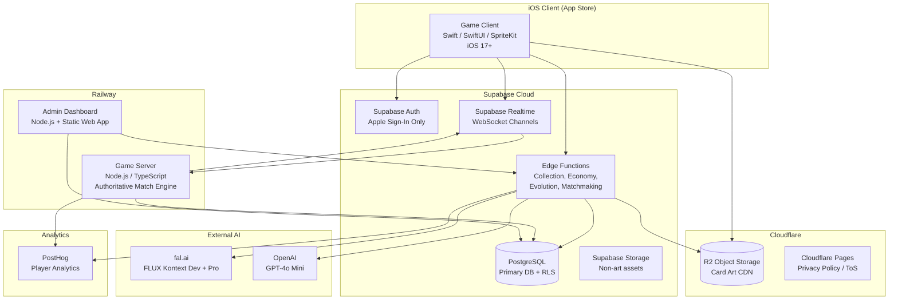
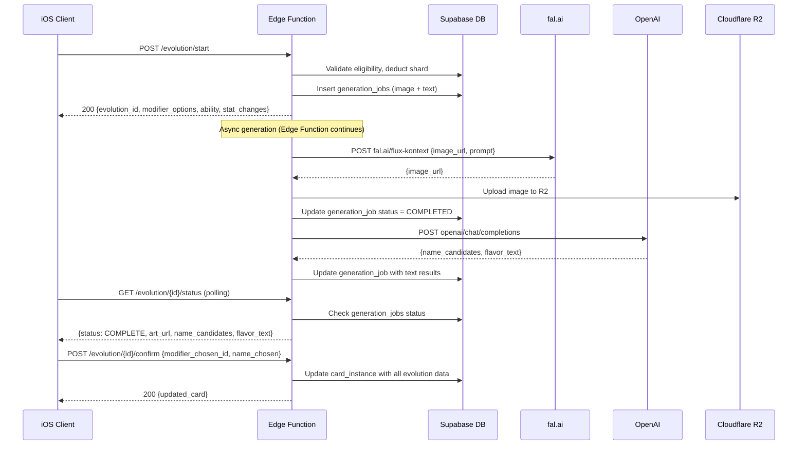
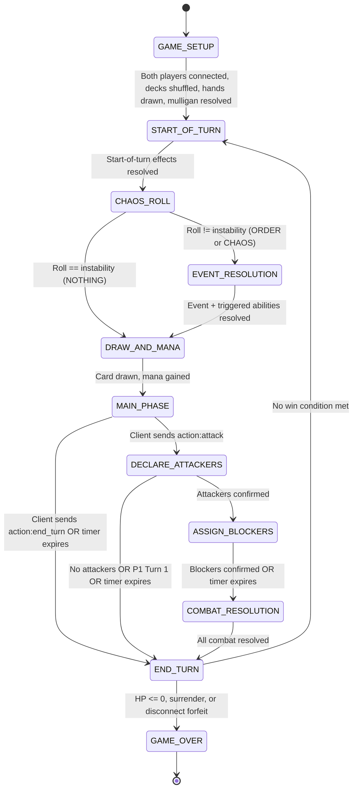

# 06 -- Technical Architecture

This document defines the system architecture, service design, API contracts, database schemas, and deployment strategy for Chaos Creatures. It is the engineering blueprint that translates the game design (00), battle mechanics (01), and data model (02) into a buildable system.

**Built for:** A solo non-engineer owner using Claude Code. Every decision is made. No ambiguity remains.

**Depends on:** `00-game-design-master.md`, `01-battle-mechanics.md`, `02-card-data-model.md`

**Two applications are produced:**
1. **Game Client** -- Native iOS app (Swift/SwiftUI/SpriteKit). What players download from the App Store.
2. **Admin Dashboard** -- Web application (Node.js + static HTML/JS, deployed on Railway). What the owner uses to manage the game.

---

## 1. System Overview

### 1.1 High-Level Architecture



### 1.2 Technology Stack (Final -- No Alternatives)

| Layer | Technology | Why This, Specifically |
|---|---|---|
| **Game Client** | Swift + SwiftUI + SpriteKit (Xcode, iOS 17+) | Native iOS performance. SwiftUI for menus/collection/deck builder. SpriteKit for battlefield animations. No cross-platform overhead. |
| **Auth** | Supabase Auth (Apple Sign-In only) | Built-in Apple Sign-In. JWT issuance, refresh tokens, session management -- zero custom code. iOS-only means no Google Sign-In needed. |
| **Database** | Supabase PostgreSQL | Managed Postgres with Row Level Security (RLS). No connection pooling to configure. Built-in migrations. |
| **Serverless API** | Supabase Edge Functions (Deno/TypeScript) | Handles REST endpoints for collection, economy, evolution, matchmaking. Auto-scales. Zero infrastructure. |
| **Real-time** | Supabase Realtime (WebSocket channels) | Clients subscribe to match channels. Game server broadcasts state changes. Built-in auth on channels. |
| **Game Server** | Railway (Node.js / TypeScript) | Stateful match engine. Railway auto-scales, auto-deploys from GitHub. One `railway up` command. |
| **Image Generation** | fal.ai (FLUX Kontext API) | Direct HTTP API. No GPU provisioning. FLUX Kontext Dev for free tier, Pro for subscribers. |
| **Text Generation** | OpenAI API (GPT-4o Mini) | Card names, flavor text. ~$0.15/$0.60 per 1M tokens. Negligible cost. |
| **Card Art Storage + CDN** | Cloudflare R2 | S3-compatible object storage with built-in global CDN. No egress fees. |
| **Analytics** | PostHog | Player behavior, retention, match data, economy health. Free tier covers launch. |
| **Payments** | StoreKit 2 (native Apple API) | In-app subscriptions. No RevenueCat, no Stripe, no third-party payment SDK. Server-side receipt validation via App Store Server API v2. |
| **App Distribution** | Xcode Cloud + App Store Connect | Automated builds triggered on git push. TestFlight for beta. App Store for release. |
| **Admin Dashboard** | Node.js + Express + static HTML/JS on Railway | Simple web app for the owner to manage the game without touching code. Separate Railway service. |
| **Legal Pages** | Cloudflare Pages (free) | Privacy policy and Terms of Service hosted as static HTML. Required for App Store submission. |

### 1.3 Environment Variables

The owner creates accounts and puts all keys in a single `.xcconfig` file for the iOS client and a `.env` file for backend services. Claude Code reads from these.

**Backend `.env` (used by game-server, admin-dashboard, and referenced by Edge Functions):**

```bash
# Supabase
SUPABASE_URL=https://xxxx.supabase.co
SUPABASE_ANON_KEY=eyJ...
SUPABASE_SERVICE_ROLE_KEY=eyJ...

# fal.ai
FAL_KEY=fal_...

# OpenAI
OPENAI_API_KEY=sk-...

# Cloudflare R2
R2_ACCOUNT_ID=xxxx
R2_ACCESS_KEY_ID=xxxx
R2_SECRET_ACCESS_KEY=xxxx
R2_BUCKET_NAME=chaos-creatures-art
R2_PUBLIC_URL=https://art.chaoscreatures.com

# PostHog
POSTHOG_API_KEY=phc_...
POSTHOG_HOST=https://app.posthog.com

# Admin Dashboard
ADMIN_PASSWORD=random-32-char-password
ADMIN_JWT_SECRET=random-64-char-secret

# Game Server
GAME_SERVER_PORT=3001
GAME_SERVER_SECRET=random-64-char-secret

# App Store Server API (for subscription validation)
APP_STORE_KEY_ID=XXXXXXXXXX
APP_STORE_ISSUER_ID=xxxxxxxx-xxxx-xxxx-xxxx-xxxxxxxxxxxx
APP_STORE_PRIVATE_KEY_PATH=./AuthKey_XXXXXXXXXX.p8
APP_STORE_BUNDLE_ID=com.chaoscreatures.app
APP_STORE_ENVIRONMENT=Production
```

**iOS client `Config.xcconfig` (NOT committed to git -- in .gitignore):**

```
SUPABASE_URL = https:$()/$()/xxxx.supabase.co
SUPABASE_ANON_KEY = eyJ...
R2_PUBLIC_URL = https:$()/$()/art.chaoscreatures.com
POSTHOG_API_KEY = phc_...
POSTHOG_HOST = https:$()/$()/app.posthog.com
```

These are read in Swift via `Bundle.main.infoDictionary` after being referenced in `Info.plist`.

### 1.4 Budget Estimate ($300 Total Cap)

| Service | Plan | Monthly Cost | Build Phase Cost | Notes |
|---|---|---|---|---|
| Supabase | Free tier (dev), Pro $25/mo (launch) | $0-25 | $25 | Free tier for dev. Pro for launch month. |
| Railway | Starter (free $5 credit), then usage | $5-10 | $15 | Game server + admin dashboard. Low traffic at launch. |
| fal.ai | Pay-as-you-go | ~$0.02-0.08/image | $80 | ~367 base cards + testing + evolution testing. Budget 2000 generations. |
| OpenAI | Pay-as-you-go | ~$0.0001/call | $2 | GPT-4o Mini is extremely cheap. ~2000 calls. |
| Cloudflare R2 | Free 10GB storage, free egress | $0 | $0 | Free tier covers launch and beyond. |
| PostHog | Free tier (1M events/mo) | $0 | $0 | Free tier covers launch. |
| Apple Developer | $99/year | $8.25/mo | $99 | Required for App Store. Annual fee. |
| Cloudflare Pages | Free | $0 | $0 | Privacy policy + ToS hosting. |
| Domain (optional) | ~$12/year | $1/mo | $12 | For custom R2 CDN URL. Optional -- can use default R2 URL. |
| **TOTAL** | | | **~$233** | **$67 buffer remaining** |

Build-phase AI generation budget breakdown:
- 367 base card images at ~$0.04 avg = $14.68
- 367 base card text generations at ~$0.0001 = $0.04
- Testing/iteration (3x multiplier for rejects and retries) = $44
- Evolution testing (~200 test evolutions) = $10
- App icon + store assets = $2
- **Total AI spend: ~$71**

---

## 2. iOS Client Architecture

### 2.1 Xcode Project Structure

```
ChaosCreatures/
  ChaosCreatures.xcodeproj
  ChaosCreatures/
    App/
      ChaosCreaturesApp.swift          # @main entry point, scene setup
      AppState.swift                    # ObservableObject: auth state, player data
      AppRouter.swift                   # Navigation state machine
    Config/
      Config.xcconfig                   # API keys (gitignored)
      Info.plist                        # References xcconfig values
      Secrets.swift                     # Reads keys from Bundle
    Services/
      SupabaseService.swift             # Supabase Swift SDK client singleton
      AuthService.swift                 # Apple Sign-In + Supabase Auth
      CollectionService.swift           # Card/deck CRUD via Edge Functions
      EconomyService.swift              # Dust, shards, purchases
      EvolutionService.swift            # Evolution flow + polling
      MatchmakingService.swift          # Queue join/leave + match found listener
      MatchService.swift                # Realtime channel for active match
      ImageCacheService.swift           # URLCache + disk cache for card art
      StoreKitService.swift             # StoreKit 2 subscription management
      PostHogService.swift              # Analytics events
    Models/
      Player.swift                      # Codable struct matching DB schema
      CardTemplate.swift                # Codable struct
      CardInstance.swift                # Codable struct
      Deck.swift                        # Codable struct
      BattleCard.swift                  # Runtime battle representation
      GameState.swift                   # Client-side game state projection
      MatchEvent.swift                  # All server event types (Codable enums)
      PlayerAction.swift                # All client action types
      EconomyConfig.swift               # Dust costs, shard costs
    Views/
      Onboarding/
        OnboardingView.swift            # Faction selection, tutorial
        FactionPickerView.swift
      Home/
        HomeView.swift                  # Main tab container
        DailyMissionsView.swift
      Collection/
        CollectionView.swift            # Card grid with filters
        CardDetailView.swift            # Full card view + evolution button
        DeckBuilderView.swift           # Drag-drop deck editor
        DeckListView.swift
      Shop/
        ShopView.swift                  # Card packs, shards, subscription
        CardPackOpeningView.swift        # Pack reveal animation
        SubscriptionView.swift          # StoreKit 2 paywall
      Battle/
        MatchmakingView.swift           # Queue UI with timer
        BattleContainerView.swift       # Hosts SpriteKit scene
        PostMatchView.swift             # Results, rewards, energy gains
      Evolution/
        EvolutionFlowView.swift         # Multi-step evolution ceremony
        ModifierPickerView.swift        # Choose visual modifier
        EvolutionRevealView.swift       # Dramatic art reveal
      Profile/
        ProfileView.swift               # Player stats, rank, settings
        SettingsView.swift
      Components/
        CardView.swift                  # Reusable card rendering
        ManaGemView.swift               # Mana cost display
        KeywordBadgeView.swift          # Keyword icon + tooltip
        LoadingView.swift               # Standard loading state
        ErrorView.swift                 # Standard error state with retry
        EmptyStateView.swift            # Standard empty state
    SpriteKit/
      Scenes/
        BattleScene.swift               # Main battlefield SKScene
        ChaosRollScene.swift            # D20 roll animation overlay
      Nodes/
        BoardNode.swift                 # 5-slot board layout (per player)
        CreatureNode.swift              # Card on board (art, stats, keywords)
        HandNode.swift                  # Fan of cards in hand
        HandCardNode.swift              # Individual hand card
        AvatarNode.swift                # Player avatar + HP bar
        ManaBarNode.swift               # Mana crystal display
        DamageNumberNode.swift          # Floating damage text
        EventBannerNode.swift           # Order/Chaos event popup
        TimerNode.swift                 # Turn timer display
        PhaseIndicatorNode.swift        # Current phase label
      Actions/
        CardPlayAction.swift            # Hand-to-board animation
        AttackAction.swift              # Creature attack animation (lunge)
        DamageAction.swift              # Damage number + shake
        DeathAction.swift               # Creature death (fade/shatter)
        HealAction.swift                # Green number float up
        ShieldBreakAction.swift         # Shield pop effect
        ChaosRollAction.swift           # D20 spin + result reveal
        EventSlideAction.swift          # Event banner slide in/out
      Utilities/
        SpriteKitConstants.swift        # Layout constants, z-positions
        ParticleEffects.swift           # SKEmitterNode presets per faction
    Extensions/
      Color+Theme.swift                 # Faction color palettes
      View+Loading.swift                # Loading/error/empty state modifiers
      Data+Codable.swift                # JSON helpers
    Resources/
      Assets.xcassets/                  # App icon, color sets, SF Symbols
      Particles/                        # .sks particle files per faction
      Sounds/                           # Sound effect files
      Fonts/                            # Custom fonts if any
  ChaosCreaturesTests/
    Services/
      AuthServiceTests.swift
      CollectionServiceTests.swift
      MatchServiceTests.swift
    Models/
      GameStateTests.swift
      CombatResolutionTests.swift
    SpriteKit/
      BattleSceneTests.swift
  ChaosCreaturesUITests/
    OnboardingUITests.swift
    BattleFlowUITests.swift
    ScreenshotTests.swift               # Generates App Store screenshots
```

### 2.2 Supabase Swift SDK Integration

```swift
// Services/SupabaseService.swift
import Supabase

final class SupabaseService {
    static let shared = SupabaseService()

    let client: SupabaseClient

    private init() {
        client = SupabaseClient(
            supabaseURL: URL(string: Secrets.supabaseURL)!,
            supabaseKey: Secrets.supabaseAnonKey
        )
    }
}

// Services/AuthService.swift
import AuthenticationServices
import Supabase

@MainActor
final class AuthService: ObservableObject {
    @Published var session: Session?
    @Published var isLoading = false
    @Published var error: String?

    private let supabase = SupabaseService.shared.client

    func signInWithApple() async {
        isLoading = true
        defer { isLoading = false }
        do {
            let session = try await supabase.auth.signInWithApple()
            self.session = session
        } catch {
            self.error = error.localizedDescription
        }
    }

    func restoreSession() async {
        do {
            session = try await supabase.auth.session
        } catch {
            session = nil
        }
    }

    func signOut() async {
        try? await supabase.auth.signOut()
        session = nil
    }
}
```

### 2.3 SpriteKit Scene Hierarchy for Battlefield

```swift
// SpriteKit/Scenes/BattleScene.swift
import SpriteKit

final class BattleScene: SKScene {
    // Layout: opponent board at top, player board at bottom, hands at edges
    // Z-ordering (back to front):
    //   0: Background
    //   10: Board slots (both players)
    //   20: Creatures on board
    //   30: Avatars + HP bars
    //   40: Mana bar
    //   50: Hand cards
    //   60: Phase indicator + timer
    //   70: Damage numbers (float above everything)
    //   80: Event banner overlay
    //   90: Chaos roll overlay (D20)
    //  100: UI buttons (end turn, attack)

    private var opponentBoard: BoardNode!
    private var playerBoard: BoardNode!
    private var playerHand: HandNode!
    private var opponentHandIndicator: SKLabelNode!  // Shows card count only
    private var playerAvatar: AvatarNode!
    private var opponentAvatar: AvatarNode!
    private var manaBar: ManaBarNode!
    private var phaseIndicator: PhaseIndicatorNode!
    private var timerNode: TimerNode!
    private var eventBanner: EventBannerNode!
    private var endTurnButton: SKSpriteNode!
    private var attackButton: SKSpriteNode!

    weak var matchDelegate: BattleSceneDelegate?

    override func didMove(to view: SKView) {
        backgroundColor = .black
        setupBackground()
        setupBoards()
        setupAvatars()
        setupHand()
        setupUI()
    }

    private func setupBoards() {
        // Opponent board: 5 slots across top third of screen
        opponentBoard = BoardNode(slotCount: 5, isOpponent: true)
        opponentBoard.position = CGPoint(x: size.width / 2, y: size.height * 0.65)
        opponentBoard.zPosition = 10
        addChild(opponentBoard)

        // Player board: 5 slots across bottom third
        playerBoard = BoardNode(slotCount: 5, isOpponent: false)
        playerBoard.position = CGPoint(x: size.width / 2, y: size.height * 0.35)
        playerBoard.zPosition = 10
        addChild(playerBoard)
    }

    // Called when server sends game events
    func handleServerEvent(_ event: MatchEvent) {
        switch event {
        case .turnStart(let data):
            animateTurnStart(turn: data.turnNumber, activePlayer: data.activePlayer)
        case .chaosRoll(let data):
            animateChaosRoll(roll: data.rollValue, instability: data.instability, result: data.result)
        case .eventTriggered(let data):
            animateEventBanner(event: data)
        case .cardPlayed(let data):
            animateCardPlay(card: data.card, slot: data.slot, playerSide: data.playerSide)
        case .combatResolution(let data):
            animateCombat(data: data)
        case .matchEnd(let data):
            animateMatchEnd(winner: data.winner, reason: data.endReason)
        default:
            break
        }
    }

    // Animation: Card play (hand to board)
    private func animateCardPlay(card: BattleCard, slot: Int, playerSide: PlayerSide) {
        let board = playerSide == .mine ? playerBoard : opponentBoard
        let creatureNode = CreatureNode(card: card)
        creatureNode.setScale(0.3)
        creatureNode.alpha = 0

        let targetPosition = board!.slotPosition(slot)
        creatureNode.position = playerSide == .mine
            ? CGPoint(x: size.width / 2, y: -50)  // From hand area
            : CGPoint(x: size.width / 2, y: size.height + 50)  // From opponent hand

        addChild(creatureNode)

        let moveAction = SKAction.move(to: targetPosition, duration: 0.4)
        moveAction.timingMode = .easeOut
        let scaleAction = SKAction.scale(to: 1.0, duration: 0.4)
        let fadeAction = SKAction.fadeIn(withDuration: 0.2)
        let impactAction = SKAction.run {
            self.run(SKAction.playSoundFileNamed("card_play.wav", waitForCompletion: false))
            board?.flashSlot(slot)
        }

        creatureNode.run(SKAction.sequence([
            SKAction.group([moveAction, scaleAction, fadeAction]),
            impactAction,
        ]))
    }

    // Animation: Chaos Roll (D20 spin)
    private func animateChaosRoll(roll: Int, instability: Int, result: ChaosRollResult) {
        let rollOverlay = ChaosRollScene(roll: roll, instability: instability, result: result)
        rollOverlay.position = CGPoint(x: size.width / 2, y: size.height / 2)
        rollOverlay.zPosition = 90
        addChild(rollOverlay)

        rollOverlay.animate { [weak rollOverlay] in
            rollOverlay?.removeFromParent()
        }
    }

    // Animation: Creature attack (lunge toward target + damage number)
    private func animateCombat(data: CombatResolutionData) {
        var delay: TimeInterval = 0

        for pair in data.pairs {
            let attackerNode = findCreatureNode(id: pair.attackerID)
            let blockerNode = findCreatureNode(id: pair.blockerID)

            DispatchQueue.main.asyncAfter(deadline: .now() + delay) {
                self.animateAttackLunge(attacker: attackerNode, target: blockerNode)
                self.showDamageNumber(on: blockerNode, amount: pair.attackerDamageDealt)
                self.showDamageNumber(on: attackerNode, amount: pair.blockerDamageDealt)

                if pair.attackerDied { self.animateDeath(node: attackerNode) }
                if pair.blockerDied { self.animateDeath(node: blockerNode) }
            }
            delay += 0.6
        }

        for unblocked in data.unblocked {
            let attackerNode = findCreatureNode(id: unblocked.attackerID)
            let targetAvatar = opponentAvatar!

            DispatchQueue.main.asyncAfter(deadline: .now() + delay) {
                self.animateAttackLunge(attacker: attackerNode, target: targetAvatar)
                self.showDamageNumber(on: targetAvatar, amount: unblocked.faceDamage)
            }
            delay += 0.4
        }
    }

    // Animation: Creature death (shatter particles)
    private func animateDeath(node: CreatureNode?) {
        guard let node = node else { return }
        let particles = SKEmitterNode(fileNamed: "creature_death")!
        particles.position = node.position
        particles.zPosition = 70
        addChild(particles)

        node.run(SKAction.sequence([
            SKAction.group([
                SKAction.fadeOut(withDuration: 0.3),
                SKAction.scale(to: 0.5, duration: 0.3),
            ]),
            SKAction.removeFromParent(),
        ]))

        particles.run(SKAction.sequence([
            SKAction.wait(forDuration: 1.0),
            SKAction.removeFromParent(),
        ]))
    }

    // Touch handling: card selection, slot targeting, attack declaration
    override func touchesBegan(_ touches: Set<UITouch>, with event: UIEvent?) {
        guard let touch = touches.first else { return }
        let location = touch.location(in: self)
        let touchedNodes = nodes(at: location)

        for node in touchedNodes {
            if let handCard = node as? HandCardNode {
                matchDelegate?.didSelectHandCard(handCard.cardID)
            } else if let slotNode = node as? BoardSlotNode, slotNode.isEmpty {
                matchDelegate?.didSelectBoardSlot(slotNode.slotIndex)
            } else if let creatureNode = node as? CreatureNode {
                matchDelegate?.didSelectCreature(creatureNode.cardID)
            } else if node == endTurnButton {
                matchDelegate?.didTapEndTurn()
            } else if node == attackButton {
                matchDelegate?.didTapAttack()
            }
        }
    }

    private func findCreatureNode(id: String) -> CreatureNode? {
        enumerateChildNodes(withName: "//creature_*") { node, _ in
            // Search logic
        }
        return children.compactMap { $0 as? CreatureNode }.first { $0.cardID == id }
    }
}

protocol BattleSceneDelegate: AnyObject {
    func didSelectHandCard(_ cardID: String)
    func didSelectBoardSlot(_ slot: Int)
    func didSelectCreature(_ cardID: String)
    func didTapEndTurn()
    func didTapAttack()
}
```

### 2.4 StoreKit 2 Subscription Flow

```swift
// Services/StoreKitService.swift
import StoreKit

@MainActor
final class StoreKitService: ObservableObject {
    @Published var subscriptions: [Product] = []
    @Published var currentSubscription: Product?
    @Published var purchaseError: String?

    // Product IDs configured in App Store Connect
    static let midTierID = "com.chaoscreatures.subscription.mid"      // $6.99/mo
    static let topTierID = "com.chaoscreatures.subscription.top"      // $12.99/mo

    private var transactionListener: Task<Void, Error>?

    init() {
        transactionListener = listenForTransactions()
    }

    deinit {
        transactionListener?.cancel()
    }

    func loadProducts() async {
        do {
            let products = try await Product.products(for: [
                Self.midTierID,
                Self.topTierID,
            ])
            subscriptions = products.sorted { $0.price < $1.price }
        } catch {
            purchaseError = "Failed to load subscriptions: \(error.localizedDescription)"
        }
    }

    func purchase(_ product: Product) async -> Bool {
        do {
            let result = try await product.purchase()
            switch result {
            case .success(let verification):
                let transaction = try checkVerified(verification)
                // Send receipt to server for validation + tier update
                await syncSubscriptionWithServer(transaction: transaction)
                await transaction.finish()
                return true
            case .userCancelled:
                return false
            case .pending:
                // Transaction requires approval (Ask to Buy)
                return false
            @unknown default:
                return false
            }
        } catch {
            purchaseError = error.localizedDescription
            return false
        }
    }

    func restorePurchases() async {
        try? await AppStore.sync()
        await updateCurrentSubscription()
    }

    private func listenForTransactions() -> Task<Void, Error> {
        Task.detached {
            for await result in Transaction.updates {
                do {
                    let transaction = try self.checkVerified(result)
                    await self.syncSubscriptionWithServer(transaction: transaction)
                    await transaction.finish()
                    await self.updateCurrentSubscription()
                } catch {
                    // Log verification failure
                }
            }
        }
    }

    private func updateCurrentSubscription() async {
        for await result in Transaction.currentEntitlements {
            if let transaction = try? checkVerified(result),
               transaction.productType == .autoRenewable {
                currentSubscription = subscriptions.first { $0.id == transaction.productID }
                return
            }
        }
        currentSubscription = nil
    }

    private func syncSubscriptionWithServer(transaction: Transaction) async {
        // Call Edge Function to update player's subscription_tier
        let supabase = SupabaseService.shared.client
        struct TierUpdate: Encodable {
            let transactionID: UInt64
            let productID: String
            let originalTransactionID: UInt64
        }
        do {
            try await supabase.functions.invoke(
                "apple-webhook",
                options: .init(body: TierUpdate(
                    transactionID: transaction.id,
                    productID: transaction.productID,
                    originalTransactionID: transaction.originalID
                ))
            )
        } catch {
            // Retry on next app launch via listenForTransactions
        }
    }

    private func checkVerified<T>(_ result: VerificationResult<T>) throws -> T {
        switch result {
        case .unverified(_, let error):
            throw error
        case .verified(let safe):
            return safe
        }
    }
}
```

**App Store Server Notifications (V2) webhook -- Edge Function:**

```typescript
// supabase/functions/apple-webhook/index.ts
import { serve } from "https://deno.land/std@0.168.0/http/server.ts";
import { createClient } from "https://esm.sh/@supabase/supabase-js@2";
import { decodeJwt } from "https://deno.land/x/jose@v4.14.4/index.ts";

serve(async (req) => {
  const supabase = createClient(
    Deno.env.get("SUPABASE_URL")!,
    Deno.env.get("SUPABASE_SERVICE_ROLE_KEY")!
  );

  const body = await req.json();

  // Handle client-side sync (from StoreKitService)
  if (body.transactionID) {
    const tier = body.productID.includes("mid") ? "MID" : "HIGH";
    const { data: session } = await supabase.auth.getUser(
      req.headers.get("Authorization")?.replace("Bearer ", "") ?? ""
    );
    if (!session.user) return new Response("Unauthorized", { status: 401 });

    await supabase
      .from("players")
      .update({
        subscription_tier: tier,
        max_cards_per_faction: tier === "HIGH" ? 200 : tier === "MID" ? 100 : 50,
        max_deck_slots: tier === "HIGH" ? 10 : tier === "MID" ? 5 : 3,
      })
      .eq("auth_id", session.user.id);

    return new Response(JSON.stringify({ tier }), { status: 200 });
  }

  // Handle App Store Server Notification V2
  // Apple sends a signed JWS payload
  const signedPayload = body.signedPayload;
  const payload = decodeJwt(signedPayload);
  const notificationType = payload.notificationType as string;

  // Map notification to tier update
  if (
    notificationType === "SUBSCRIBED" ||
    notificationType === "DID_RENEW"
  ) {
    const transactionInfo = decodeJwt(
      (payload.data as any).signedTransactionInfo
    );
    const productId = transactionInfo.productId as string;
    const appAccountToken = transactionInfo.appAccountToken as string;
    const tier = productId.includes("mid") ? "MID" : "HIGH";

    await supabase
      .from("players")
      .update({
        subscription_tier: tier,
        max_cards_per_faction: tier === "HIGH" ? 200 : tier === "MID" ? 100 : 50,
        max_deck_slots: tier === "HIGH" ? 10 : tier === "MID" ? 5 : 3,
      })
      .eq("auth_id", appAccountToken);
  } else if (
    notificationType === "EXPIRED" ||
    notificationType === "REVOKE"
  ) {
    const transactionInfo = decodeJwt(
      (payload.data as any).signedTransactionInfo
    );
    const appAccountToken = transactionInfo.appAccountToken as string;

    await supabase
      .from("players")
      .update({
        subscription_tier: "FREE",
        max_cards_per_faction: 50,
        max_deck_slots: 3,
      })
      .eq("auth_id", appAccountToken);
  }

  return new Response(JSON.stringify({ ok: true }), { status: 200 });
});
```

### 2.5 Match Communication (Swift Client)

```swift
// Services/MatchService.swift
import Supabase
import Realtime

@MainActor
final class MatchService: ObservableObject {
    @Published var gameState: ClientGameState?
    @Published var connectionStatus: ConnectionStatus = .disconnected
    @Published var latestEvent: MatchEvent?

    private var channel: RealtimeChannelV2?
    private let supabase = SupabaseService.shared.client
    private var matchID: String?
    private var playerID: String?
    private var reconnectAttempts = 0
    private let maxReconnectAttempts = 5

    func connectToMatch(matchID: String, playerID: String) async {
        self.matchID = matchID
        self.playerID = playerID
        connectionStatus = .connecting

        channel = supabase.realtimeV2.channel("match:\(matchID)")

        channel?.onBroadcast(event: "game_event") { [weak self] message in
            guard let self = self else { return }
            Task { @MainActor in
                self.handleServerMessage(message)
            }
        }

        do {
            try await channel?.subscribe()
            connectionStatus = .connected
            reconnectAttempts = 0
            // Request full state snapshot
            try await sendAction(.reconnect)
        } catch {
            await attemptReconnect()
        }
    }

    func sendAction(_ action: PlayerAction) async throws {
        guard let channel = channel else { return }
        let payload: [String: AnyJSON] = [
            "action": .string(action.actionName),
            "data": action.jsonData,
            "player_id": .string(playerID ?? ""),
            "timestamp": .double(Double(Date().timeIntervalSince1970 * 1000)),
        ]
        try await channel.broadcast(event: "player_action", message: payload)
    }

    private func handleServerMessage(_ message: JSONObject) {
        guard let eventTypeStr = message["event_type"]?.stringValue,
              let dataJSON = message["data"] else { return }

        do {
            let data = try JSONSerialization.data(withJSONObject: dataJSON)
            let event = try MatchEvent.decode(eventType: eventTypeStr, data: data)
            latestEvent = event

            if case .matchState(let state) = event {
                gameState = state
            }
        } catch {
            // Log decoding error
        }
    }

    private func attemptReconnect() async {
        guard reconnectAttempts < maxReconnectAttempts else {
            connectionStatus = .failed
            return
        }

        reconnectAttempts += 1
        connectionStatus = .reconnecting

        let delay = pow(2.0, Double(reconnectAttempts)) + Double.random(in: 0...1)
        try? await Task.sleep(nanoseconds: UInt64(delay * 1_000_000_000))

        if let matchID = matchID, let playerID = playerID {
            await connectToMatch(matchID: matchID, playerID: playerID)
        }
    }

    func disconnect() async {
        await channel?.unsubscribe()
        channel = nil
        connectionStatus = .disconnected
    }

    enum ConnectionStatus {
        case disconnected, connecting, connected, reconnecting, failed
    }
}
```

### 2.6 Image Caching

```swift
// Services/ImageCacheService.swift
import SwiftUI

actor ImageCacheService {
    static let shared = ImageCacheService()

    private let memoryCache = NSCache<NSString, UIImage>()
    private let diskCacheURL: URL
    private let maxDiskCacheBytes: Int = 200 * 1024 * 1024 // 200MB

    init() {
        let caches = FileManager.default.urls(for: .cachesDirectory, in: .userDomainMask)[0]
        diskCacheURL = caches.appendingPathComponent("CardArt", isDirectory: true)
        try? FileManager.default.createDirectory(at: diskCacheURL, withIntermediateDirectories: true)
        memoryCache.countLimit = 200
    }

    func image(for url: URL) async -> UIImage? {
        let key = url.absoluteString as NSString

        // Check memory cache
        if let cached = memoryCache.object(forKey: key) {
            return cached
        }

        // Check disk cache
        let diskPath = diskCacheURL.appendingPathComponent(url.lastPathComponent)
        if let data = try? Data(contentsOf: diskPath),
           let image = UIImage(data: data) {
            memoryCache.setObject(image, forKey: key)
            return image
        }

        // Download
        guard let (data, _) = try? await URLSession.shared.data(from: url),
              let image = UIImage(data: data) else {
            return nil
        }

        memoryCache.setObject(image, forKey: key)
        try? data.write(to: diskPath)
        return image
    }

    func preloadBattleArt(cardArtURLs: [URL]) async {
        await withTaskGroup(of: Void.self) { group in
            for url in cardArtURLs {
                group.addTask { _ = await self.image(for: url) }
            }
        }
    }
}
```

### 2.7 Xcode Cloud CI/CD Pipeline

Xcode Cloud is configured in App Store Connect (not a YAML file). These are the workflow settings:

**Workflow: "Build and Test" (on every push to `main`)**
- Start condition: Push to `main` branch, changes in `ChaosCreatures/` directory
- Environment: Latest Xcode, latest macOS
- Build action: Build for testing (iOS Simulator, iPhone 15 Pro)
- Test action: Run all unit tests + UI tests
- Post-action: Notify via email on failure

**Workflow: "TestFlight Beta" (on git tag `beta/*`)**
- Start condition: Tag matching `beta/*`
- Environment: Latest Xcode, latest macOS
- Build action: Archive (iOS, Release configuration)
- Code signing: Automatic (managed by Xcode Cloud)
- Post-action: Deploy to TestFlight (internal testers)

**Workflow: "App Store Release" (on git tag `release/*`)**
- Start condition: Tag matching `release/*`
- Environment: Latest Xcode, latest macOS
- Build action: Archive (iOS, Release configuration)
- Code signing: Automatic (managed by Xcode Cloud)
- Post-action: Submit to App Store Review

**Custom build script (`ci_scripts/ci_post_clone.sh`):**
```bash
#!/bin/bash
# Xcode Cloud runs this after cloning the repo
# Write xcconfig from Xcode Cloud environment variables
cat > ../ChaosCreatures/Config/Config.xcconfig << EOF
SUPABASE_URL = ${SUPABASE_URL}
SUPABASE_ANON_KEY = ${SUPABASE_ANON_KEY}
R2_PUBLIC_URL = ${R2_PUBLIC_URL}
POSTHOG_API_KEY = ${POSTHOG_API_KEY}
POSTHOG_HOST = ${POSTHOG_HOST}
EOF
```

Environment variables (`SUPABASE_URL`, etc.) are set in Xcode Cloud workflow settings in App Store Connect. They are never committed to git.

---

## 3. Supabase Database Schema

All tables live in Supabase PostgreSQL. Row Level Security (RLS) policies are defined for every table. The schema maps directly to entities in `02-card-data-model.md`.

### 3.1 Core Tables

#### `players`

```sql
CREATE TABLE players (
  id UUID PRIMARY KEY DEFAULT gen_random_uuid(),
  auth_id UUID UNIQUE NOT NULL REFERENCES auth.users(id) ON DELETE CASCADE,
  display_name TEXT UNIQUE NOT NULL CHECK (length(display_name) BETWEEN 3 AND 20),
  friend_code TEXT UNIQUE NOT NULL DEFAULT ('CHAOS-' || upper(substr(md5(random()::text), 1, 4))),

  -- Subscription
  subscription_tier TEXT NOT NULL DEFAULT 'FREE' CHECK (subscription_tier IN ('FREE', 'MID', 'HIGH')),

  -- Faction
  primary_faction_id UUID REFERENCES factions(id),
  unlocked_faction_ids UUID[] DEFAULT '{}',
  onboarding_complete BOOLEAN NOT NULL DEFAULT FALSE,

  -- Progression
  player_level INTEGER NOT NULL DEFAULT 1,
  player_xp INTEGER NOT NULL DEFAULT 0,
  season_rank TEXT NOT NULL DEFAULT 'BRONZE_3',
  season_rank_points INTEGER NOT NULL DEFAULT 0,
  hidden_mmr INTEGER NOT NULL DEFAULT 1000,

  -- Currency
  chaos_dust INTEGER NOT NULL DEFAULT 0 CHECK (chaos_dust >= 0),

  -- Collection limits (derived from subscription_tier, denormalized for query speed)
  max_cards_per_faction INTEGER NOT NULL DEFAULT 50,
  max_deck_slots INTEGER NOT NULL DEFAULT 3,

  -- Shards
  shards_uncommon INTEGER NOT NULL DEFAULT 0 CHECK (shards_uncommon >= 0),
  shards_rare INTEGER NOT NULL DEFAULT 0 CHECK (shards_rare >= 0),
  shards_epic INTEGER NOT NULL DEFAULT 0 CHECK (shards_epic >= 0),
  shards_legendary INTEGER NOT NULL DEFAULT 0 CHECK (shards_legendary >= 0),

  -- Profile
  showcase_card_ids UUID[] DEFAULT '{}',
  active_title TEXT,

  -- Stats
  total_games INTEGER NOT NULL DEFAULT 0,
  total_wins INTEGER NOT NULL DEFAULT 0,
  total_losses INTEGER NOT NULL DEFAULT 0,
  current_win_streak INTEGER NOT NULL DEFAULT 0,
  best_win_streak INTEGER NOT NULL DEFAULT 0,
  cards_evolved_total INTEGER NOT NULL DEFAULT 0,
  highest_tier_reached TEXT NOT NULL DEFAULT 'COMMON',

  -- Social
  friend_ids UUID[] DEFAULT '{}',

  -- Settings (JSONB for flexibility)
  settings JSONB NOT NULL DEFAULT '{
    "master_volume": 1.0,
    "music_volume": 0.7,
    "sfx_volume": 1.0,
    "reduced_motion": false,
    "colorblind_mode": "NONE",
    "card_animation_quality": "FULL",
    "screen_shake": true,
    "auto_end_turn": false,
    "confirm_end_turn": true,
    "notify_daily_rewards": true,
    "notify_evolution_ready": true,
    "notify_friend_activity": true,
    "notify_season_ending": true,
    "block_friend_requests": false,
    "hide_profile": false,
    "hide_online_status": false
  }'::jsonb,

  created_at TIMESTAMPTZ NOT NULL DEFAULT now(),
  updated_at TIMESTAMPTZ NOT NULL DEFAULT now()
);

-- RLS: Players can only read/update their own row
ALTER TABLE players ENABLE ROW LEVEL SECURITY;

CREATE POLICY "Players can read own data"
  ON players FOR SELECT
  USING (auth.uid() = auth_id);

CREATE POLICY "Players can update own data"
  ON players FOR UPDATE
  USING (auth.uid() = auth_id)
  WITH CHECK (auth.uid() = auth_id);

-- Service role can read/write all (for game server, edge functions)
CREATE POLICY "Service role full access"
  ON players FOR ALL
  USING (auth.role() = 'service_role');

-- Public profiles: anyone can read display_name, season_rank, showcase
CREATE POLICY "Public profile read"
  ON players FOR SELECT
  USING (true);
```

#### `factions`

```sql
CREATE TABLE factions (
  id UUID PRIMARY KEY DEFAULT gen_random_uuid(),
  name TEXT NOT NULL,
  short_name TEXT UNIQUE NOT NULL CHECK (short_name IN ('IRONWRIGHT', 'FEY_COURTS', 'DEMONIC_KINGDOMS')),
  exclusive_mechanic TEXT NOT NULL CHECK (exclusive_mechanic IN ('AUGMENT', 'BOND', 'CORRUPTION')),
  art_prompt_prefix TEXT NOT NULL,
  flavor_voice TEXT NOT NULL,
  name_voice TEXT NOT NULL,
  card_frame_asset TEXT NOT NULL DEFAULT '',
  color_primary TEXT NOT NULL DEFAULT '#000000',
  color_secondary TEXT NOT NULL DEFAULT '#000000',
  color_background TEXT NOT NULL DEFAULT '#000000',
  particle_theme TEXT NOT NULL DEFAULT 'default',
  released_at TIMESTAMPTZ NOT NULL DEFAULT now(),
  card_template_count INTEGER NOT NULL DEFAULT 0
);

-- RLS: Factions are global read-only data
ALTER TABLE factions ENABLE ROW LEVEL SECURITY;
CREATE POLICY "Anyone can read factions" ON factions FOR SELECT USING (true);
```

#### `card_templates`

```sql
CREATE TABLE card_templates (
  id UUID PRIMARY KEY DEFAULT gen_random_uuid(),
  name TEXT NOT NULL,
  card_type TEXT NOT NULL CHECK (card_type IN ('CREATURE', 'SPELL', 'STABILIZER')),
  faction_id UUID NOT NULL REFERENCES factions(id),

  -- Base stats
  base_attack INTEGER,
  base_health INTEGER,
  base_instability INTEGER NOT NULL DEFAULT 0 CHECK (base_instability BETWEEN 0 AND 5),
  mana_cost INTEGER NOT NULL CHECK (mana_cost BETWEEN 1 AND 10),

  -- Keywords
  base_keywords TEXT[] NOT NULL DEFAULT '{}',

  -- Spell/Stabilizer
  spell_effect JSONB,
  stabilizer_type TEXT CHECK (stabilizer_type IN ('ORDER', 'CHAOS', 'HYBRID')),

  -- AI generation metadata
  art_prompt TEXT NOT NULL,
  art_url TEXT NOT NULL,
  flavor_text TEXT NOT NULL DEFAULT '',

  -- Pipeline metadata
  batch_id TEXT,
  approved_at TIMESTAMPTZ,
  approved_by TEXT,
  is_legendary_eligible BOOLEAN NOT NULL DEFAULT TRUE,

  created_at TIMESTAMPTZ NOT NULL DEFAULT now()
);

-- RLS: Templates are global read-only
ALTER TABLE card_templates ENABLE ROW LEVEL SECURITY;
CREATE POLICY "Anyone can read templates" ON card_templates FOR SELECT USING (true);
CREATE POLICY "Service role manages templates" ON card_templates FOR ALL USING (auth.role() = 'service_role');
```

#### `card_instances`

```sql
CREATE TABLE card_instances (
  id UUID PRIMARY KEY DEFAULT gen_random_uuid(),
  template_id UUID NOT NULL REFERENCES card_templates(id),
  owner_id UUID NOT NULL REFERENCES players(id) ON DELETE CASCADE,

  -- Current state
  tier TEXT NOT NULL DEFAULT 'COMMON' CHECK (tier IN ('COMMON', 'UNCOMMON', 'RARE', 'EPIC', 'LEGENDARY')),
  current_name TEXT NOT NULL,
  current_attack INTEGER,
  current_health INTEGER,
  current_mana_cost INTEGER NOT NULL,
  instability_value INTEGER NOT NULL DEFAULT 0,

  -- Keywords
  innate_keywords TEXT[] NOT NULL DEFAULT '{}',
  modifier_keywords TEXT[] NOT NULL DEFAULT '{}',

  -- Evolution history (JSONB array -- denormalized for single-row read)
  evolution_history JSONB NOT NULL DEFAULT '[]'::jsonb,

  -- Modifiers (JSONB array of ModifierInstance objects)
  modifiers JSONB NOT NULL DEFAULT '[]'::jsonb,

  -- Triggered abilities (JSONB array)
  triggered_abilities JSONB NOT NULL DEFAULT '[]'::jsonb,

  -- Progression
  chaos_energy INTEGER NOT NULL DEFAULT 0,
  games_played INTEGER NOT NULL DEFAULT 0,

  -- Art
  art_url TEXT NOT NULL,
  flavor_text TEXT NOT NULL DEFAULT '',
  art_prompt_history TEXT[] NOT NULL DEFAULT '{}',

  -- Metadata
  is_favorite BOOLEAN NOT NULL DEFAULT FALSE,
  in_deck_ids UUID[] NOT NULL DEFAULT '{}',
  created_at TIMESTAMPTZ NOT NULL DEFAULT now(),
  last_evolved_at TIMESTAMPTZ
);

-- Indexes
CREATE INDEX idx_card_instances_owner ON card_instances(owner_id);
CREATE INDEX idx_card_instances_owner_template ON card_instances(owner_id, template_id);
CREATE INDEX idx_card_instances_evolution_ready ON card_instances(owner_id, tier, chaos_energy);

-- RLS: Players can read/update their own cards
ALTER TABLE card_instances ENABLE ROW LEVEL SECURITY;

CREATE POLICY "Players read own cards"
  ON card_instances FOR SELECT
  USING (auth.uid() = (SELECT auth_id FROM players WHERE id = owner_id));

CREATE POLICY "Service role full access"
  ON card_instances FOR ALL
  USING (auth.role() = 'service_role');
```

#### `decks`

```sql
CREATE TABLE decks (
  id UUID PRIMARY KEY DEFAULT gen_random_uuid(),
  owner_id UUID NOT NULL REFERENCES players(id) ON DELETE CASCADE,
  name TEXT NOT NULL,
  faction_id UUID NOT NULL REFERENCES factions(id),
  avatar_id UUID NOT NULL REFERENCES avatars(id),

  -- Contents (JSONB array of {card_instance_id, quantity})
  card_entries JSONB NOT NULL DEFAULT '[]'::jsonb,

  -- Validation
  is_valid BOOLEAN NOT NULL DEFAULT FALSE,
  validation_errors TEXT[] NOT NULL DEFAULT '{}',

  -- Stats
  games_played INTEGER NOT NULL DEFAULT 0,
  wins INTEGER NOT NULL DEFAULT 0,
  losses INTEGER NOT NULL DEFAULT 0,

  created_at TIMESTAMPTZ NOT NULL DEFAULT now(),
  updated_at TIMESTAMPTZ NOT NULL DEFAULT now()
);

-- RLS
ALTER TABLE decks ENABLE ROW LEVEL SECURITY;

CREATE POLICY "Players read own decks"
  ON decks FOR SELECT
  USING (auth.uid() = (SELECT auth_id FROM players WHERE id = owner_id));

CREATE POLICY "Players manage own decks"
  ON decks FOR ALL
  USING (auth.uid() = (SELECT auth_id FROM players WHERE id = owner_id));

CREATE POLICY "Service role full access"
  ON decks FOR ALL
  USING (auth.role() = 'service_role');
```

#### `avatars`

```sql
CREATE TABLE avatars (
  id UUID PRIMARY KEY DEFAULT gen_random_uuid(),
  name TEXT NOT NULL,
  faction_id UUID NOT NULL REFERENCES factions(id),
  instability_modifier INTEGER NOT NULL,
  portrait_url TEXT NOT NULL DEFAULT '',
  battle_sprite_url TEXT NOT NULL DEFAULT '',
  frame_style TEXT NOT NULL DEFAULT 'default',
  title TEXT NOT NULL DEFAULT '',
  lore_text TEXT NOT NULL DEFAULT '',
  unlock_condition JSONB NOT NULL DEFAULT '{"type": "FREE_STARTER"}'::jsonb,
  created_at TIMESTAMPTZ NOT NULL DEFAULT now()
);

ALTER TABLE avatars ENABLE ROW LEVEL SECURITY;
CREATE POLICY "Anyone can read avatars" ON avatars FOR SELECT USING (true);
CREATE POLICY "Service role manages avatars" ON avatars FOR ALL USING (auth.role() = 'service_role');
```

#### `modifier_definitions`

```sql
CREATE TABLE modifier_definitions (
  id UUID PRIMARY KEY DEFAULT gen_random_uuid(),
  name TEXT NOT NULL,
  flavor_text TEXT NOT NULL DEFAULT '',
  pool_type TEXT NOT NULL CHECK (pool_type IN ('UNIVERSAL', 'FACTION')),
  faction_id UUID REFERENCES factions(id),
  pp_cost INTEGER NOT NULL CHECK (pp_cost BETWEEN 1 AND 3),
  tier_bracket TEXT NOT NULL CHECK (tier_bracket IN ('EARLY', 'LATE')),
  attunement TEXT NOT NULL CHECK (attunement IN ('ORDER', 'CHAOS')),
  base_effect JSONB NOT NULL,
  attuned_effect JSONB NOT NULL,
  has_penalty BOOLEAN NOT NULL DEFAULT FALSE,
  penalty_effect JSONB,
  grants_keyword TEXT,
  keyword_is_attuned BOOLEAN NOT NULL DEFAULT FALSE,
  instability_adjustment INTEGER NOT NULL DEFAULT 0,
  instability_is_attuned BOOLEAN NOT NULL DEFAULT FALSE,
  faction_mechanic TEXT CHECK (faction_mechanic IN ('AUGMENT', 'BOND', 'CORRUPTION')),
  power_rating INTEGER NOT NULL DEFAULT 5 CHECK (power_rating BETWEEN 1 AND 10)
);

ALTER TABLE modifier_definitions ENABLE ROW LEVEL SECURITY;
CREATE POLICY "Anyone can read modifiers" ON modifier_definitions FOR SELECT USING (true);
CREATE POLICY "Service role manages modifiers" ON modifier_definitions FOR ALL USING (auth.role() = 'service_role');
```

#### `match_records`

```sql
CREATE TABLE match_records (
  id UUID PRIMARY KEY,
  mode TEXT NOT NULL CHECK (mode IN ('RANKED', 'CASUAL', 'PRACTICE')),
  player_1_id UUID NOT NULL REFERENCES players(id),
  player_2_id UUID REFERENCES players(id),
  winner_id UUID REFERENCES players(id),
  loser_id UUID REFERENCES players(id),

  player_1_deck_id UUID,
  player_2_deck_id UUID,
  player_1_avatar_id UUID,
  player_2_avatar_id UUID,
  player_1_faction_id UUID,
  player_2_faction_id UUID,

  end_reason TEXT NOT NULL CHECK (end_reason IN ('HP_ZERO', 'SURRENDER', 'DISCONNECT', 'TIMEOUT')),
  total_turns INTEGER NOT NULL,
  duration_seconds INTEGER NOT NULL,

  player_1_final_hp INTEGER NOT NULL,
  player_2_final_hp INTEGER NOT NULL,
  player_1_rank TEXT,
  player_2_rank TEXT,

  cards_played JSONB NOT NULL DEFAULT '[]'::jsonb,

  total_rolls INTEGER NOT NULL DEFAULT 0,
  order_events_p1 INTEGER NOT NULL DEFAULT 0,
  chaos_events_p1 INTEGER NOT NULL DEFAULT 0,
  order_events_p2 INTEGER NOT NULL DEFAULT 0,
  chaos_events_p2 INTEGER NOT NULL DEFAULT 0,

  full_log JSONB NOT NULL DEFAULT '[]'::jsonb,

  started_at TIMESTAMPTZ NOT NULL,
  ended_at TIMESTAMPTZ NOT NULL DEFAULT now(),
  season_id TEXT NOT NULL DEFAULT 'season_1'
);

CREATE INDEX idx_match_records_p1 ON match_records(player_1_id, started_at DESC);
CREATE INDEX idx_match_records_p2 ON match_records(player_2_id, started_at DESC);

ALTER TABLE match_records ENABLE ROW LEVEL SECURITY;

CREATE POLICY "Players read own matches"
  ON match_records FOR SELECT
  USING (
    auth.uid() = (SELECT auth_id FROM players WHERE id = player_1_id)
    OR auth.uid() = (SELECT auth_id FROM players WHERE id = player_2_id)
  );

CREATE POLICY "Service role full access"
  ON match_records FOR ALL
  USING (auth.role() = 'service_role');
```

#### `missions`

```sql
CREATE TABLE missions (
  id UUID PRIMARY KEY DEFAULT gen_random_uuid(),
  player_id UUID NOT NULL REFERENCES players(id) ON DELETE CASCADE,
  mission_type TEXT NOT NULL,
  description TEXT NOT NULL,
  difficulty TEXT NOT NULL CHECK (difficulty IN ('EASY', 'MEDIUM', 'HARD')),
  period TEXT NOT NULL CHECK (period IN ('DAILY', 'WEEKLY', 'ONBOARDING')),
  target_value INTEGER NOT NULL,
  current_value INTEGER NOT NULL DEFAULT 0,
  is_completed BOOLEAN NOT NULL DEFAULT FALSE,
  is_claimed BOOLEAN NOT NULL DEFAULT FALSE,
  reward_dust INTEGER NOT NULL DEFAULT 0,
  reward_shard_tier TEXT,
  reward_shard_count INTEGER NOT NULL DEFAULT 0,
  expires_at TIMESTAMPTZ NOT NULL,
  created_at TIMESTAMPTZ NOT NULL DEFAULT now()
);

CREATE INDEX idx_missions_player ON missions(player_id, is_completed, expires_at);

ALTER TABLE missions ENABLE ROW LEVEL SECURITY;
CREATE POLICY "Players read own missions"
  ON missions FOR SELECT
  USING (auth.uid() = (SELECT auth_id FROM players WHERE id = player_id));
CREATE POLICY "Service role full access"
  ON missions FOR ALL
  USING (auth.role() = 'service_role');
```

#### `shard_transactions`

```sql
CREATE TABLE shard_transactions (
  id UUID PRIMARY KEY DEFAULT gen_random_uuid(),
  player_id UUID NOT NULL REFERENCES players(id) ON DELETE CASCADE,
  shard_tier TEXT NOT NULL,
  amount INTEGER NOT NULL,
  source TEXT NOT NULL,
  reference_id TEXT,
  created_at TIMESTAMPTZ NOT NULL DEFAULT now()
);

CREATE INDEX idx_shard_tx_player ON shard_transactions(player_id, created_at DESC);

ALTER TABLE shard_transactions ENABLE ROW LEVEL SECURITY;
CREATE POLICY "Players read own transactions"
  ON shard_transactions FOR SELECT
  USING (auth.uid() = (SELECT auth_id FROM players WHERE id = player_id));
CREATE POLICY "Service role full access"
  ON shard_transactions FOR ALL
  USING (auth.role() = 'service_role');
```

#### `event_definitions`

```sql
CREATE TABLE event_definitions (
  id TEXT PRIMARY KEY,
  name TEXT NOT NULL,
  event_type TEXT NOT NULL CHECK (event_type IN ('ORDER', 'CHAOS')),
  effect JSONB NOT NULL,
  description TEXT NOT NULL,
  design_notes TEXT NOT NULL DEFAULT '',
  can_backfire BOOLEAN NOT NULL DEFAULT FALSE
);

ALTER TABLE event_definitions ENABLE ROW LEVEL SECURITY;
CREATE POLICY "Anyone can read events" ON event_definitions FOR SELECT USING (true);
CREATE POLICY "Service role manages events" ON event_definitions FOR ALL USING (auth.role() = 'service_role');
```

#### `economy_config` (live-tunable values)

```sql
CREATE TABLE economy_config (
  key TEXT PRIMARY KEY,
  value JSONB NOT NULL,
  description TEXT NOT NULL DEFAULT '',
  updated_at TIMESTAMPTZ NOT NULL DEFAULT now(),
  updated_by TEXT NOT NULL DEFAULT 'system'
);

-- Seed with initial values
INSERT INTO economy_config (key, value, description) VALUES
  ('dust_per_win', '15', 'Chaos Dust earned per match win'),
  ('dust_per_loss', '5', 'Chaos Dust earned per match loss'),
  ('card_pack_cost_own_faction', '100', 'Dust cost for own faction pack'),
  ('card_pack_cost_other_faction', '150', 'Dust cost for other faction pack'),
  ('specific_common_cost', '50', 'Dust cost for targeted Common purchase'),
  ('shard_cost_uncommon', '30', 'Dust cost for Uncommon shard'),
  ('shard_cost_rare', '60', 'Dust cost for Rare shard'),
  ('shard_cost_epic', '120', 'Dust cost for Epic shard'),
  ('shard_cost_legendary', '240', 'Dust cost for Legendary shard'),
  ('avatar_unlock_cost', '300', 'Dust cost for avatar unlock'),
  ('energy_per_win', '2', 'Chaos energy per card per win'),
  ('energy_per_loss', '1', 'Chaos energy per card per loss'),
  ('energy_threshold_uncommon', '15', 'Energy needed for Common -> Uncommon'),
  ('energy_threshold_rare', '30', 'Energy needed for Uncommon -> Rare'),
  ('energy_threshold_epic', '50', 'Energy needed for Rare -> Epic'),
  ('energy_threshold_legendary', '75', 'Energy needed for Epic -> Legendary'),
  ('evolution_daily_cap_free', '5', 'Max evolutions per day for free tier'),
  ('evolution_daily_cap_mid', '15', 'Max evolutions per day for mid tier'),
  ('evolution_daily_cap_high', '30', 'Max evolutions per day for high tier'),
  ('ranked_points_win_same', '25', 'Points for winning vs same rank'),
  ('ranked_points_loss_same', '-20', 'Points for losing vs same rank'),
  ('season_length_weeks', '8', 'Season duration in weeks');

ALTER TABLE economy_config ENABLE ROW LEVEL SECURITY;
CREATE POLICY "Anyone can read config" ON economy_config FOR SELECT USING (true);
CREATE POLICY "Service role manages config" ON economy_config FOR ALL USING (auth.role() = 'service_role');
```

#### `generation_jobs` (AI generation tracking)

```sql
CREATE TABLE generation_jobs (
  id UUID PRIMARY KEY DEFAULT gen_random_uuid(),
  job_type TEXT NOT NULL CHECK (job_type IN ('EVOLUTION_IMAGE', 'EVOLUTION_TEXT', 'BASE_CARD_IMAGE', 'BASE_CARD_TEXT')),
  status TEXT NOT NULL DEFAULT 'PENDING' CHECK (status IN ('PENDING', 'PROCESSING', 'COMPLETED', 'FAILED', 'RETRYING')),
  priority INTEGER NOT NULL DEFAULT 0,

  -- Input
  player_id UUID REFERENCES players(id),
  card_instance_id UUID REFERENCES card_instances(id),
  input_data JSONB NOT NULL,

  -- Output
  output_data JSONB,
  art_url TEXT,
  error_message TEXT,

  -- Cost tracking
  model_used TEXT,
  cost_usd NUMERIC(10, 6) DEFAULT 0,

  -- Retry
  attempt_count INTEGER NOT NULL DEFAULT 0,
  max_attempts INTEGER NOT NULL DEFAULT 3,

  created_at TIMESTAMPTZ NOT NULL DEFAULT now(),
  started_at TIMESTAMPTZ,
  completed_at TIMESTAMPTZ
);

CREATE INDEX idx_generation_jobs_status ON generation_jobs(status, priority DESC, created_at);
CREATE INDEX idx_generation_jobs_player ON generation_jobs(player_id, created_at DESC);

ALTER TABLE generation_jobs ENABLE ROW LEVEL SECURITY;
CREATE POLICY "Players read own jobs"
  ON generation_jobs FOR SELECT
  USING (auth.uid() = (SELECT auth_id FROM players WHERE id = player_id));
CREATE POLICY "Service role full access"
  ON generation_jobs FOR ALL
  USING (auth.role() = 'service_role');
```

#### `rate_limit_log`

```sql
CREATE TABLE rate_limit_log (
  id UUID PRIMARY KEY DEFAULT gen_random_uuid(),
  player_id UUID NOT NULL REFERENCES players(id) ON DELETE CASCADE,
  action TEXT NOT NULL,
  created_at TIMESTAMPTZ NOT NULL DEFAULT now()
);

CREATE INDEX idx_rate_limit_player_action ON rate_limit_log(player_id, action, created_at DESC);

-- Auto-cleanup: delete entries older than 24 hours (via pg_cron)
-- SELECT cron.schedule('cleanup-rate-limits', '0 * * * *', $$DELETE FROM rate_limit_log WHERE created_at < now() - interval '24 hours'$$);

ALTER TABLE rate_limit_log ENABLE ROW LEVEL SECURITY;
CREATE POLICY "Service role only" ON rate_limit_log FOR ALL USING (auth.role() = 'service_role');
```

### 3.2 Database Migrations

All migrations are managed by Supabase CLI. The file structure:

```
supabase/
  migrations/
    20260301000000_create_factions.sql
    20260301000001_create_avatars.sql
    20260301000002_create_card_templates.sql
    20260301000003_create_players.sql
    20260301000004_create_card_instances.sql
    20260301000005_create_decks.sql
    20260301000006_create_modifier_definitions.sql
    20260301000007_create_match_records.sql
    20260301000008_create_missions.sql
    20260301000009_create_shard_transactions.sql
    20260301000010_create_event_definitions.sql
    20260301000011_create_economy_config.sql
    20260301000012_create_generation_jobs.sql
    20260301000013_create_rate_limit_log.sql
    20260301000014_create_matchmaking_queue.sql
    20260301000015_seed_factions.sql
    20260301000016_seed_avatars.sql
    20260301000017_seed_event_definitions.sql
    20260301000018_seed_economy_config.sql
    20260301000019_create_triggers.sql
  seed.sql
```

Apply migrations:
```bash
npx supabase db push
```

---

## 4. Service Architecture

### 4.1 Auth (Supabase Auth -- Apple Sign-In Only)

Supabase Auth handles everything. iOS-only means only Apple Sign-In is needed.

- **Apple Sign-In:** Configured in Supabase dashboard. iOS client uses `supabase.auth.signInWithApple()` via the Supabase Swift SDK.
- **JWT tokens:** Supabase issues and refreshes automatically.
- **Session management:** Swift SDK handles token refresh transparently.

**On first sign-in**, a database trigger creates the player row:

```sql
CREATE OR REPLACE FUNCTION handle_new_user()
RETURNS TRIGGER AS $$
BEGIN
  INSERT INTO players (auth_id, display_name)
  VALUES (NEW.id, 'Player_' || substr(NEW.id::text, 1, 8));
  RETURN NEW;
END;
$$ LANGUAGE plpgsql SECURITY DEFINER;

CREATE TRIGGER on_auth_user_created
  AFTER INSERT ON auth.users
  FOR EACH ROW
  EXECUTE FUNCTION handle_new_user();
```

**Subscription tier updates:** The Edge Function `apple-webhook` receives App Store Server Notifications V2 (webhook) and client-side StoreKit 2 sync calls, then updates `players.subscription_tier`. See Section 2.4 for the full implementation.

### 4.2 Collection Service (Supabase Edge Functions)

Manages card ownership, deck building, and inventory. All logic runs in Edge Functions with service_role access to bypass RLS when needed.

### 4.3 Economy Service (Supabase Edge Functions)

Manages Chaos Dust, shards, card pack purchases, quest tracking. All currency operations use PostgreSQL transactions with row-level locking:

```sql
-- Example: Dust deduction with atomicity
BEGIN;
  UPDATE players SET chaos_dust = chaos_dust - 100
  WHERE id = $1 AND chaos_dust >= 100;
  -- If 0 rows updated, ROLLBACK (insufficient funds)
  INSERT INTO card_instances (...) VALUES (...);
COMMIT;
```

Economy values are read from `economy_config` table at runtime, allowing the owner to change them via the Admin Dashboard without code changes.

### 4.4 Evolution Service (Supabase Edge Functions)

Orchestrates the full evolution flow. The evolution is a multi-step async process:

1. **Check eligibility** -- validate energy, shard availability, daily cap
2. **Start evolution** -- deduct shard, roll 70/30, select modifier options, generate ability, calculate stat changes
3. **Trigger AI generation** -- insert rows into `generation_jobs`, call fal.ai and OpenAI
4. **Poll status** -- client polls until image and text are ready
5. **Confirm choices** -- player picks modifier and name, server updates card

### 4.5 Matchmaking Service (Supabase Edge Functions + Realtime)

Uses a Supabase table as the matchmaking queue:

```sql
CREATE TABLE matchmaking_queue (
  id UUID PRIMARY KEY DEFAULT gen_random_uuid(),
  player_id UUID UNIQUE NOT NULL REFERENCES players(id),
  deck_id UUID NOT NULL REFERENCES decks(id),
  avatar_id UUID NOT NULL,
  faction_id UUID NOT NULL,
  mode TEXT NOT NULL CHECK (mode IN ('RANKED', 'CASUAL', 'PRACTICE')),
  season_rank TEXT NOT NULL,
  season_rank_points INTEGER NOT NULL,
  hidden_mmr INTEGER NOT NULL,
  queued_at TIMESTAMPTZ NOT NULL DEFAULT now()
);

ALTER TABLE matchmaking_queue ENABLE ROW LEVEL SECURITY;
CREATE POLICY "Players manage own queue entry"
  ON matchmaking_queue FOR ALL
  USING (auth.uid() = (SELECT auth_id FROM players WHERE id = player_id));
CREATE POLICY "Service role full access"
  ON matchmaking_queue FOR ALL
  USING (auth.role() = 'service_role');
```

**Matchmaking runs on the Game Server (not Edge Functions).** The game server polls the matchmaking_queue table every 2 seconds using a setInterval loop. This avoids the pg_cron 1-minute minimum limitation.

```typescript
// game-server/src/matchmaker.ts
// Runs every 2 seconds inside the Node.js game server process

async function pollMatchmakingQueue() {
  const { data: queue } = await supabase
    .from('matchmaking_queue')
    .select('*')
    .order('queued_at', { ascending: true });

  if (!queue || queue.length < 2) return;

  // Group by mode
  const ranked = queue.filter(q => q.mode === 'RANKED');

  for (let i = 0; i < ranked.length - 1; i++) {
    const p1 = ranked[i];
    const waitSeconds = (Date.now() - new Date(p1.queued_at).getTime()) / 1000;

    // Expand search range based on wait time
    const rankRange = Math.min(5, 2 + Math.floor(waitSeconds / 5));

    for (let j = i + 1; j < ranked.length; j++) {
      const p2 = ranked[j];
      const rankDiff = Math.abs(rankToNumber(p1.season_rank) - rankToNumber(p2.season_rank));

      if (rankDiff <= rankRange) {
        await createMatch(p1, p2);
        // Remove both from queue
        ranked.splice(j, 1);
        ranked.splice(i, 1);
        i--;
        break;
      }
    }
  }
}

// Start polling
setInterval(pollMatchmakingQueue, 2000);
```

When a match is created, both players are notified via Supabase Realtime (they subscribe to `matchmaking:{player_id}` channel).

### 4.6 Game Server (Railway -- Node.js/TypeScript)

The game server is the authoritative match engine. It runs on Railway as a Node.js process.

**Responsibilities:**
- WebSocket connection management via Supabase Realtime channels
- Full game state machine (Section 5)
- Server-authoritative turn resolution
- Timer management (60s decision, 10s event choice)
- Seeded PRNG per match for reproducible chaos rolls
- Combat resolution with full keyword priority algorithm
- Match result persistence to Supabase PostgreSQL
- Matchmaking queue polling (every 2 seconds)

**Communication pattern:**
- Game server connects to Supabase Realtime as a service-role client
- Each match gets a channel: `match:{match_id}`
- Players subscribe to this channel from the iOS client
- Game server broadcasts state updates; players send actions

**Scaling:**
- Railway auto-scales based on CPU/memory
- Each server instance handles 50-100 concurrent matches
- Match state is held in-memory during the match, with periodic snapshots to PostgreSQL for reconnection

**Server startup:**
```typescript
import { createClient } from '@supabase/supabase-js';

const supabase = createClient(
  process.env.SUPABASE_URL!,
  process.env.SUPABASE_SERVICE_ROLE_KEY!
);

// Game server listens for new match assignments
const channel = supabase.channel('game-server-assignments');
channel.on('broadcast', { event: 'new_match' }, (payload) => {
  const match = payload.payload;
  startMatch(match.match_id, match.player_1, match.player_2, match.decks);
});
channel.subscribe();

// Start matchmaking poller
setInterval(pollMatchmakingQueue, 2000);
```

### 4.7 AI Generation Pipeline (Edge Functions + fal.ai + OpenAI)

AI generation runs inside Edge Functions. No separate worker infrastructure needed -- Edge Functions handle the async pattern.

**Flow:**



**fal.ai call (image generation) -- parameters match doc 03 Section 1.4 exactly:**

```typescript
async function generateEvolutionArt(params: {
  referenceImageUrl: string;
  prompt: string;
  negativePrompt: string;
  shardQuality: 'PLANAR' | 'REFINED' | 'PRISMATIC';
  evolutionOutcome: 'ORDER' | 'CHAOS';
  evolutionStep: 'COMMON_UNCOMMON' | 'UNCOMMON_RARE' | 'RARE_EPIC' | 'EPIC_LEGENDARY';
}): Promise<string> {
  // Endpoint selection per doc 03 Section 1.4
  const model = params.shardQuality === 'PLANAR'
    ? 'fal-ai/flux-kontext/dev'
    : 'fal-ai/flux-kontext/pro';

  // num_inference_steps per doc 03 Section 1.4
  const stepsMap = { PLANAR: 28, REFINED: 32, PRISMATIC: 40 };
  const numInferenceSteps = stepsMap[params.shardQuality];

  // guidance_scale per doc 03 Section 1.4
  const guidanceMap = { PLANAR: 7.0, REFINED: 7.5, PRISMATIC: 8.0 };
  const guidanceScale = guidanceMap[params.shardQuality];

  // image_size per doc 03 Section 1.4
  const imageSize = params.shardQuality === 'PLANAR' ? 'portrait_4_3' : 'square_hd';

  // strength (denoising) per doc 03 Section 1.4 table
  const strengthTable: Record<string, { ORDER: number; CHAOS: number }> = {
    COMMON_UNCOMMON: { ORDER: 0.35, CHAOS: 0.65 },
    UNCOMMON_RARE:   { ORDER: 0.40, CHAOS: 0.70 },
    RARE_EPIC:       { ORDER: 0.45, CHAOS: 0.75 },
    EPIC_LEGENDARY:  { ORDER: 0.50, CHAOS: 0.80 },
  };
  const strength = strengthTable[params.evolutionStep][params.evolutionOutcome];

  const response = await fetch(`https://fal.run/${model}`, {
    method: 'POST',
    headers: {
      'Authorization': `Key ${Deno.env.get('FAL_KEY')}`,
      'Content-Type': 'application/json',
    },
    body: JSON.stringify({
      image_url: params.referenceImageUrl,
      prompt: params.prompt,
      negative_prompt: params.negativePrompt,
      image_size: imageSize,
      num_inference_steps: numInferenceSteps,
      guidance_scale: guidanceScale,
      strength: strength,
      num_images: 1,
      enable_safety_checker: true,
      output_format: 'webp',
    }),
  });

  const result = await response.json();

  // Check safety
  if (result.has_nsfw_concepts?.[0]) {
    throw new Error('NSFW_DETECTED');
  }

  const imageUrl = result.images[0].url;

  // Upload to R2
  const r2Url = await uploadToR2(imageUrl, params);

  // If PRISMATIC, run second refinement pass per doc 03 Section 1.4
  if (params.shardQuality === 'PRISMATIC') {
    const refinementResponse = await fetch(`https://fal.run/fal-ai/flux-kontext/pro`, {
      method: 'POST',
      headers: {
        'Authorization': `Key ${Deno.env.get('FAL_KEY')}`,
        'Content-Type': 'application/json',
      },
      body: JSON.stringify({
        image_url: r2Url,
        prompt: `Enhance lighting quality, sharpen details, improve overall fidelity without changing the composition or design. ${params.prompt}`,
        negative_prompt: params.negativePrompt,
        image_size: imageSize,
        num_inference_steps: 20,
        guidance_scale: guidanceScale,
        strength: 0.20,
        num_images: 1,
        enable_safety_checker: true,
        output_format: 'webp',
      }),
    });
    const refinementResult = await refinementResponse.json();
    return await uploadToR2(refinementResult.images[0].url, params, 'refined');
  }

  return r2Url;
}

// Negative prompt constant (from doc 03 Section 1.2)
const NEGATIVE_PROMPT = "text, words, letters, watermarks, signatures, logos, borders, frames, NSFW, explicit content, gore, low quality, blurry, distorted anatomy, multiple heads, deformed limbs, floating objects, extra limbs, fused body parts, speech bubbles, comic panels, grid layout";
```

**OpenAI call (text generation):**

```typescript
async function generateEvolutionText(params: {
  faction: Faction;
  templateName: string;
  currentName: string;
  tier: string;
  evolutionOutcome: 'ORDER' | 'CHAOS';
  evolutionHistory: EvolutionRecord[];
}): Promise<{ nameCandidates: string[]; flavorText: string }> {
  const response = await fetch('https://api.openai.com/v1/chat/completions', {
    method: 'POST',
    headers: {
      'Authorization': `Bearer ${Deno.env.get('OPENAI_API_KEY')}`,
      'Content-Type': 'application/json',
    },
    body: JSON.stringify({
      model: 'gpt-4o-mini',
      temperature: 0.8,
      max_tokens: 200,
      response_format: { type: 'json_object' },
      messages: [
        {
          role: 'system',
          content: `You generate card names and flavor text for a fantasy card game.
            Faction: ${params.faction.name}. Voice: ${params.faction.flavor_voice}.
            Return JSON: {"names": ["Name1", "Name2", "Name3"], "flavor_text": "..."}`
        },
        {
          role: 'user',
          content: `Base name: ${params.templateName}
            Current name: ${params.currentName}
            Evolution: ${params.tier}, direction: ${params.evolutionOutcome}
            History: ${params.evolutionHistory.length} prior evolutions
            Generate 3 name candidates (2-4 words each) and 1 flavor text (max 120 chars).`
        }
      ],
    }),
  });

  const result = await response.json();
  const parsed = JSON.parse(result.choices[0].message.content);
  return { nameCandidates: parsed.names, flavorText: parsed.flavor_text };
}
```

**Quality check pipeline:**

```typescript
async function validateGeneratedImage(
  generationResult: { images: Array<{ url: string }>; has_nsfw_concepts: boolean[] }
): Promise<{ valid: boolean; reason?: string }> {
  // Step 1: NSFW check (fal.ai returns this with enable_safety_checker: true)
  if (generationResult.has_nsfw_concepts?.[0]) {
    return { valid: false, reason: 'NSFW content detected by fal.ai safety checker' };
  }

  // Step 2: Image dimensions check (verify we got the expected size)
  const imageUrl = generationResult.images[0].url;
  const response = await fetch(imageUrl, { method: 'HEAD' });
  const contentLength = parseInt(response.headers.get('content-length') ?? '0');

  // Reject suspiciously small images (likely failed generation)
  if (contentLength < 10000) {
    return { valid: false, reason: 'Image too small -- likely a failed generation' };
  }

  // Step 3: Text-in-image detection
  // FLUX Kontext with the negative prompt "text, words, letters..." rarely generates text.
  // The negative prompt in every request handles this. No additional OCR needed for MVP.
  // If text appears in production, add an OCR pass here using a fal.ai OCR model.

  return { valid: true };
}
```

**Retry logic:**
- Generation jobs have `attempt_count` and `max_attempts` (3)
- On failure: increment attempt_count, modify prompt (add stronger "no text" directive, reduce strength by 0.05)
- After 3 failures: apply programmatic fallback (color shift + overlay using Sharp on the game server) and set a flag for background retry
- The game server processes retries every 30 seconds via setInterval (not pg_cron)

**Fallback art:**

```typescript
async function generateFallbackArt(
  existingArtUrl: string,
  evolutionOutcome: 'ORDER' | 'CHAOS'
): Promise<string> {
  // Download existing art
  const imageBuffer = await fetch(existingArtUrl).then(r => r.arrayBuffer());

  // Apply color treatment using Sharp
  const sharp = (await import('sharp')).default;
  let processed = sharp(Buffer.from(imageBuffer));

  if (evolutionOutcome === 'ORDER') {
    processed = processed.tint({ r: 100, g: 150, b: 255 }).sharpen();
  } else {
    processed = processed.tint({ r: 200, g: 50, b: 150 }).modulate({ saturation: 1.3 });
  }

  const outputBuffer = await processed.webp().toBuffer();
  return await uploadBufferToR2(outputBuffer, 'fallback');
}
```

---

## 5. Game Server Deep Dive

### 5.1 Game State Machine

Maps directly to the `TurnPhase` enum from `02-card-data-model.md` Section 13.



**Phase transition rules:**

| From | To | Trigger | Server Action |
|---|---|---|---|
| `GAME_SETUP` | `START_OF_TURN` | Both players connected, mulligan resolved | Create GameState, assign P1/P2, deal opening hands (P1: 4 cards, P2: 5 cards + Chaos Spark) |
| `START_OF_TURN` | `CHAOS_ROLL` | Automatic | Fire start-of-turn effects left-to-right (slot 0-4). Corruption self-damage. Check deaths. Recalculate instability. |
| `CHAOS_ROLL` | `EVENT_RESOLUTION` | Roll != instability | Roll D20, compare to instability, update attunement state on all creatures, recalculate stats |
| `CHAOS_ROLL` | `DRAW_AND_MANA` | Roll == instability | Skip event phase entirely |
| `EVENT_RESOLUTION` | `DRAW_AND_MANA` | Event resolved + triggers fired | Select random event from 8-event pool, resolve effect, fire ON_ORDER/ON_CHAOS triggers left-to-right, process deaths |
| `DRAW_AND_MANA` | `MAIN_PHASE` | Automatic | Draw 1 card (if deck non-empty), gain 1 mana (up to cap 10). Start 60s decision timer. |
| `MAIN_PHASE` | `DECLARE_ATTACKERS` | Client sends `action:attack` | Validate all cards played were legal. Transition to attacker selection. |
| `MAIN_PHASE` | `END_TURN` | Client sends `action:end_turn` OR timer expires | No combat this turn. |
| `DECLARE_ATTACKERS` | `ASSIGN_BLOCKERS` | Client sends `action:confirm_attackers` | Validate Taunt forced-attack rules. Lock attacker list. Switch control to defender. Start defender 60s timer. |
| `DECLARE_ATTACKERS` | `END_TURN` | P1 Turn 1 OR no valid attackers OR timer expires | Skip combat. |
| `ASSIGN_BLOCKERS` | `COMBAT_RESOLUTION` | Client sends `action:confirm_blockers` OR timer expires | Validate Taunt forced-block rules. If timer expired: no blockers assigned. |
| `COMBAT_RESOLUTION` | `END_TURN` | All combat resolved | Execute full combat algorithm. Process deaths. Check win condition. |
| `END_TURN` | `START_OF_TURN` | No win condition met | Expire temporary buffs. Recalculate stats. Advance turn counter. Switch active player. |
| `END_TURN` | `GAME_OVER` | Win condition met | Record MatchRecord. Award chaos energy (2/win, 1/loss) to all 20 deck cards. Update player stats/rank. |

### 5.2 Turn Resolution Algorithm

All game logic runs server-side. The client sends only discrete actions; the server validates, applies, and broadcasts results.

**Phase 1: Start of Turn**
```typescript
function resolveStartOfTurn(state: GameState): void {
  state.current_turn += 1;
  const activePlayer = getActivePlayer(state);

  // Fire start-of-turn effects left-to-right (slot 0 -> slot 4)
  for (let slot = 0; slot < 5; slot++) {
    const creature = activePlayer.board[slot];
    if (!creature || !creature.is_alive) continue;

    // Corruption self-damage from modifiers
    for (const modifier of creature.modifiers) {
      if (modifier.base_effect.effect_type === 'DAMAGE' &&
          modifier.base_effect.target === 'SELF') {
        applyDamage(creature, modifier.base_effect.value!);
      }
    }
  }

  // Check deaths from start-of-turn effects
  processDeaths(state, activePlayer);
  recalculateInstability(activePlayer);
}
```

**Phase 2: Chaos Roll**
```typescript
function resolveChaosRoll(state: GameState): ChaosRollResult {
  const activePlayer = getActivePlayer(state);
  const roll = state.rng.nextInt(1, 20); // Seeded PRNG

  state.last_roll_value = roll;

  let result: 'ORDER' | 'CHAOS' | 'NOTHING';
  if (roll < activePlayer.instability) {
    result = 'CHAOS';
  } else if (roll > activePlayer.instability) {
    result = 'ORDER';
  } else {
    result = 'NOTHING';
    state.last_roll_event = null;
    return { roll, result, instability: activePlayer.instability };
  }

  state.last_roll_event = result;
  activePlayer.last_event_type = result;

  // Update attunement state on all active player's creatures
  for (const creature of activePlayer.board) {
    if (!creature) continue;
    for (const modifier of creature.modifiers) {
      modifier.is_attuned_active = (modifier.attunement === result);
      modifier.is_penalty_active = (modifier.has_penalty && modifier.attunement !== result);
    }
  }

  recalculateAllCreatureStats(activePlayer);
  recalculateInstability(activePlayer);

  return { roll, result, instability: activePlayer.instability };
}
```

**Phase 3: Event Resolution**
```typescript
function resolveEvent(state: GameState): EventResolutionResult | null {
  if (!state.last_roll_event || state.last_roll_event === 'NOTHING') return null;

  const activePlayer = getActivePlayer(state);
  const eventPool = getEventPool(state.last_roll_event); // 8 events
  const selectedEvent = eventPool[state.rng.nextInt(0, 7)]; // Equal weight 12.5% each

  state.last_roll_event_id = selectedEvent.id;

  // Resolve event effect
  const eventResult = resolveEffect(state, selectedEvent.effect, activePlayer);

  // For events requiring player choice (O2 Planar Ward, O5 Fortify):
  // Send choice request to client with 10s sub-timer
  // This sub-timer does NOT count against the 60s decision timer
  // On timeout: auto-select leftmost valid target

  // Fire triggered abilities left-to-right (slot 0 -> slot 4)
  const triggerType = (state.last_roll_event === 'ORDER') ? 'ON_ORDER' : 'ON_CHAOS';
  const triggers: TriggerResult[] = [];

  for (let slot = 0; slot < 5; slot++) {
    const creature = activePlayer.board[slot];
    if (!creature || !creature.is_alive) continue;

    for (const ability of creature.triggered_abilities) {
      if (ability.trigger === triggerType) {
        const result = resolveEffect(state, ability.effect, activePlayer);
        triggers.push({ creature_id: creature.instance_id, ability_name: ability.name, result });
      }
    }
  }

  processDeaths(state, activePlayer);
  recalculateInstability(activePlayer);

  return { event: selectedEvent, triggers };
}
```

**Phase 4: Draw and Gain Mana**
```typescript
function resolveDrawAndMana(state: GameState): { card?: BattleCard; mana: number } {
  const activePlayer = getActivePlayer(state);
  let drawnCard: BattleCard | undefined;

  if (activePlayer.deck.length > 0) {
    drawnCard = activePlayer.deck.shift()!;
    activePlayer.hand.push(drawnCard);
  }

  if (activePlayer.current_mana < activePlayer.mana_cap) {
    activePlayer.current_mana += 1;
  }

  return { card: drawnCard, mana: activePlayer.current_mana };
}
```

**Phase 5: Main Phase (client-driven, server-validated)**
```typescript
function handlePlayCard(state: GameState, action: {
  card_id: string;
  target_slot?: number;
  target_id?: string;
}): PlayCardResult {
  const activePlayer = getActivePlayer(state);
  const card = activePlayer.hand.find(c => c.instance_id === action.card_id);

  if (!card) throw new GameError('CARD_NOT_IN_HAND', 'Card not in hand');
  if (card.mana_cost > activePlayer.current_mana) throw new GameError('NOT_ENOUGH_MANA', 'Not enough mana');

  if (card.card_type === 'CREATURE' || card.card_type === 'STABILIZER') {
    if (action.target_slot === undefined) throw new GameError('NO_SLOT', 'Must specify board slot');
    if (action.target_slot < 0 || action.target_slot > 4) throw new GameError('INVALID_SLOT', 'Slot must be 0-4');
    if (activePlayer.board[action.target_slot] !== null) throw new GameError('SLOT_OCCUPIED', 'Slot is occupied');
  }

  activePlayer.current_mana -= card.mana_cost;
  activePlayer.hand = activePlayer.hand.filter(c => c.instance_id !== action.card_id);

  if (card.card_type === 'CREATURE' || card.card_type === 'STABILIZER') {
    const placed = createBattleCreature(card, action.target_slot!);
    activePlayer.board[action.target_slot!] = placed;

    // Fire ON_PLAY triggered abilities
    for (const ability of placed.triggered_abilities) {
      if (ability.trigger === 'ON_PLAY') {
        resolveEffect(state, ability.effect, activePlayer);
      }
    }
    recalculateInstability(activePlayer);
  } else if (card.card_type === 'SPELL') {
    resolveSpellEffect(state, card, action.target_id);
    activePlayer.graveyard.push(card);
  }

  return { card, slot: action.target_slot };
}
```

**Phase 6: Declare Attackers**
```typescript
function handleDeclareAttackers(state: GameState, action: {
  attacker_ids: string[];
}): void {
  const activePlayer = getActivePlayer(state);
  const defendingPlayer = getDefendingPlayer(state);

  // P1 Turn 1 restriction
  if (state.current_turn === 1 && state.active_player === state.first_player) {
    throw new GameError('P1_NO_ATTACK_TURN_1', 'P1 cannot attack on turn 1');
  }

  // Validate each attacker
  for (const id of action.attacker_ids) {
    const creature = findOnBoard(activePlayer, id);
    if (!creature || !creature.is_alive) throw new GameError('INVALID_ATTACKER', `Invalid attacker: ${id}`);
    if (creature.card_type === 'STABILIZER') throw new GameError('STABILIZER_CANNOT_ATTACK', 'Stabilizers cannot attack');
  }

  // Validate Taunt forced-attack minimum
  const opponentTauntCount = countTauntCreatures(defendingPlayer);
  const attackableCount = countAttackableCreatures(activePlayer);
  const minAttackers = Math.min(opponentTauntCount, attackableCount);

  if (action.attacker_ids.length < minAttackers) {
    throw new GameError('TAUNT_MINIMUM', `Must attack with at least ${minAttackers} creatures due to Taunt`);
  }

  // Fire ON_ATTACK triggered abilities
  for (const id of action.attacker_ids) {
    const creature = findOnBoard(activePlayer, id)!;
    for (const ability of creature.triggered_abilities) {
      if (ability.trigger === 'ON_ATTACK') {
        resolveEffect(state, ability.effect, activePlayer);
      }
    }
  }

  state.declared_attackers = action.attacker_ids;
}
```

**Phase 7: Assign Blockers**
```typescript
function handleAssignBlockers(state: GameState, action: {
  assignments: Array<{ blocker_id: string; attacker_id: string }>;
}): void {
  const defendingPlayer = getDefendingPlayer(state);
  const activePlayer = getActivePlayer(state);

  const usedBlockers = new Set<string>();
  const usedAttackers = new Set<string>();

  for (const assignment of action.assignments) {
    const blocker = findOnBoard(defendingPlayer, assignment.blocker_id);
    const attacker = findOnBoard(activePlayer, assignment.attacker_id);

    if (!blocker?.is_alive) throw new GameError('INVALID_BLOCKER', 'Invalid blocker');
    if (!attacker || !state.declared_attackers.includes(attacker.instance_id)) {
      throw new GameError('INVALID_BLOCK_TARGET', 'Invalid attacker target');
    }
    if (usedBlockers.has(blocker.instance_id)) throw new GameError('BLOCKER_USED', 'Blocker already assigned');
    if (usedAttackers.has(attacker.instance_id)) throw new GameError('ATTACKER_BLOCKED', 'Attacker already blocked');
    if (blocker.card_type === 'STABILIZER') throw new GameError('STABILIZER_CANNOT_BLOCK', 'Stabilizers cannot block');

    // Flying check
    if (attacker.active_keywords.includes('FLYING')) {
      if (!blocker.active_keywords.includes('FLYING') && !blocker.active_keywords.includes('REACH')) {
        throw new GameError('CANNOT_BLOCK_FLYING', 'Cannot block Flying without Flying or Reach');
      }
    }

    usedBlockers.add(blocker.instance_id);
    usedAttackers.add(attacker.instance_id);
  }

  // Validate Taunt forced-block: all Taunt creatures MUST block if they can legally block any attacker
  for (const creature of defendingPlayer.board) {
    if (!creature?.is_alive) continue;
    if (!creature.active_keywords.includes('TAUNT')) continue;
    if (usedBlockers.has(creature.instance_id)) continue;

    // Check if any unblocked attacker can be legally blocked by this Taunt
    for (const attackerId of state.declared_attackers) {
      if (usedAttackers.has(attackerId)) continue;
      const attacker = findOnBoard(activePlayer, attackerId)!;

      if (attacker.active_keywords.includes('FLYING')) {
        if (!creature.active_keywords.includes('FLYING') && !creature.active_keywords.includes('REACH')) {
          continue; // Cannot legally block
        }
      }
      // This Taunt creature can block but was not assigned
      throw new GameError('TAUNT_MUST_BLOCK', 'Taunt creature must block if able');
    }
  }

  // Fire ON_BLOCK triggered abilities
  for (const assignment of action.assignments) {
    const blocker = findOnBoard(defendingPlayer, assignment.blocker_id)!;
    for (const ability of blocker.triggered_abilities) {
      if (ability.trigger === 'ON_BLOCK') {
        resolveEffect(state, ability.effect, defendingPlayer);
      }
    }
  }

  state.blocker_assignments = action.assignments.map(a => ({
    blocker_creature_id: a.blocker_id,
    attacker_creature_id: a.attacker_id,
  }));
}
```

### 5.3 Combat Resolution Algorithm

Implements the full keyword priority order from `01-battle-mechanics.md` Phase 8.

```typescript
function resolveCombat(state: GameState): CombatResult {
  const activePlayer = getActivePlayer(state);
  const defendingPlayer = getDefendingPlayer(state);
  const destroyedCreatures: Array<{ creature: BattleCreature; side: 'ATTACKING' | 'DEFENDING' }> = [];
  const combatPairs: CombatPairResult[] = [];

  // --- Blocked combat pairs ---
  for (const assignment of state.blocker_assignments) {
    const attacker = findOnBoard(activePlayer, assignment.attacker_creature_id)!;
    const blocker = findOnBoard(defendingPlayer, assignment.blocker_creature_id)!;

    let attackerDamageToBlocker = attacker.attack;
    let blockerDamageToAttacker = blocker.attack;
    let blockerShieldAbsorbed = false;
    let attackerShieldAbsorbed = false;

    // STEP 1: SHIELD CHECK
    if (blocker.shield_active) {
      blocker.shield_active = false;
      attackerDamageToBlocker = 0;
      blockerShieldAbsorbed = true;
    }
    if (attacker.shield_active) {
      attacker.shield_active = false;
      blockerDamageToAttacker = 0;
      attackerShieldAbsorbed = true;
    }

    // STEP 2: DEAL DAMAGE (simultaneous)
    blocker.health -= attackerDamageToBlocker;
    attacker.health -= blockerDamageToAttacker;

    // STEP 3: DEATHTOUCH CHECK
    if (attacker.active_keywords.includes('DEATHTOUCH') && attackerDamageToBlocker > 0) {
      blocker.is_alive = false;
      destroyedCreatures.push({ creature: blocker, side: 'DEFENDING' });
    }
    if (blocker.active_keywords.includes('DEATHTOUCH') && blockerDamageToAttacker > 0) {
      attacker.is_alive = false;
      destroyedCreatures.push({ creature: attacker, side: 'ATTACKING' });
    }

    // STEP 4: NORMAL DEATH CHECK
    if (blocker.health <= 0 && blocker.is_alive) {
      blocker.is_alive = false;
      destroyedCreatures.push({ creature: blocker, side: 'DEFENDING' });
    }
    if (attacker.health <= 0 && attacker.is_alive) {
      attacker.is_alive = false;
      destroyedCreatures.push({ creature: attacker, side: 'ATTACKING' });
    }

    // STEP 5: PIERCING CHECK (attacker only)
    if (attacker.active_keywords.includes('PIERCING') && !blockerShieldAbsorbed) {
      if (attackerDamageToBlocker > 0) {
        const overkill = attacker.attack - blocker.max_health;
        if (overkill > 0) {
          defendingPlayer.current_hp -= overkill;
        }
      }
    }

    // STEP 6: LIFESTEAL CHECK
    if (attacker.active_keywords.includes('LIFESTEAL')) {
      activePlayer.current_hp = Math.min(
        activePlayer.current_hp + attackerDamageToBlocker,
        activePlayer.max_hp
      );
    }
    if (blocker.active_keywords.includes('LIFESTEAL')) {
      defendingPlayer.current_hp = Math.min(
        defendingPlayer.current_hp + blockerDamageToAttacker,
        defendingPlayer.max_hp
      );
    }

    combatPairs.push({
      attacker_id: attacker.instance_id,
      blocker_id: blocker.instance_id,
      attacker_damage: attackerDamageToBlocker,
      blocker_damage: blockerDamageToAttacker,
    });
  }

  // --- Unblocked attackers ---
  const blockedAttackerIds = new Set(state.blocker_assignments.map(a => a.attacker_creature_id));
  const unblockedResults: UnblockedResult[] = [];

  for (const attackerId of state.declared_attackers) {
    if (blockedAttackerIds.has(attackerId)) continue;
    const attacker = findOnBoard(activePlayer, attackerId);
    if (!attacker?.is_alive) continue;

    defendingPlayer.current_hp -= attacker.attack;

    if (attacker.active_keywords.includes('LIFESTEAL')) {
      activePlayer.current_hp = Math.min(
        activePlayer.current_hp + attacker.attack,
        activePlayer.max_hp
      );
    }

    unblockedResults.push({ attacker_id: attackerId, face_damage: attacker.attack });
  }

  // STEP 7: Remove destroyed creatures
  for (const entry of destroyedCreatures) {
    removeFromBoard(entry.creature);
  }

  // STEP 8: Fire ON_DEATH abilities (active player deaths first, left-to-right)
  const activeDeaths = destroyedCreatures
    .filter(e => e.side === 'ATTACKING')
    .sort((a, b) => a.creature.board_slot - b.creature.board_slot);
  const defendingDeaths = destroyedCreatures
    .filter(e => e.side === 'DEFENDING')
    .sort((a, b) => a.creature.board_slot - b.creature.board_slot);

  for (const entry of [...activeDeaths, ...defendingDeaths]) {
    for (const ability of entry.creature.triggered_abilities) {
      if (ability.trigger === 'ON_DEATH') {
        const owner = entry.side === 'ATTACKING' ? activePlayer : defendingPlayer;
        resolveEffect(state, ability.effect, owner);
      }
    }
  }

  // STEP 9: Recalculate instability
  recalculateInstability(activePlayer);
  recalculateInstability(defendingPlayer);

  // STEP 10: Check win condition
  if (defendingPlayer.current_hp <= 0 && activePlayer.current_hp <= 0) {
    state.winner = defendingPlayer.side; // Simultaneous death: active player loses
  } else if (defendingPlayer.current_hp <= 0) {
    state.winner = activePlayer.side;
  } else if (activePlayer.current_hp <= 0) {
    state.winner = defendingPlayer.side;
  }

  state.declared_attackers = [];
  state.blocker_assignments = [];

  return { pairs: combatPairs, unblocked: unblockedResults, deaths: destroyedCreatures };
}
```

### 5.4 Timer Management

```typescript
class MatchTimerManager {
  private decisionTimer: NodeJS.Timeout | null = null;
  private eventChoiceTimer: NodeJS.Timeout | null = null;
  private timerStartedAt: number = 0;
  private timerDurationMs: number = 60000;

  startDecisionTimer(matchId: string, callback: () => void): void {
    this.timerStartedAt = Date.now();
    this.timerDurationMs = 60000;

    // 15-second warning
    setTimeout(() => {
      broadcastToMatch(matchId, 'timer:warning', { seconds_remaining: 15 });
    }, 45000);

    // Expiry
    this.decisionTimer = setTimeout(() => {
      broadcastToMatch(matchId, 'timer:expired', { phase: 'decision' });
      callback();
    }, 60000);
  }

  startEventChoiceTimer(matchId: string, callback: () => void): void {
    this.eventChoiceTimer = setTimeout(() => {
      broadcastToMatch(matchId, 'timer:expired', { phase: 'event_choice' });
      callback(); // Auto-select leftmost valid target
    }, 10000);
  }

  getRemainingMs(): number {
    return Math.max(0, this.timerDurationMs - (Date.now() - this.timerStartedAt));
  }

  cancelAll(): void {
    if (this.decisionTimer) clearTimeout(this.decisionTimer);
    if (this.eventChoiceTimer) clearTimeout(this.eventChoiceTimer);
  }
}
```

**Disconnect handling:**
- When a player disconnects, their timer keeps running
- If the timer expires while disconnected, the turn auto-ends
- Track `consecutive_missed_turns` on the BattlePlayer
- At 3 consecutive missed turns: auto-forfeit (EndReason: DISCONNECT)

### 5.5 Anti-Cheat: Server-Authoritative Design

**What the client sends (actions only):**

| Action | Payload | Phase |
|---|---|---|
| `play_card` | `{card_id: string, target_slot?: number, target_id?: string}` | MAIN_PHASE |
| `use_chaos_spark` | `{}` | MAIN_PHASE |
| `end_main_phase` | `{}` | MAIN_PHASE |
| `declare_attackers` | `{attacker_ids: string[]}` | DECLARE_ATTACKERS |
| `assign_blockers` | `{assignments: [{blocker_id: string, attacker_id: string}]}` | ASSIGN_BLOCKERS |
| `choose_event_target` | `{creature_id: string}` | EVENT_RESOLUTION |
| `surrender` | `{}` | Any (after turn 2) |

**What the server validates on every action:**
- Action is legal in the current phase
- It is the correct player's turn to act
- The action is within the timer window
- Card is in the player's hand and they have enough mana
- Board slot is empty (for placement)
- Blocker assignments satisfy Taunt rules
- No impossible targeting (e.g., blocking Flying without Reach)

**What the client never knows:**
- Opponent's hand contents
- Opponent's deck order
- The match PRNG seed
- Upcoming event results

### 5.6 Reconnection Handling

```typescript
async function handleReconnection(matchId: string, playerId: string): Promise<GameStateProjection> {
  // Load match state from in-memory store (or PostgreSQL snapshot if server restarted)
  const state = matchStore.get(matchId);
  if (!state) throw new GameError('MATCH_NOT_FOUND', 'Match not found or expired');

  const player = state.player_1.player_id === playerId ? state.player_1 : state.player_2;
  player.is_connected = true;
  player.consecutive_missed_turns = 0;

  // Build client-specific projection (hide opponent hand/deck)
  const projection = buildClientProjection(state, playerId);

  // Notify opponent
  broadcastToMatch(matchId, 'opponent:reconnected', {});

  return projection;
}

function buildClientProjection(state: GameState, playerId: string): GameStateProjection {
  const isP1 = state.player_1.player_id === playerId;
  const myPlayer = isP1 ? state.player_1 : state.player_2;
  const opponent = isP1 ? state.player_2 : state.player_1;

  return {
    match_id: state.match_id,
    current_turn: state.current_turn,
    phase: state.phase,
    active_player: state.active_player,
    my_side: isP1 ? 'PLAYER_1' : 'PLAYER_2',

    my_hp: myPlayer.current_hp,
    my_mana: myPlayer.current_mana,
    my_mana_cap: myPlayer.mana_cap,
    my_instability: myPlayer.instability,
    my_board: myPlayer.board,
    my_hand: myPlayer.hand, // Full hand visible to own player
    my_deck_count: myPlayer.deck.length,
    my_graveyard: myPlayer.graveyard,

    opponent_hp: opponent.current_hp,
    opponent_mana: opponent.current_mana,
    opponent_instability: opponent.instability,
    opponent_board: opponent.board, // Board is public
    opponent_hand_count: opponent.hand.length, // Only count, not contents
    opponent_deck_count: opponent.deck.length,
    opponent_graveyard: opponent.graveyard,

    last_roll_value: state.last_roll_value,
    last_roll_event: state.last_roll_event,
    declared_attackers: state.declared_attackers,
    blocker_assignments: state.blocker_assignments,
    timer_remaining_ms: state.timerManager.getRemainingMs(),
  };
}
```

---

## 6. WebSocket Message Formats

All match communication uses Supabase Realtime channels with JSON payloads. Each match uses channel `match:{match_id}`.

### 6.1 Client-to-Server Messages

The iOS client sends messages via the Supabase Swift SDK Realtime channel broadcast. All payloads are JSON.

**Action JSON shapes:**

```json
// play_card
{
  "action": "play_card",
  "data": { "card_id": "uuid", "target_slot": 2 },
  "player_id": "uuid",
  "timestamp": 1709312345678
}

// declare_attackers
{
  "action": "declare_attackers",
  "data": { "attacker_ids": ["uuid-1", "uuid-2"] },
  "player_id": "uuid",
  "timestamp": 1709312345678
}

// assign_blockers
{
  "action": "assign_blockers",
  "data": {
    "assignments": [
      { "blocker_id": "uuid-b1", "attacker_id": "uuid-a1" }
    ]
  },
  "player_id": "uuid",
  "timestamp": 1709312345678
}

// end_main_phase
{
  "action": "end_main_phase",
  "data": {},
  "player_id": "uuid",
  "timestamp": 1709312345678
}

// surrender
{
  "action": "surrender",
  "data": {},
  "player_id": "uuid",
  "timestamp": 1709312345678
}

// choose_event_target
{
  "action": "choose_event_target",
  "data": { "creature_id": "uuid" },
  "player_id": "uuid",
  "timestamp": 1709312345678
}

// mulligan
{
  "action": "mulligan",
  "data": { "mulligan": true },
  "player_id": "uuid",
  "timestamp": 1709312345678
}

// reconnect (request full state)
{
  "action": "reconnect",
  "data": {},
  "player_id": "uuid",
  "timestamp": 1709312345678
}
```

### 6.2 Server-to-Client Messages

The game server broadcasts to the match channel. Each message has an `event_type`, `data`, monotonic `sequence` number, and `timestamp`.

**Event JSON shapes:**

```json
// match:start
{
  "event_type": "match:start",
  "data": {
    "match_id": "uuid",
    "your_side": "PLAYER_1",
    "opponent": { "display_name": "Opponent", "avatar_id": "uuid", "faction_id": "uuid" },
    "first_player": "PLAYER_1",
    "your_hand": [{ "instance_id": "uuid", "card_type": "CREATURE", "current_name": "Cogwork Stalker", "current_attack": 2, "current_health": 3, "mana_cost": 2, "art_url": "https://...", "active_keywords": [] }],
    "your_deck_count": 16
  },
  "sequence": 1,
  "timestamp": 1709312345678
}

// match:state (full snapshot on connect/reconnect)
{
  "event_type": "match:state",
  "data": {
    "match_id": "uuid",
    "current_turn": 5,
    "phase": "MAIN_PHASE",
    "active_player": "PLAYER_1",
    "my_side": "PLAYER_1",
    "my_hp": 18,
    "my_mana": 5,
    "my_mana_cap": 5,
    "my_instability": 8,
    "my_board": [null, { "instance_id": "uuid", "current_name": "Cogwork Stalker", "attack": 3, "health": 4, "active_keywords": ["SHIELD"], "shield_active": true }, null, null, null],
    "my_hand": [],
    "my_deck_count": 12,
    "my_graveyard": [],
    "opponent_hp": 20,
    "opponent_mana": 4,
    "opponent_instability": 6,
    "opponent_board": [],
    "opponent_hand_count": 3,
    "opponent_deck_count": 14,
    "opponent_graveyard": [],
    "last_roll_value": 12,
    "last_roll_event": "ORDER",
    "declared_attackers": [],
    "blocker_assignments": [],
    "timer_remaining_ms": 45000
  },
  "sequence": 42,
  "timestamp": 1709312345678
}

// turn:chaos_roll
{
  "event_type": "turn:chaos_roll",
  "data": {
    "roll_value": 14,
    "instability": 8,
    "result": "ORDER",
    "creatures_updated": [
      { "creature_id": "uuid", "attack": 4, "health": 5, "active_keywords": ["SHIELD"], "modifiers_active": [{ "id": "uuid", "is_attuned": true, "is_penalty": false }] }
    ]
  },
  "sequence": 43,
  "timestamp": 1709312345678
}

// turn:event
{
  "event_type": "turn:event",
  "data": {
    "event_id": "O1",
    "event_name": "Mana Surge",
    "event_type": "ORDER",
    "description": "Gain 1 additional mana this turn.",
    "effect_results": [{ "target_id": "player", "effect": "GAIN_MANA", "value": 1 }]
  },
  "sequence": 44,
  "timestamp": 1709312345678
}

// turn:event_choice_required
{
  "event_type": "turn:event_choice_required",
  "data": {
    "valid_targets": ["uuid-creature-1", "uuid-creature-2"],
    "timeout_seconds": 10,
    "event_id": "O2",
    "event_name": "Planar Ward"
  },
  "sequence": 45,
  "timestamp": 1709312345678
}

// card:played
{
  "event_type": "card:played",
  "data": {
    "player_side": "PLAYER_1",
    "card": { "instance_id": "uuid", "card_type": "CREATURE", "current_name": "Gear Sprite", "current_attack": 1, "current_health": 2, "mana_cost": 1, "art_url": "https://...", "active_keywords": [] },
    "slot": 0,
    "mana_remaining": 4
  },
  "sequence": 46,
  "timestamp": 1709312345678
}

// combat:resolution
{
  "event_type": "combat:resolution",
  "data": {
    "pairs": [
      { "attacker_id": "uuid-a", "blocker_id": "uuid-b", "attacker_damage_dealt": 3, "blocker_damage_dealt": 2, "attacker_died": false, "blocker_died": true, "piercing_damage": 0, "attacker_lifesteal": 0, "blocker_lifesteal": 0 }
    ],
    "unblocked": [
      { "attacker_id": "uuid-c", "face_damage": 4, "lifesteal": 0 }
    ],
    "player_1_hp": 18,
    "player_2_hp": 16
  },
  "sequence": 50,
  "timestamp": 1709312345678
}

// match:end
{
  "event_type": "match:end",
  "data": {
    "winner": "PLAYER_1",
    "end_reason": "HP_ZERO",
    "your_rank_change": 25,
    "chaos_energy_earned": 2,
    "dust_earned": 15,
    "missions_progressed": [{ "mission_id": "uuid", "new_value": 3, "completed": false }]
  },
  "sequence": 60,
  "timestamp": 1709312345678
}

// timer:warning
{
  "event_type": "timer:warning",
  "data": { "seconds_remaining": 15 },
  "sequence": 47,
  "timestamp": 1709312345678
}

// error (sent only to offending player)
{
  "event_type": "error",
  "data": { "code": "NOT_ENOUGH_MANA", "message": "Not enough mana" },
  "sequence": 48,
  "timestamp": 1709312345678
}
```

### 6.3 Error Codes

| Code | Message | When |
|---|---|---|
| `CARD_NOT_IN_HAND` | Card not in hand | play_card with invalid card_id |
| `NOT_ENOUGH_MANA` | Not enough mana | play_card when mana insufficient |
| `SLOT_OCCUPIED` | Slot is occupied | play_card to non-empty slot |
| `INVALID_SLOT` | Slot must be 0-4 | play_card with bad slot |
| `WRONG_PHASE` | Action not valid in current phase | Any action in wrong phase |
| `NOT_YOUR_TURN` | Not your turn | Action when not active player |
| `INVALID_ATTACKER` | Invalid attacker | declare_attackers with bad ID |
| `TAUNT_MINIMUM` | Must attack due to Taunt | Too few attackers declared |
| `INVALID_BLOCKER` | Invalid blocker | assign_blockers with bad ID |
| `CANNOT_BLOCK_FLYING` | Cannot block Flying | Ground creature blocking flyer |
| `TAUNT_MUST_BLOCK` | Taunt must block if able | Taunt creature not assigned |
| `STABILIZER_CANNOT_ATTACK` | Stabilizers cannot attack | Stabilizer in attacker list |
| `STABILIZER_CANNOT_BLOCK` | Stabilizers cannot block | Stabilizer in blocker list |
| `P1_NO_ATTACK_TURN_1` | P1 cannot attack turn 1 | P1 attacks on turn 1 |
| `TIMER_EXPIRED` | Timer expired | Action after timer ran out |
| `MATCH_NOT_FOUND` | Match not found | Reconnect to invalid match |

---

## 7. REST API Endpoints

All REST endpoints are Supabase Edge Functions. Base URL: `https://<project>.supabase.co/functions/v1`

### 7.1 Auth

Auth is handled entirely by Supabase Auth SDK. The iOS client calls `supabase.auth.signInWithApple()` via the Supabase Swift SDK. No custom endpoints needed.

### 7.2 Players

| Method | Path | Request | Response |
|---|---|---|---|
| GET | `/players/me` | -- | `{ player: Player }` |
| PATCH | `/players/me` | `{ display_name?: string, settings?: PlayerSettings }` | `{ player: Player }` |
| POST | `/players/me/faction` | `{ faction_id: string }` | `{ player: Player }` |
| GET | `/players/{id}/public` | -- | `{ display_name, season_rank, showcase_card_ids, active_title }` |

### 7.3 Collection

| Method | Path | Request | Response |
|---|---|---|---|
| GET | `/collection/cards` | `?faction_id=&tier=&sort=name&page=1&limit=20` | `{ cards: CardInstance[], total: number, page: number }` |
| GET | `/collection/cards/{id}` | -- | `{ card: CardInstance }` |
| DELETE | `/collection/cards/{id}` | -- | `{ shard_returned: string | null, shard_tier: string | null }` |
| PATCH | `/collection/cards/{id}` | `{ is_favorite: boolean }` | `{ card: CardInstance }` |

### 7.4 Decks

| Method | Path | Request | Response |
|---|---|---|---|
| GET | `/decks` | -- | `{ decks: Deck[] }` |
| POST | `/decks` | `{ name: string, faction_id: string, avatar_id: string }` | `{ deck: Deck }` |
| GET | `/decks/{id}` | -- | `{ deck: Deck, cards: CardInstance[] }` |
| PUT | `/decks/{id}` | `{ name?: string, avatar_id?: string, card_entries?: DeckEntry[] }` | `{ deck: Deck, validation_errors: string[] }` |
| DELETE | `/decks/{id}` | -- | `204 No Content` |

### 7.5 Economy

| Method | Path | Request | Response |
|---|---|---|---|
| GET | `/economy/balance` | -- | `{ chaos_dust: number, shards: { uncommon, rare, epic, legendary } }` |
| POST | `/economy/purchase/card-pack` | `{ faction_id: string }` | `{ cards: CardInstance[], dust_spent: number }` |
| POST | `/economy/purchase/specific-card` | `{ template_id: string }` | `{ card: CardInstance, dust_spent: number }` |
| POST | `/economy/purchase/shard` | `{ shard_tier: "UNCOMMON" | "RARE" | "EPIC" | "LEGENDARY" }` | `{ shard_tier, dust_spent }` |
| POST | `/economy/purchase/avatar` | `{ avatar_id: string }` | `{ avatar: Avatar, dust_spent: number }` |
| GET | `/economy/missions` | -- | `{ daily: Mission[], weekly: Mission[], onboarding: Mission[] }` |
| POST | `/economy/missions/{id}/claim` | -- | `{ reward_type: string, reward_amount: number }` |

### 7.6 Evolution

| Method | Path | Request | Response |
|---|---|---|---|
| POST | `/evolution/check` | `{ card_instance_id: string }` | Eligibility status (see Section 4.4) |
| POST | `/evolution/start` | `{ card_instance_id, prompt_modifiers, channel_direction }` | Evolution data + job IDs |
| GET | `/evolution/{id}/status` | -- | `{ status, art_url?, name_candidates?, flavor_text? }` |
| POST | `/evolution/{id}/confirm` | `{ modifier_chosen_id, name_chosen }` | `{ card: CardInstance }` |

Status values: `PENDING` | `IMAGE_PROCESSING` | `TEXT_PROCESSING` | `COMPLETE` | `FAILED`

### 7.7 Matchmaking

| Method | Path | Request | Response |
|---|---|---|---|
| POST | `/matchmaking/queue` | `{ deck_id: string, mode: "RANKED" | "CASUAL" | "PRACTICE" }` | `{ queue_id, estimated_wait_seconds }` |
| DELETE | `/matchmaking/queue` | -- | `204 No Content` |
| GET | `/matchmaking/status` | -- | `{ status: "QUEUED" | "MATCHED" | "NOT_QUEUED", match_id? }` |

When a match is found, the client receives a Realtime broadcast on channel `matchmaking:{player_id}`:

```json
{
  "event": "match_found",
  "payload": {
    "match_id": "uuid",
    "opponent": {
      "display_name": "OpponentName",
      "avatar_id": "uuid",
      "faction_short_name": "FEY_COURTS"
    }
  }
}
```

---

## 8. Object Storage (Cloudflare R2)

### 8.1 Bucket Structure

```
chaos-creatures-art/
  base/                          # Base card art from batch pipeline
    {faction_short_name}/
      {template_id}.webp
  evolution/                     # Per-player evolution art
    {player_id}/
      {card_instance_id}/
        step-1.webp
        step-2.webp
        step-3.webp
        step-4.webp
  avatars/
    {avatar_id}.webp
  fallback/                      # Programmatic fallback art
    {card_instance_id}/
      step-{n}.webp
```

### 8.2 R2 Upload Helper

```typescript
import { S3Client, PutObjectCommand } from '@aws-sdk/client-s3';

const r2Client = new S3Client({
  region: 'auto',
  endpoint: `https://${process.env.R2_ACCOUNT_ID}.r2.cloudflarestorage.com`,
  credentials: {
    accessKeyId: process.env.R2_ACCESS_KEY_ID!,
    secretAccessKey: process.env.R2_SECRET_ACCESS_KEY!,
  },
});

async function uploadToR2(
  imageUrl: string,
  params: { player_id?: string; card_instance_id?: string; step?: number; type: 'base' | 'evolution' | 'fallback' },
  suffix?: string
): Promise<string> {
  const imageBuffer = await fetch(imageUrl).then(r => r.arrayBuffer());

  let key: string;
  if (params.type === 'base') {
    key = `base/${params.card_instance_id}.webp`;
  } else if (params.type === 'evolution') {
    const filename = suffix ? `step-${params.step}-${suffix}.webp` : `step-${params.step}.webp`;
    key = `evolution/${params.player_id}/${params.card_instance_id}/${filename}`;
  } else {
    key = `fallback/${params.card_instance_id}/step-${params.step}.webp`;
  }

  await r2Client.send(new PutObjectCommand({
    Bucket: process.env.R2_BUCKET_NAME,
    Key: key,
    Body: Buffer.from(imageBuffer),
    ContentType: 'image/webp',
    CacheControl: params.type === 'base' ? 'public, max-age=31536000' : 'public, max-age=3600',
  }));

  return `${process.env.R2_PUBLIC_URL}/${key}`;
}
```

### 8.3 CDN Configuration

- R2 public bucket URL serves as CDN automatically (Cloudflare edge caching)
- Base art: `Cache-Control: public, max-age=31536000` (1 year, immutable)
- Evolution art: `Cache-Control: public, max-age=3600` (1 hour, may be replaced by retry)
- iOS client caches images locally via `ImageCacheService` (200MB disk cache, LRU eviction)
- All images are WebP format (smaller than PNG, supported on iOS 14+)

---

## 9. Admin Dashboard (Separate Web Application)

The Admin Dashboard is a **separate web application** deployed on Railway. It is NOT part of the iOS app. It is what the owner uses to manage the game without touching code or databases.

**Technology:** Node.js + Express backend serving static HTML/JS/CSS. No React framework needed -- plain HTML with fetch() calls to the Express API. This keeps it simple and fast to build.

**URL:** `https://admin-chaos-creatures.up.railway.app` (Railway assigns this automatically)

### 9.1 Features

| Feature | Description | Application |
|---|---|---|
| **Dashboard** | Active matches count, players online, daily signups, revenue, AI generation cost | Admin Dashboard |
| **Player Lookup** | Search by display_name or friend_code. View full profile, collection, match history. | Admin Dashboard |
| **Match Monitor** | List active matches. View match state in real-time (spectator mode). | Admin Dashboard |
| **Card Templates** | Browse all templates. View art, stats, approval status. | Admin Dashboard |
| **Card Generation** | Trigger batch card generation. Set faction, count, creature type. Review/approve/reject in grid view. | Admin Dashboard |
| **Economy Controls** | Form fields for all `economy_config` values. Change dust rewards, shard costs, energy thresholds. Changes take effect immediately. | Admin Dashboard |
| **Balance Patch** | Update modifier definitions (stats, effects). Push changes live. | Admin Dashboard |
| **Content Review** | Queue of AI-generated evolution art awaiting review (for flagged content). Approve/reject. | Admin Dashboard |
| **Analytics** | Embedded PostHog dashboards -- DAU/MAU, retention, match stats, economy health. | Admin Dashboard |
| **Season Management** | Start/end seasons. Configure rewards. Push season reset. | Admin Dashboard |
| **Generation Jobs** | View AI generation queue. See pending/failed/completed jobs. Retry failed jobs. | Admin Dashboard |

### 9.2 Auth

```typescript
// Admin auth is a single shared password (owner only)
const ADMIN_PASSWORD = process.env.ADMIN_PASSWORD; // Set in Railway env vars

app.post('/admin/login', (req, res) => {
  if (req.body.password === ADMIN_PASSWORD) {
    const token = jwt.sign({ role: 'admin' }, process.env.ADMIN_JWT_SECRET!, { expiresIn: '24h' });
    res.json({ token });
  } else {
    res.status(401).json({ error: 'Invalid password' });
  }
});
```

### 9.3 Economy Config Editor

```typescript
// GET /admin/economy-config
app.get('/admin/economy-config', requireAdmin, async (req, res) => {
  const { data } = await supabase.from('economy_config').select('*').order('key');
  res.json({ config: data });
});

// PUT /admin/economy-config/:key
app.put('/admin/economy-config/:key', requireAdmin, async (req, res) => {
  const { data, error } = await supabase
    .from('economy_config')
    .update({
      value: req.body.value,
      updated_at: new Date().toISOString(),
      updated_by: 'admin',
    })
    .eq('key', req.params.key)
    .select()
    .single();

  if (error) return res.status(400).json({ error: error.message });
  res.json({ config: data });
});
```

### 9.4 Batch Card Generation UI

```typescript
// POST /admin/generate-batch
app.post('/admin/generate-batch', requireAdmin, async (req, res) => {
  const { faction_id, count, creature_type_hint } = req.body;

  const jobs = [];
  for (let i = 0; i < count; i++) {
    jobs.push({
      job_type: 'BASE_CARD_IMAGE',
      status: 'PENDING',
      priority: -1,
      input_data: { faction_id, creature_type_hint, batch_index: i },
    });
  }

  const { data } = await supabase.from('generation_jobs').insert(jobs).select();
  res.json({ jobs_created: data.length, batch_id: data[0]?.id });
});

// GET /admin/generation-review
app.get('/admin/generation-review', requireAdmin, async (req, res) => {
  const { data } = await supabase
    .from('generation_jobs')
    .select('*')
    .eq('job_type', 'BASE_CARD_IMAGE')
    .eq('status', 'COMPLETED')
    .is('output_data->approved', null)
    .order('created_at', { ascending: true })
    .limit(50);

  res.json({ pending_review: data });
});

// POST /admin/generation-review/:id/approve
app.post('/admin/generation-review/:id/approve', requireAdmin, async (req, res) => {
  const job = await getJob(req.params.id);

  await supabase.from('card_templates').insert({
    name: job.output_data.name,
    card_type: job.output_data.card_type,
    faction_id: job.input_data.faction_id,
    base_attack: job.output_data.base_attack,
    base_health: job.output_data.base_health,
    base_instability: job.output_data.base_instability,
    mana_cost: job.output_data.mana_cost,
    base_keywords: job.output_data.base_keywords,
    art_prompt: job.output_data.art_prompt,
    art_url: job.art_url,
    flavor_text: job.output_data.flavor_text,
    batch_id: job.id,
    approved_at: new Date().toISOString(),
    approved_by: 'admin',
  });

  await supabase.from('generation_jobs').update({
    output_data: { ...job.output_data, approved: true },
  }).eq('id', req.params.id);

  res.json({ status: 'approved' });
});

// POST /admin/generation-review/:id/reject
app.post('/admin/generation-review/:id/reject', requireAdmin, async (req, res) => {
  const job = await getJob(req.params.id);
  await supabase.from('generation_jobs').update({
    output_data: { ...job.output_data, approved: false, rejection_reason: req.body.reason },
  }).eq('id', req.params.id);

  res.json({ status: 'rejected' });
});
```

---

## 10. Infrastructure and Deployment

### 10.1 Local Development

```yaml
# docker-compose.yml
version: '3.8'

services:
  # Supabase local dev runs via Supabase CLI (not Docker)
  # Run `npx supabase start` separately -- it manages its own containers

  game-server:
    build:
      context: ./packages/game-server
      dockerfile: Dockerfile
    ports:
      - "3001:3001"
    environment:
      - SUPABASE_URL=http://host.docker.internal:54321
      - SUPABASE_SERVICE_ROLE_KEY=${SUPABASE_SERVICE_ROLE_KEY}
      - FAL_KEY=${FAL_KEY}
      - OPENAI_API_KEY=${OPENAI_API_KEY}
      - R2_ACCOUNT_ID=${R2_ACCOUNT_ID}
      - R2_ACCESS_KEY_ID=${R2_ACCESS_KEY_ID}
      - R2_SECRET_ACCESS_KEY=${R2_SECRET_ACCESS_KEY}
      - R2_BUCKET_NAME=${R2_BUCKET_NAME}
      - R2_PUBLIC_URL=${R2_PUBLIC_URL}
      - GAME_SERVER_PORT=3001
      - GAME_SERVER_SECRET=${GAME_SERVER_SECRET}
      - NODE_ENV=development
    volumes:
      - ./packages/game-server/src:/app/src
    extra_hosts:
      - "host.docker.internal:host-gateway"

  admin-dashboard:
    build:
      context: ./packages/admin-dashboard
      dockerfile: Dockerfile
    ports:
      - "3002:3002"
    environment:
      - SUPABASE_URL=http://host.docker.internal:54321
      - SUPABASE_SERVICE_ROLE_KEY=${SUPABASE_SERVICE_ROLE_KEY}
      - ADMIN_PASSWORD=${ADMIN_PASSWORD}
      - ADMIN_JWT_SECRET=${ADMIN_JWT_SECRET}
      - POSTHOG_API_KEY=${POSTHOG_API_KEY}
      - POSTHOG_HOST=${POSTHOG_HOST}
      - PORT=3002
    volumes:
      - ./packages/admin-dashboard/src:/app/src
    extra_hosts:
      - "host.docker.internal:host-gateway"
```

**Full local dev startup (one command):**

```bash
#!/bin/bash
# start.sh -- the only command the owner runs
set -e
npx supabase start && docker compose up -d && echo "
Local dev running:
  Supabase Studio: http://localhost:54323
  Game Server: http://localhost:3001
  Admin Dashboard: http://localhost:3002
  iOS Client: Open ChaosCreatures.xcodeproj in Xcode, run on Simulator
"
```

### 10.2 Repository Structure

```
chaos-creatures/
  docs/design/                    # Design docs (this repo)
  ChaosCreatures/                 # iOS app (Xcode project)
    ChaosCreatures.xcodeproj
    ChaosCreatures/               # Source code (see Section 2.1 for full layout)
    ChaosCreaturesTests/
    ChaosCreaturesUITests/
    ci_scripts/
      ci_post_clone.sh            # Xcode Cloud build script
  packages/
    game-server/                  # Node.js game server (Railway)
      src/
        index.ts                  # Server entry point
        match-engine.ts           # Game state machine
        combat.ts                 # Combat resolution
        matchmaker.ts             # Matchmaking queue poller
        timers.ts                 # Timer management
        types.ts                  # Shared types
      Dockerfile
      railway.json
      package.json
      tsconfig.json
    admin-dashboard/              # Admin web app (Railway)
      src/
        server.ts                 # Express server
        routes/
          dashboard.ts
          players.ts
          economy-config.ts
          generation-review.ts
          match-monitor.ts
          season-management.ts
      public/
        index.html
        login.html
        dashboard.html
        players.html
        economy.html
        generation.html
        style.css
        app.js
      Dockerfile
      railway.json
      package.json
    shared/                       # Shared TypeScript types
      src/
        types.ts                  # All game types, enums, interfaces
        constants.ts              # Game constants
  supabase/
    migrations/                   # Database migrations
    functions/                    # Edge Functions
      collection/index.ts
      economy/index.ts
      evolution/index.ts
      matchmaking/index.ts
      apple-webhook/index.ts
    seed.sql                      # Initial game data
    config.toml                   # Supabase project config
  legal/                          # Cloudflare Pages static site
    privacy-policy.html
    terms-of-service.html
  docker-compose.yml
  start.sh
  deploy.sh
  .env.example
  .gitignore                      # Includes: *.xcconfig, .env, .env.*, *.secret, *.p8
```

### 10.3 Production Deployment

**Railway config for Game Server (`packages/game-server/railway.json`):**

```json
{
  "$schema": "https://railway.app/railway.schema.json",
  "build": {
    "builder": "DOCKERFILE",
    "dockerfilePath": "Dockerfile"
  },
  "deploy": {
    "startCommand": "node dist/index.js",
    "healthcheckPath": "/health",
    "healthcheckTimeout": 10,
    "restartPolicyType": "ON_FAILURE",
    "restartPolicyMaxRetries": 3
  }
}
```

**Railway config for Admin Dashboard (`packages/admin-dashboard/railway.json`):**

```json
{
  "$schema": "https://railway.app/railway.schema.json",
  "build": {
    "builder": "DOCKERFILE",
    "dockerfilePath": "Dockerfile"
  },
  "deploy": {
    "startCommand": "node dist/server.js",
    "healthcheckPath": "/health"
  }
}
```

**Game Server Dockerfile:**

```dockerfile
FROM node:20-slim AS builder
WORKDIR /app
COPY package*.json ./
RUN npm ci
COPY . .
RUN npm run build

FROM node:20-slim
WORKDIR /app
COPY --from=builder /app/dist ./dist
COPY --from=builder /app/node_modules ./node_modules
COPY --from=builder /app/package.json .
EXPOSE 3001
CMD ["node", "dist/index.js"]
```

**One-command deploy:**

```bash
#!/bin/bash
# deploy.sh
set -e

echo "Deploying Chaos Creatures backend..."

# 1. Push Supabase migrations
echo "Pushing database migrations..."
npx supabase db push

# 2. Deploy Edge Functions
echo "Deploying Edge Functions..."
npx supabase functions deploy collection
npx supabase functions deploy economy
npx supabase functions deploy evolution
npx supabase functions deploy matchmaking
npx supabase functions deploy apple-webhook

# 3. Deploy Game Server to Railway
echo "Deploying Game Server..."
cd packages/game-server
railway up --detach
cd ../..

# 4. Deploy Admin Dashboard to Railway
echo "Deploying Admin Dashboard..."
cd packages/admin-dashboard
railway up --detach
cd ../..

echo "Backend deployment complete!"
echo "iOS builds are handled by Xcode Cloud (triggered by git tag)."
echo "  Beta: git tag beta/v0.1.0 && git push --tags"
echo "  Release: git tag release/v1.0.0 && git push --tags"
```

### 10.4 CI/CD

**Backend CI/CD (GitHub Actions):**

```yaml
# .github/workflows/deploy-backend.yml
name: Deploy Backend

on:
  push:
    branches: [main]
    paths:
      - 'packages/**'
      - 'supabase/**'

jobs:
  test:
    runs-on: ubuntu-latest
    steps:
      - uses: actions/checkout@v4
      - uses: actions/setup-node@v4
        with: { node-version: 20 }
      - run: cd packages/game-server && npm ci && npm run lint && npm run typecheck && npm test
      - run: cd packages/admin-dashboard && npm ci && npm run lint && npm run typecheck

  deploy:
    needs: test
    runs-on: ubuntu-latest
    steps:
      - uses: actions/checkout@v4
      - uses: actions/setup-node@v4
        with: { node-version: 20 }

      # Deploy Supabase
      - uses: supabase/setup-cli@v1
      - run: npx supabase db push
        env:
          SUPABASE_ACCESS_TOKEN: ${{ secrets.SUPABASE_ACCESS_TOKEN }}
          SUPABASE_PROJECT_ID: ${{ secrets.SUPABASE_PROJECT_ID }}

      - run: npx supabase functions deploy --all
        env:
          SUPABASE_ACCESS_TOKEN: ${{ secrets.SUPABASE_ACCESS_TOKEN }}
          SUPABASE_PROJECT_ID: ${{ secrets.SUPABASE_PROJECT_ID }}

      # Deploy Railway services
      - uses: railwayapp/deploy@v1
        with:
          service: game-server
        env:
          RAILWAY_TOKEN: ${{ secrets.RAILWAY_TOKEN }}

      - uses: railwayapp/deploy@v1
        with:
          service: admin-dashboard
        env:
          RAILWAY_TOKEN: ${{ secrets.RAILWAY_TOKEN }}
```

**iOS CI/CD:** Handled by Xcode Cloud (see Section 2.7). Triggered by git tags, not GitHub Actions.

### 10.5 Monitoring and Alerting

**PostHog dashboards (configured via PostHog UI, not code):**

| Dashboard | Key Metrics |
|---|---|
| **Game Health** | Active matches, match start rate, match completion rate, avg match duration, turns per match |
| **Player Health** | DAU/MAU, session length, matches per session, new player retention (D1/D7/D30) |
| **Economy** | Dust earned/spent rate, shard consumption rate, evolution rate, dust bank distribution |
| **AI Pipeline** | Generation latency, success rate, retry rate, cost per generation, queue depth |
| **Revenue** | Subscriber count by tier, conversion rate, churn rate, monthly revenue |

**Alerting:** PostHog webhooks to a Slack channel (or email) for:
- Match completion rate drops below 90% (possible game server issue)
- AI generation failure rate exceeds 10%
- Daily revenue drops >30% day-over-day
- Zero matches for 5+ minutes during expected peak hours

**Railway monitoring:** Built-in logs, metrics, and alerts. The game server logs to stdout; Railway captures and indexes automatically.

**Supabase monitoring:** Built-in dashboard shows database size, connection count, API request rate, Edge Function invocations.

---

## 11. Security

### 11.1 Server-Authoritative Game Logic

The client is a rendering and input layer. All game logic runs on the game server. The client receives only the results. See Section 5.5 for the full anti-cheat specification.

### 11.2 Rate Limiting

Supabase Edge Functions have built-in rate limiting. Additional custom limits:

| Endpoint Category | Rate Limit | Window | Implementation |
|---|---|---|---|
| Auth endpoints | 10 requests | 1 minute | Supabase Auth built-in |
| General API | 100 requests | 1 minute | Edge Function middleware |
| Evolution start | Tier-based (5/15/30 per day) | 24 hours | `generation_jobs` count check |
| Card pack purchase | 20 purchases | 1 hour | Edge Function middleware |
| Matchmaking queue | 5 entries | 1 minute | Edge Function middleware |

Rate limiting implementation in Edge Functions:

```typescript
async function checkRateLimit(playerId: string, action: string, limit: number, windowMinutes: number): Promise<boolean> {
  const windowStart = new Date(Date.now() - windowMinutes * 60 * 1000).toISOString();
  const { count } = await supabase
    .from('rate_limit_log')
    .select('*', { count: 'exact', head: true })
    .eq('player_id', playerId)
    .eq('action', action)
    .gte('created_at', windowStart);

  if ((count ?? 0) >= limit) return false;

  await supabase.from('rate_limit_log').insert({ player_id: playerId, action });
  return true;
}
```

### 11.3 Input Validation

Every client action is validated with Zod schemas on the server:

```typescript
import { z } from 'zod';

const PlayCardSchema = z.object({
  card_id: z.string().uuid(),
  target_slot: z.number().int().min(0).max(4).optional(),
  target_id: z.string().uuid().optional(),
});

const DeclareAttackersSchema = z.object({
  attacker_ids: z.array(z.string().uuid()).min(0).max(5),
});

const AssignBlockersSchema = z.object({
  assignments: z.array(z.object({
    blocker_id: z.string().uuid(),
    attacker_id: z.string().uuid(),
  })).max(5),
});
```

### 11.4 Encryption and Secrets

| Layer | Mechanism |
|---|---|
| In transit | TLS 1.3 for all connections (Supabase, Railway, R2 all enforce HTTPS) |
| At rest (database) | Supabase managed encryption (AES-256) |
| At rest (R2) | Cloudflare R2 server-side encryption |
| Secrets | Railway environment variables (encrypted at rest). Xcode Cloud environment variables for iOS builds. Never in code. |
| Player data | No passwords stored (Apple Sign-In only via Supabase Auth). Apple ID tokens never touch our code. |
| iOS client | App Transport Security (ATS) enforced by default on iOS. All connections HTTPS only. |

### 11.5 AI Safety

- **Prompt injection prevention:** Players select from a curated whitelist of visual prompt modifiers. No free-form text reaches any AI model. The prompt is constructed entirely server-side from validated components.
- **Output safety:** fal.ai has built-in content moderation (`enable_safety_checker: true` on every request). Additional checks run on generated images before storage (see Section 4.7 quality check pipeline).
- **Cost protection:** Per-user daily caps on evolution (5/15/30 by tier). Hard cap of 50 per user per day regardless of tier.

---

## 12. Performance Targets

| Metric | Target | How Measured |
|---|---|---|
| Turn resolution latency | < 100ms server-side | Game server instrumentation (timestamp before/after) |
| REST API p95 | < 200ms | Supabase Edge Function metrics |
| WebSocket delivery | < 50ms server-to-client | Client-side timestamp comparison |
| AI image generation | < 30s end-to-end | `generation_jobs` timestamps |
| AI text generation | < 5s end-to-end | `generation_jobs` timestamps |
| Matchmaking queue time | < 15s at launch | `matchmaking_queue.queued_at` to match creation |
| Client frame rate | 30fps minimum on iPhone 11 (A13 chip, 2019) | Xcode Instruments GPU profiler |
| Client cold start | < 5s to home screen | Client instrumentation via `os_signpost` |
| Card art load time | < 1s (cached), < 3s (first load) | `ImageCacheService` instrumentation |

### 12.1 Optimization Strategies

**Server-side:**
- Game state held in-memory on the game server (not in database) during active matches
- PostgreSQL snapshots only on phase transitions (for reconnection), not every action
- Pre-computed stat deltas rather than full recalculation from base stats
- Connection pooling via Supabase client (built-in)

**Client-side (iOS):**
- Card art preloaded during matchmaking via `ImageCacheService.preloadBattleArt()`
- 200MB disk cache with LRU eviction for card art
- Server sends deltas, not full state, for each action
- Lazy loading of collection screens (paginated, 20 cards per page)
- SpriteKit node pooling for damage numbers and particle effects (reuse instead of create/destroy)
- `SKTextureAtlas` for card frame assets and UI elements (reduces draw calls)
- Reduced motion setting disables particle effects and shortens animation durations

**Network:**
- R2 CDN for all card art (global edge caching)
- WebP format for all images (30-50% smaller than PNG)
- WebSocket compression via Supabase Realtime (built-in)
- Reconnection with state snapshot (no game log replay)

### 12.2 Capacity Planning (Launch)

| Metric | Launch Target | Infrastructure |
|---|---|---|
| Concurrent players | 1,000-5,000 | 1-3 Railway instances |
| Concurrent matches | 200-2,000 | ~50-100 matches per Railway instance |
| Daily matches | 10,000-50,000 | |
| Daily evolutions | 2,000-10,000 | Edge Functions (auto-scale) |
| Database size (1 year) | ~20-50 GB | Supabase Pro plan |
| R2 storage (1 year) | ~500 GB - 2 TB | Cloudflare R2 ($0.015/GB/month) |
| Monthly AI cost (post-launch) | ~$500-2,000 | Image generation dominant; scales with subscribers |

---

## 13. Data Flow Reference

| Flow | Services | Path |
|---|---|---|
| Card Evolution | Edge Function -> fal.ai + OpenAI -> R2 -> PostgreSQL | iOS Client -> Edge Function (validate, deduct shard) -> fal.ai (image) + OpenAI (text) -> R2 (store art) -> PostgreSQL (update card) -> iOS Client |
| Chaos Roll | Game Server | In-memory GameState -> Roll -> Event Selection -> Trigger Resolution -> Stat Recalc -> Broadcast (Realtime) -> iOS Client |
| Card Pack Opening | Edge Function | iOS Client -> Edge Function (deduct dust) -> PostgreSQL (create CardInstances from random templates) -> iOS Client |
| Match Lifecycle | Game Server + PostgreSQL | Queue (PostgreSQL) -> Match (in-memory) -> Turns -> MatchRecord (PostgreSQL) + chaos energy update -> iOS Client |
| Deck Validation | Edge Function | iOS Client -> Edge Function (validate 20 cards, single faction, copy limits, Legendary limits) -> PostgreSQL (save) -> iOS Client |
| Economy Config Change | Admin Dashboard | Admin UI form -> PUT /admin/economy-config -> PostgreSQL `economy_config` table -> Next API call reads new value |
| Subscription Change | StoreKit 2 + Edge Function | StoreKit 2 (iOS) -> apple-webhook Edge Function -> PostgreSQL `players.subscription_tier` update |
| App Store Review | Xcode Cloud | Git tag `release/*` -> Xcode Cloud archive -> App Store Connect -> Apple Review |

---

## Revision Log

| Change | Old | New | Reason |
|---|---|---|---|
| **Client technology** | React Native (Expo) / TypeScript | Swift + SwiftUI + SpriteKit (iOS only) | CLAUDE.md updated: "NOT React Native. NOT Unity. NOT Expo. This is iOS only -- no Android." |
| **Platform** | iOS + Android (React Native cross-platform) | iOS only (App Store only) | CLAUDE.md: iOS-only, no Android. |
| **Auth providers** | Apple Sign-In + Google Sign-In | Apple Sign-In only | iOS-only means no Google Sign-In needed. |
| **Payments** | Not specified / generic IAP | StoreKit 2 (native Apple API) | CLAUDE.md: "StoreKit 2 for in-app purchases and subscriptions (native Apple API, no third-party wrappers)." |
| **CI/CD for iOS** | Expo EAS Build + GitHub Actions | Xcode Cloud (configured in App Store Connect) | Native iOS uses Xcode Cloud, not EAS Build. Triggered by git tags for beta/release. |
| **CI/CD for backend** | Single GitHub Actions workflow for everything | Separate GitHub Actions for backend, Xcode Cloud for iOS | Separation of concerns: backend deploys on push to main, iOS builds on git tags. |
| **Client section** | Brief mention of React Native client | Full Xcode project structure, Supabase Swift SDK, SpriteKit scene hierarchy, StoreKit 2 flow, image caching, match communication | Rewritten from scratch for Swift/SwiftUI/SpriteKit per CLAUDE.md requirements. |
| **Admin Dashboard** | Mentioned as feature list in Section 8 | Dedicated Section 9 with clear separation from iOS app | CLAUDE.md: "Every doc must be clear about which application a feature belongs to." |
| **fal.ai parameters (CRIT-5)** | `guidance_scale: 12.0` for Chaos, missing `strength` and `image_size`, collapsed Mid/Free steps | All parameters match doc 03 Section 1.4 exactly: guidance_scale 7.0/7.5/8.0 by shard tier, strength per evolution step and outcome, image_size portrait_4_3/square_hd, steps 28/32/40 | REVIEW.md CRIT-5: Doc 06 must use doc 03 Section 1.4 as source of truth. |
| **fal.ai output format** | `output_format: 'png'` | `output_format: 'webp'` | Doc 03 specifies WebP. Smaller files, better for mobile bandwidth/storage. |
| **fal.ai negative prompt** | Not included in API calls | Full negative prompt from doc 03 Section 1.2 included on every request | Doc 03 requires negative prompt on every single request. |
| **fal.ai safety checker** | Not enabled | `enable_safety_checker: true` on every request | Doc 03 base request structure includes this parameter. |
| **Matchmaking architecture (WARN-12)** | "Edge Function polls every 2 seconds" via pg_cron | Game server polls via setInterval every 2 seconds | REVIEW.md WARN-12: pg_cron minimum is 1 minute. Moved polling to game server process. |
| **Bucket file extensions** | `.png` everywhere | `.webp` everywhere | Consistent with `output_format: 'webp'` in fal.ai calls. |
| **Budget estimate** | Not included | Full $300 budget breakdown with per-service costs | CLAUDE.md: "Every doc that references infrastructure costs must include a dollar estimate and stay within this budget." |
| **Legal pages** | Not mentioned | Cloudflare Pages for privacy policy and ToS | CLAUDE.md Launch Requirements: hosted at public URLs, required for App Store. |
| **Repository structure** | `packages/mobile/` (React Native) | `ChaosCreatures/` (Xcode project at repo root) + `packages/` (backend only) | iOS project uses standard Xcode project layout, not a package subfolder. |
| **Deploy script** | Included `npx eas build --platform all` | Removed mobile build from deploy.sh; iOS builds handled by Xcode Cloud | iOS builds are triggered by git tags, not a deploy script. |
| **Start script** | Referenced `npx expo start` | References Xcode Simulator | Local iOS dev uses Xcode, not Expo. |
| **WebSocket messages** | TypeScript type definitions only | Full JSON shapes for every message type | iOS client needs JSON shapes, not TypeScript types. Swift Codable works from JSON. |
| **App Store env** | Not included | `APP_STORE_KEY_ID`, `APP_STORE_ISSUER_ID`, `APP_STORE_PRIVATE_KEY_PATH`, `APP_STORE_BUNDLE_ID` | Required for App Store Server API v2 subscription validation. |
| **Fallback art format** | `.png()` | `.webp()` | Consistent WebP throughout. |
| **rate_limit_log table** | Referenced in code but not in schema | Added to Section 3.1 with full CREATE TABLE, index, RLS, and pg_cron cleanup | Was missing from schema definition. |
| **matchmaking_queue table** | Defined only in Section 3.5 | Also listed in migrations (Section 3.2) | Ensures migration file list is complete. |
| **Docker compose** | Missing AI service env vars and host.docker.internal | Added FAL_KEY, OPENAI_API_KEY, R2 vars, and extra_hosts for macOS Docker | Game server needs AI keys for retry processing; macOS Docker needs extra_hosts. |

---

*Last updated: 2026-02-16*
*Status: Complete revision for native iOS (Swift/SwiftUI/SpriteKit), iOS-only (App Store), StoreKit 2 payments, $300 budget cap. All fal.ai parameters match doc 03 Section 1.4 exactly. Admin Dashboard is a separate Railway web app. All schemas, API contracts, message formats, and deployment configs are code-ready.*
